# Projects

Projects lets you take advantage of the true potential of cloud development and live collaboration. With Projects you can develop web apps of any size, from anywhere, while enjoying the optimized workflows we have designed for peak productivity.

CodeSandbox for iOS support for Sandbox development is powered by the app’s Node.js port, it enables offline development but it is limited by the restrictions imposed by iOS. To unleash the full potential of developing on iOS you can use CodeSandbox Projects. Projects allows you to have the same experience across different devices but making the most of each platform’s potential.

## Getting Started

You can start using CodeSandbox Projects from the web, VSCode, or even iOS so choosing the most convenient platform that fits to your workflow. Furthermore, whenever you want just hop between different clients and continue the work on your project where you left off.

## Importing a project

Once you have signed into CodeSandbox with your GitHub account you can import your first project. 

You can easily import any public repositories by pasting its GitHub URL into the “GitHub repository URL” field and hitting the “enter” key or the “Import button”. This action will automatically fork the repository and spin a development environment for you to start coding straight away.

In addition, you can create a project from any repository (public or private if you are a Pro user) of any GitHub Organization you belong to or create a new project using one of the templates available.

## Dashboard

The Dashboard is the place where you can browse and manage your projects and the branches in your projects. 

The “Projects” view allows you to see at the fist glance all the projects in a team, which team members are working actively on a project, whether the project is public or private, the number of branches of the project and the number of pull requests that are currently open.

### Kanban view

This screen shows you an overview of all the branches on a project’s repository split by the stage in a common development workflow the branches are in. 

- The “Stage” column contains the default branch of your repository, which is usually protected.
- The “Review” column shows all branches with an open Pull Request.
- The “Drafts” column contains all the other work in progress branches.

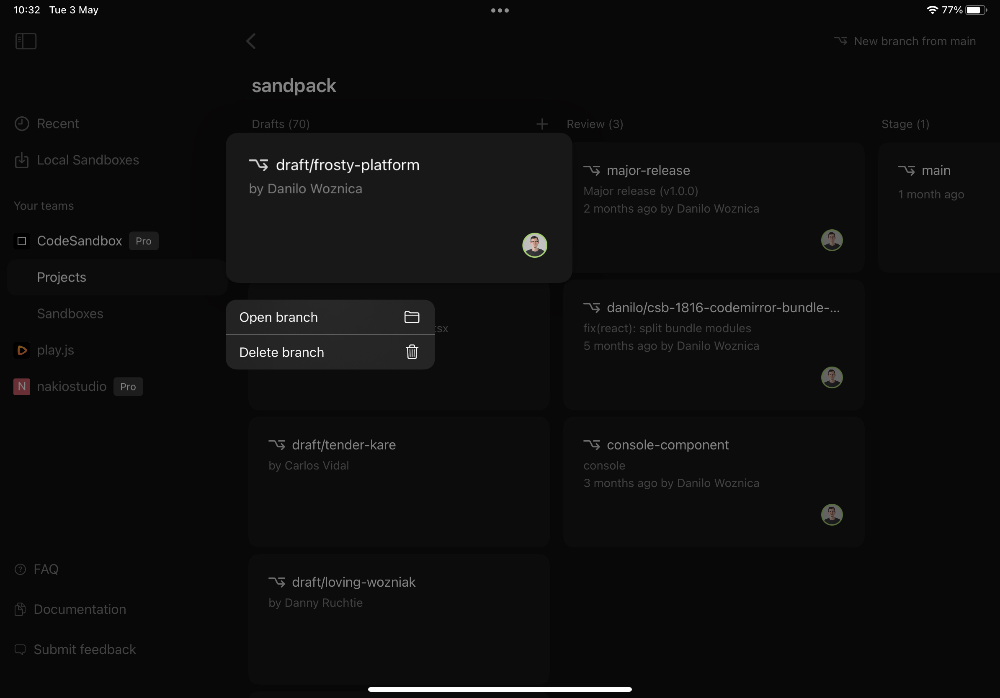

### Command palette

Every dashboard action enumerated here is also available in the command palette which you can access by double tapping anywhere in the screen with two fingers or via the `⌘ + K` shortcut.

## Development Environment

If you have checked the “Sandboxes” section of this documentation you should be familiar with the different parts of the IDE. Here, we will show you the main differences between the Sandboxes and the Projects IDE and how the new components work.

### Sidebar

**Branch Picker**

Sitting at the top of the sidebar you can see the name of the current branch. Tap on it to access the “Branch Picker” where you can change branch, create a new one, delete existing ones or rename the currently selected branch.

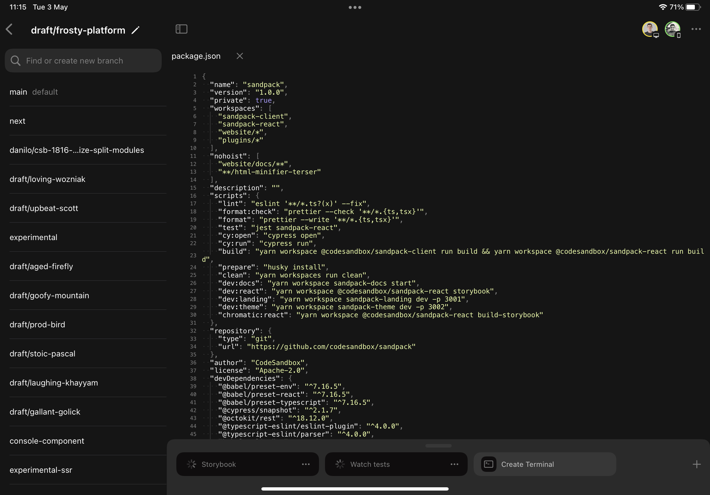

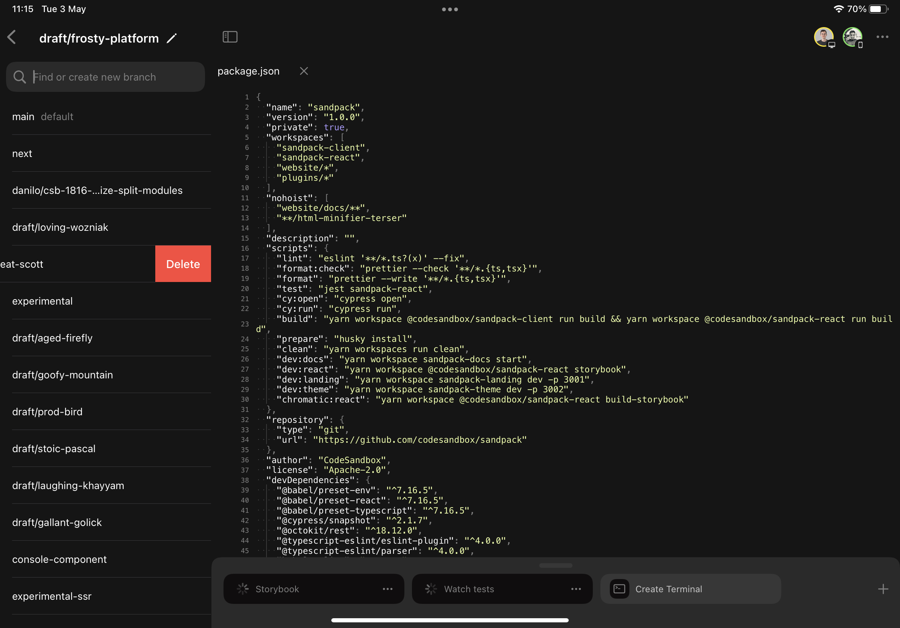

**Content Search**

In the second tab of the sidebar, the “Content Search” screen allows you to search in the entire project a term or matching result for a regular expression.

**Git Client**

Unlike the “Git Client” for Local Sandboxes, the remote repository is configured for you and push operations take place automatically when a new commit is made.
The small files picker allows you to select which files you want to commit or discard changes from. 

In this screen you can also find the commits introduced since the target branch was forked and a button to quickly create a new Pull Request for the current branch.

### Editor

There is some differences between the Projects and the Sandboxes editor that we will outline below.

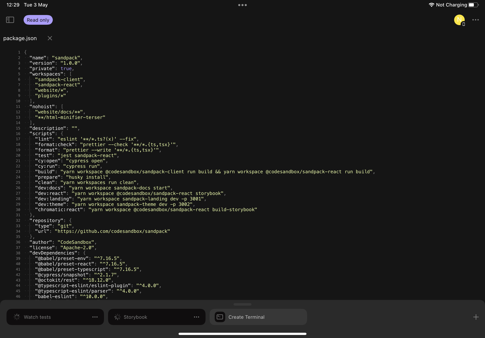

**Project Status**

At the right of the button to toggle the sidebar there is the status pill. This component informs you about the current state of the projects and also about background actions being performed on your projects. These are the different states possible:

- Protected: the current branch is protected and no changes can be performed.
- Reconnecting: the internet connection was lost and the application is trying to reconnect to Pitcher.
- Offline: the attempts to reconnect timed out and the Editor is in offline mode where no changes can be performed. Tapping on the status pill triggers new reconnection attempts.
- Commits behind main branch (i.e. “4 commits behind main”): New commits have been merged onto the main branch and the current branch is a number of commits behind the HEAD of the main branch. Tapping on the status pill merges the main branch into the current branch.
- Merge Conflicts: indicates that merge conflicts arose as a result of pulling or merging the main branch onto the current branch.
- Commit Error: indicates that a pre-commit hook failed halting the commit operation. Tapping on the status pill opens a shell with the output of the failed commit operation.

**Live Collaboration**

Every time you access a branch, through the Dashboard or a universal link, you will join a live editing session. At the top-right corner of the screen you will see who has joined the session and by tapping on their avatar you will be able to follow their activity as they work on the current branch.

**IntelliSense**

The Editor interacts with Pitcher’s language server. The application only consumes the auto-completion service but new features will be added in the future.

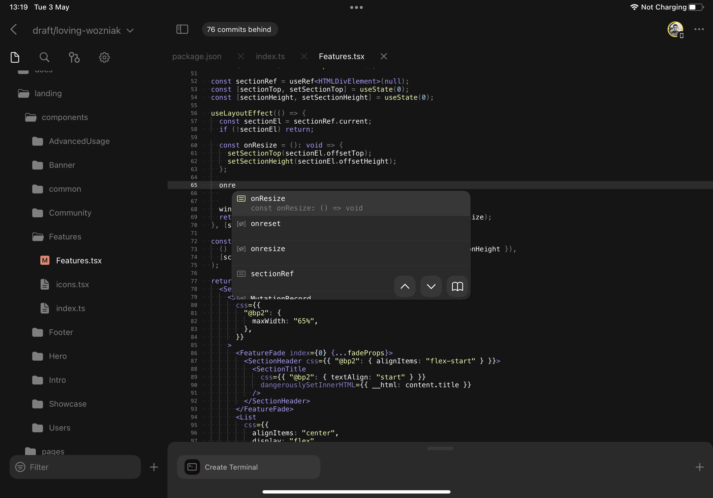

**Conflict resolution**

The Editor detects conflicts in a source file and allows you to quickly pick a conflict resolution by tapping on the chevron located at the left of the first conflicting line.

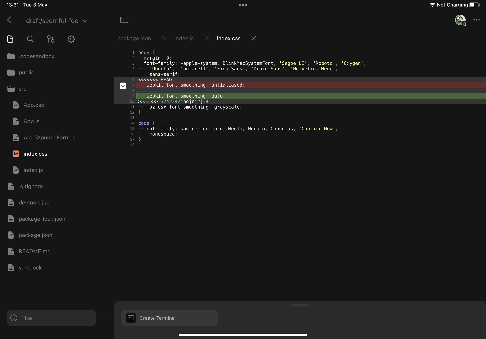

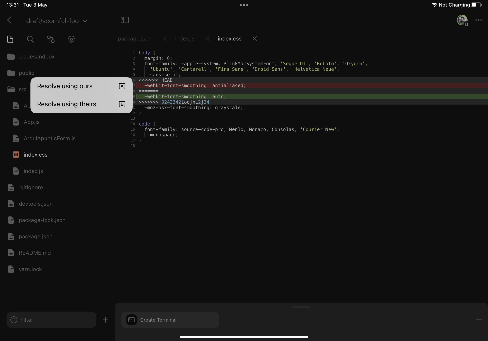

### DevTools

**Tasks**

At the bottom of the screen you can find the DevTools area. This component allows you to easily launch tasks defined in your `package.json` or  `.codesandbox/tasks.json` files, check their output or stop their execution. 

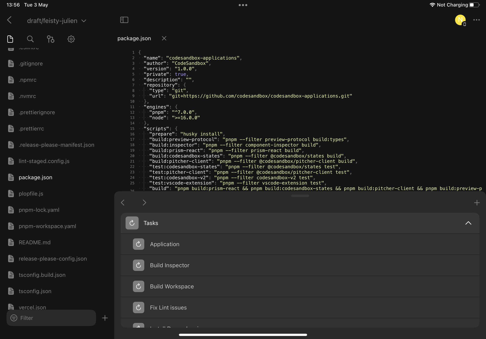

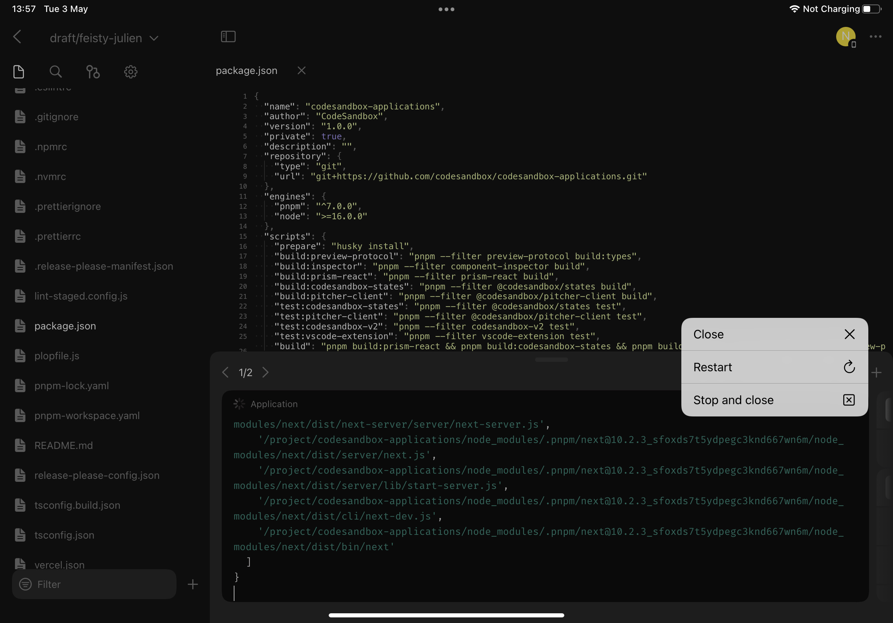

**Previews**

Every time a port is open a new preview will become accessible from the “Previews” section and if possible it will show the name of the task that created the port. Tapping on any of these entries will open app the in-app web browser and load the content that port is serving.

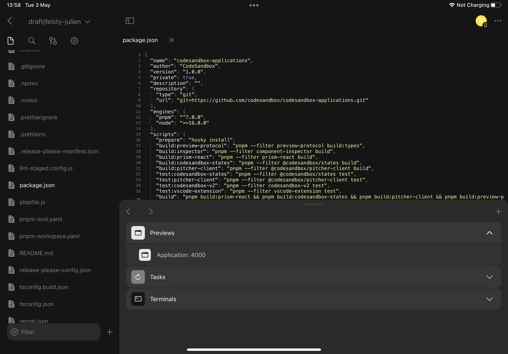

**Terminals**

Lastly, the Terminals section lets you pick among all the running shells and also create new ones.

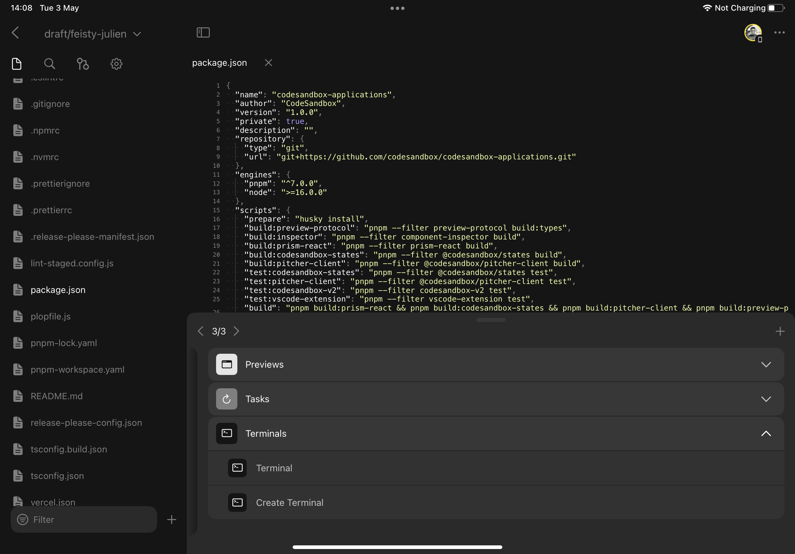