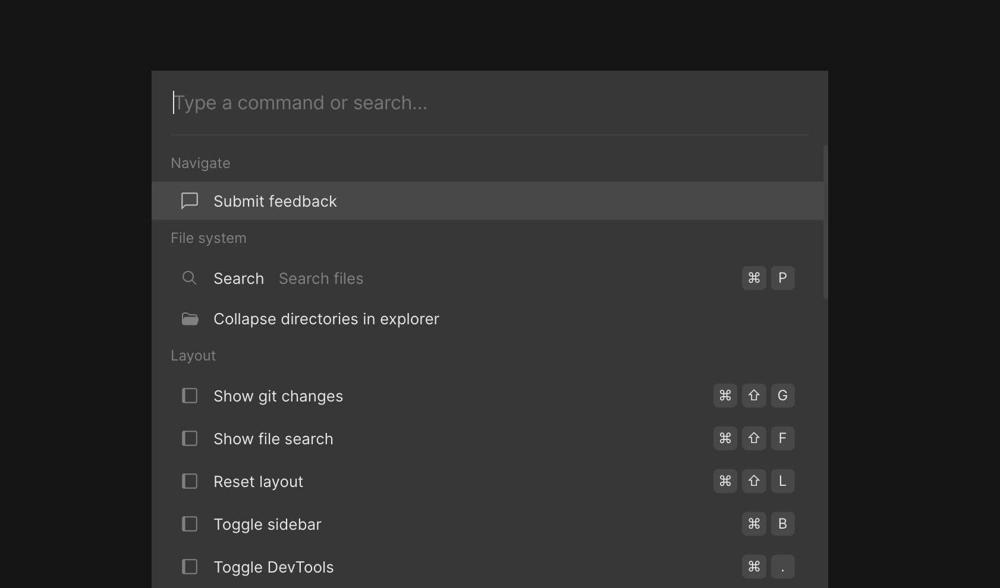
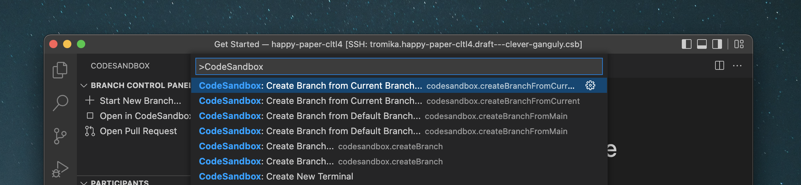

import Callout from 'nextra-theme-docs/callout'
import Video from '../../../../../shared-components/Video'

# Command Palette

The CodeSandbox Projects functionality is almost completely accessible from your keyboard as well. You can bring up the Command Palette on the Dashboard or in the editor using ⌘ + K. 

From here, you have access to all of the functionality of Projects, including keyboard shortcuts for the most common operations. In addition, Projects related functionality is available in VS Code’s command palette (⇧⌘ P) as well.

With the Command Palette, you can change the layout, run tasks, manage env vars, or run git operations. You can even run any command in the terminal. Just type the command and Projects will open a terminal and execute it.

