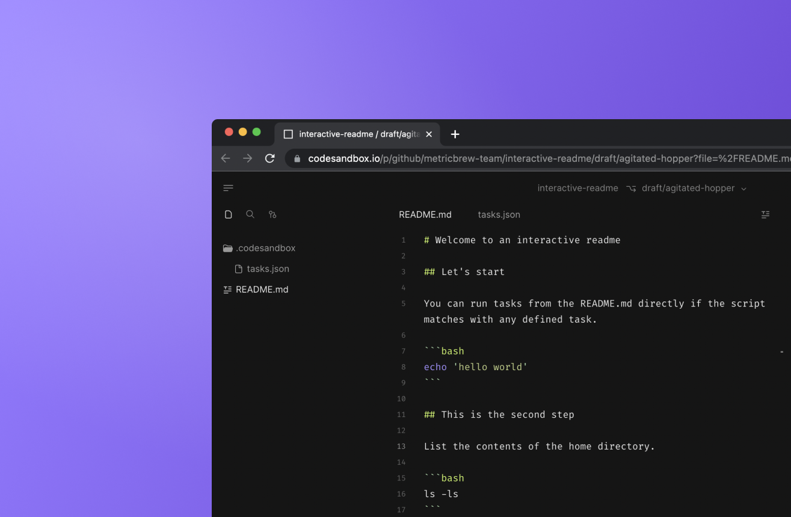
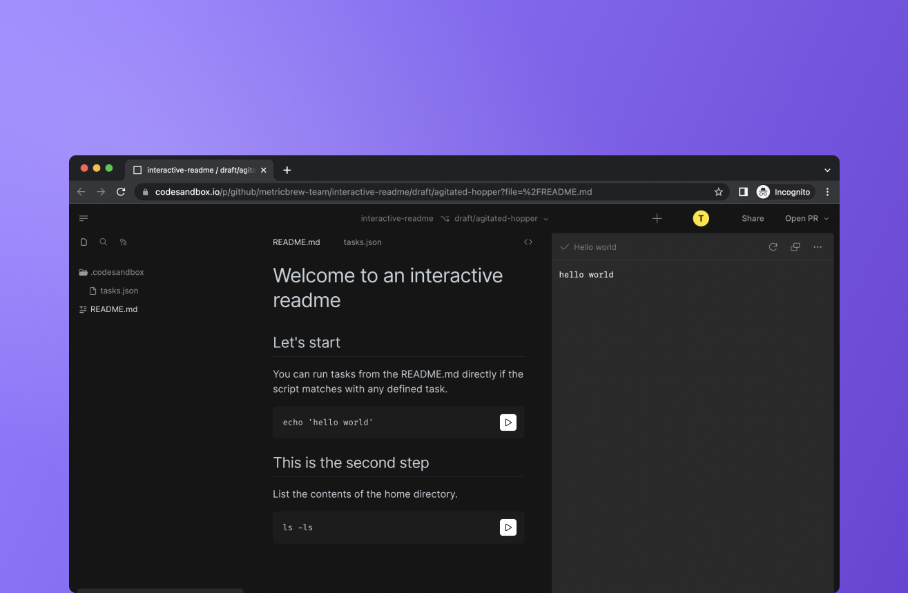

# Interactive Readme

With the interactive readme feature Projects supports running [tasks](https://codesandbox.io/docs/projects/setting-up/overview) directly from Markdown. 

All you need is to define tasks using the [configuration file](https://codesandbox.io/docs/projects/setting-up/tasks), also see an example below.

In the Markdown file you have to use the same shell command in a code block that used in the `tasks.json` file. 

If there is match, Projects will render a play icon next to the command. Interactive tasks can be run by any user with read access to your project. 

