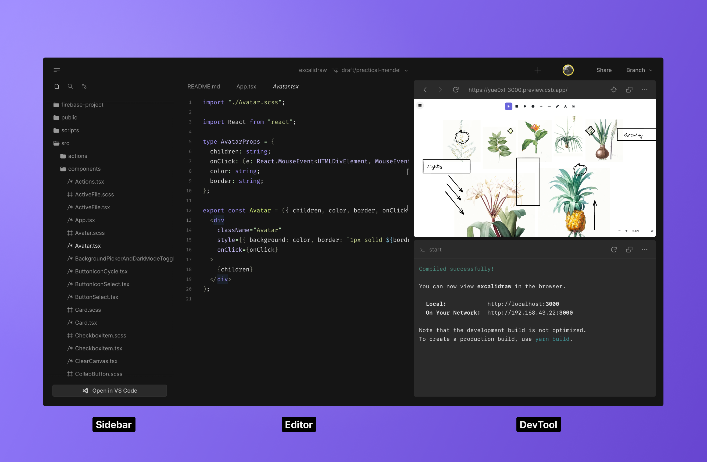
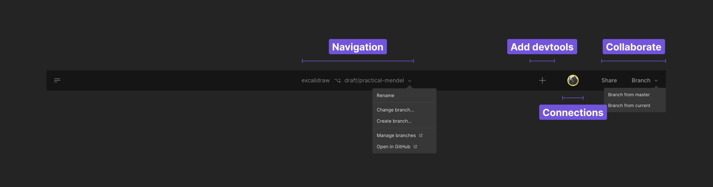

# Overview

CodeSandbox has [many alternatives for you to code](linktoiosandvscode). One of the tools is the unique and opinionated Web Editor, built from scratch and optimized to help the developer focus on what matters: being creative and doing their activities without friction. 

The web editor contains a set of features to increase the accessibility of complex tools like git, setup, review flows, contributions, and visualizing components. 

Here is an overview of the web editor structure:

## Header

The header is where you perform general operations on your project.

- **Navigation**: Back to the project level.
- **Navigation**: Checkout to other branches.
- **DevTools**: Add devtools to help in your work. 
- **Collaborate**: Invite friends to work together.
- **Collaborate**: Quickly start a new branch and propose changes.

## Sidebar

The sidebar is a quick way to operate and navigate your codebase. It allows you to:

- View and manipulate your files
- Search inside your project
- Interact with source control

## Editor

## DevTool