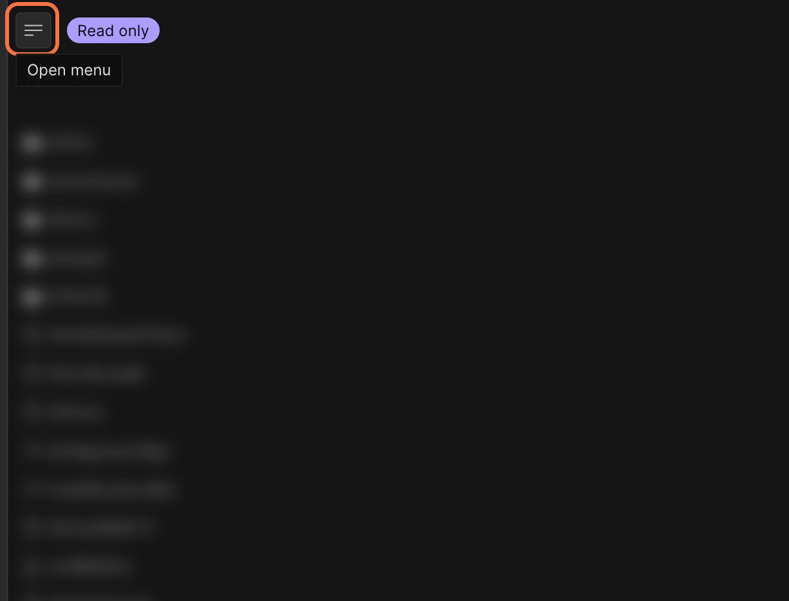

import Callout from 'nextra-theme-docs/callout'
import Video from '../../../../../shared-components/Video'

# Environment variables and secrets

You can pass environment variables and secrets into Project. These are configuration values that depend on the environment such as settings for your project or access tokens for APIs.

<Video src="../assets/EnvVars.mp4" />

## Storing secrets in Projects

The environment variables are stored in our database, AES encrypted. We reroll the encryption key from time to time (on an unannounced schedule) and we store the key separately from the database.

## Exposure

Keep in mind that everyone with terminal access will be able to access the environment variables. Read-only users don’t have terminal access, but people who can write to the repo will have access. In addition, it’s only available for private repositories to make sure publicly accessible Projects won’t expose any secrets.

## Project-level environment variables and secrets

Currently CodeSandbox Projects only support project-level env vars and secrets. The secrets and environment variables are shared across all VMs but after making changes you have to restart your workspace to take effect. 

### Set environment variables and secrets through the UI

**First, click on the open menu on any workspace.**

**Then, click on the Env variables menu item.**

### Set environment variables and secrets using the command palette

Open the command palette using ⌘ + K. Then start typing `Add environment variables`.

### Manage environment variables and secrets

You can also make changes and view all the existing environment variables and secrets after navigating there from the UI or the command palette.

