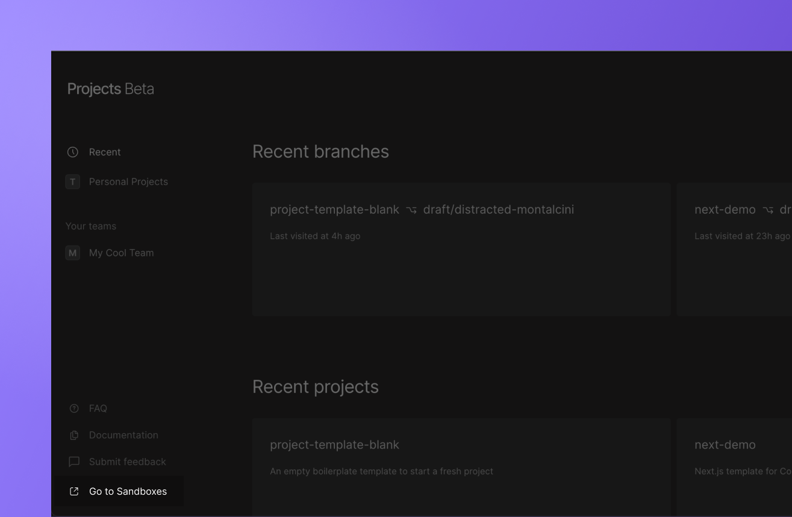
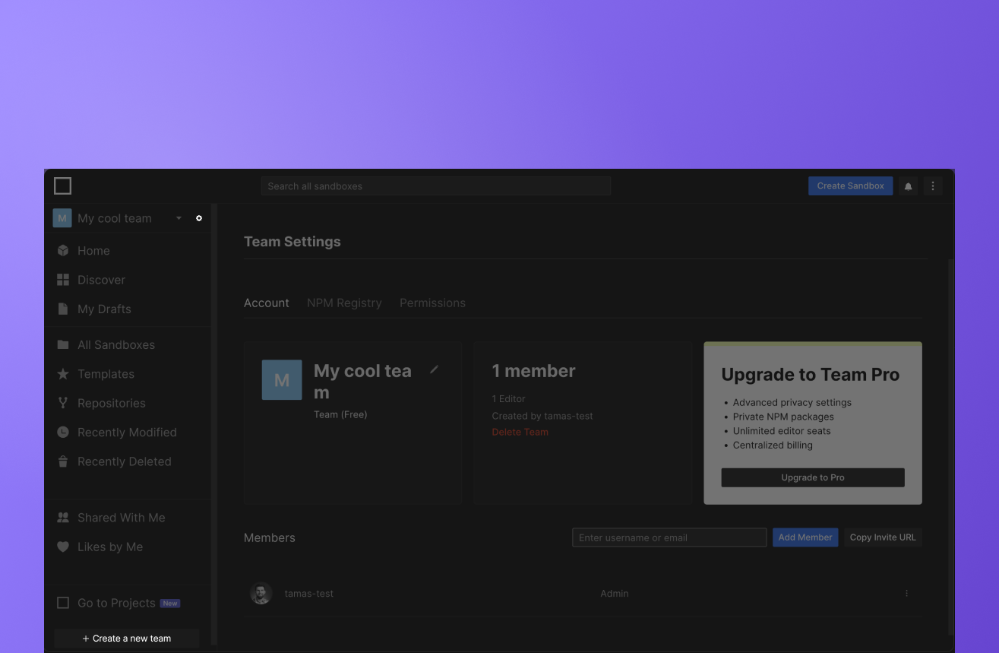

import Callout from 'nextra-theme-docs/callout'

# Team and access management

<Callout>
Please note currently CodeSandbox Projects heavily relies on permissions from GitHub. In the future we're going to change this but until then please keep this in mind.
</Callout>

## Teams

Currently, you can orgianize your work under Personal Projects and Teams inside CodeSandbox Projects. Your teams are synced across Sandboxes and Projects and every member of the given team can navigate between the already imported projects. During the open beta, Projects provides the visibility of projects to teams rather than options to manage permissions or access control. We have to admit, probably you set up permissions on GitHub by this time so Projects can rely on your existing settings. You can find more about the roles and permissions on [this page]().

### Mangage your team

Managing your team is possible through the Sandboxes dashboard. 

On the sandboxes dashboard you can change to any of your teams and with clicking the gear icon you can manage your existing team. Would you like to create a new team? You can create a new team on the sandboxes dashboard as well. [More about CodeSandbox Teams](https://codesandbox.io/docs/workspaces)

### Add new team members

Under the team settings, you can invite users to the team by inviting them via email or searching for their CodeSandbox username.

