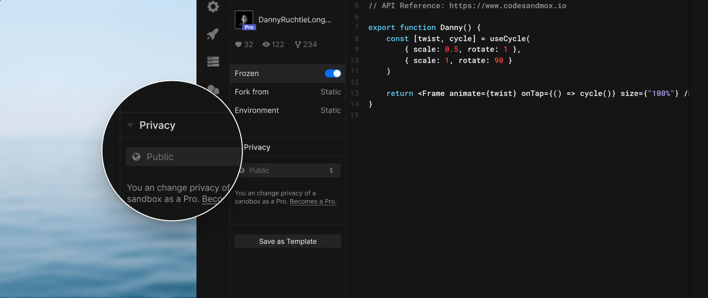

import { Tabs, WrapContent } from '../../../shared-components/Tabs'

# FAQ

<Tabs tabs={["Web", "VS Code", "iOS"]}>
    <WrapContent>
      ## Which languages and frameworks are supported?

CodeSandbox works with JavaScript (including TypeScript) and has front-end and
full-stack support.

We've client templates for: React, Vue, Angular, Preact, Svelte, Dojo, CX,
Reason, as well as vanilla JavaScript that uses Parcel, and one for static
(HTML, JavaScript, CSS) projects.

We also have container templates for: Node.js, Angular, Adonis, Gatsby, Marko,
Nuxt, Next, Sapper, Apollo, Ember, Nest, Styleguidist, MDX Deck, Gridsome,
Quasar, Docusaurus and Vuepress.

[Create a sandbox from a template](https://codesandbox.io/s/), or read more
about the
[difference between client and container sandboxes](/learn/sandboxes/editors).

## How do I make a sandbox private?

You can set a sandbox as private in two main ways: From the editor, change the
privacy setting from the Privacy drop-down under Sandbox Info, and from the
dashboard right-click and select make private.

Note that a [Pro subscription](https://codesandbox.io/pricing) is required to
make sandboxes private or unlisted.

## I'm getting a 422 error when importing from GitHub, why?

There are a few possible reasons a repo might throw that error on import. The
most common are either a lack of a `package.json` file, or the project using
more than 500 modules (files). If you think it's something else, or you're not
able to solve this yourself, then [get in touch](mailto:support@codesandbox.io)
and provide a link to the repo you're importing and we can look into this for
you.

## Why are my start scripts not having an effect?

For performance reasons we ignore any specified scripts in client sandboxes,
instead using a default script. If you need to control the scripts, then we
recommend using a container sandbox.

## Can I change the Node version used in a container sandbox?

Yes. Container sandboxes that are created after May 10 2021 run Node v14.18.1 (LTS) by default.
For backwards compatibility the older sandboxes are on Node v10. However, you can
specify a `node` value to alter the version in `sandbox.config.json`, which will
be used instead. For further details, see [configuration](/learn/sandboxes/configuration).

## Can I open the terminal or console or test panel instead of the browser in a sandbox?

Yes, the terminal, console, and problems tabs are all draggable. Click on the
tab and drag it up into the bar alongside browser and tests. You can then
re-order those items by dragging them in that bar. Whichever is 1st from left to
right in the list of tabs is what opens first when other folks view the sandbox.
The ordering is maintained within the sandbox. You can also achieve this change
by setting a value for "view" in a
[sandbox config file](/configuration#sandbox-configuration).

## How do I change the font used in the editor?

Ensure the font you want to use has been installed on your computer, then put
the name of it first in the comma-separated list under 'Editor: Font Family'
from File > Preferences > Settings in the editor.

## Are there any limitations with sandboxes?

We currently provide [Browser Sandboxes](/learn/sandboxes/overview#what-is-a-browser-sandbox) and [Cloud Sandboxes](/learn/sandboxes/overview?tab=cloud#what-is-a-cloud-sandbox). Browser Sandboxes have the following limitations:

- The maximum file upload size is 7MB for Free users and 30MB for Pro users.
- Imported sandboxes must contain a `package.json` file.
- Cannot use more than 500 modules (files). Note though that
  `node_modules` and dependencies are not counted toward this limit.
- The maximum file size that can be opened in the editor is 2MB. Files uploaded
  that are larger than that still exist but are linked as a static asset.
- Terminal commands which alter the filesystem of the container instance aren't
  synced with files shown in the editor. You'll need to refresh to see files
  updated this way.
- When using a container, there is a sync limit of 10 files per second and only
  files up to 2MB are synced with the editor. Files larger than that still exist
  but are not shown in the editor's file tree. You're still able to write and
  read to and from them in your code and they can be seen and edited via the
  terminal.
- When using a container, the sandbox sleeps after around 10 minutes and can be woken by opening
  the sandbox or preview in a web browser.
- When using a container, the sandbox has a 1GB persistent storage limit, a 1GB vCPU soft
  limit, and a hard memory limit of 2GB.
  
Cloud Sandboxes are part of our evolved CodeSandbox experience, so we highly advise you use them to avoid encountering these limitations.

## I'm getting a 'Request Entity too Large' error, what should I do?

If you encounter this error when importing or committing, check your sandbox or
repo for large binary files and remove them.

## Can I use a database on CodeSandbox?

Yes. Container sandboxes on CodeSandbox have a persistent filesystem, so you're
able to use file-based database options like
[SQLite](https://codesandbox.io/s/sqlite3-sequelize-example-starter-lst3n),
[Lowdb](https://codesandbox.io/s/lowdb-json-file-database-example-starter-pldy5),
and [NeDB](https://codesandbox.io/s/nedb-example-starter-kyv7s). For more
powerful databases, like MongoDB, MySQL etc. we recommend using a third-party
host, like
[MongoDB Atlas](https://codesandbox.io/s/mongodb-database-example-starter-v3ker),
and interacting with them via an API/SDK.

## How do I change the editor theme?

You can change the theme from File > Preferences > Color Theme in the editor.

You can also set a custom VS Code theme. Open VS Code, Press (CMD or CTRL) +
SHIFT + P, Enter: '> Developer: Generate Color Scheme From Current Settings',
copy the contents and paste it into Preferences > Appearance from the top-right
avatar menu. After completing that you need to reload the browser and select
"Custom" as your color theme from File > Preferences > Color Theme.

## I can't edit my code because of an infinite loop

While we do have infinite loop protection as a
[configurable option](https://codesandbox.io/docs/learn/sandboxes/configuration) it doesn't
prevent all scenarios where infinite loops can occur, such as with incomplete
code. When this happens, you can append `runonclick=1` to the editor URL to stop
the code from being automatically executed enabling you to edit your code to
resolve it. For example:
[https://codesandbox.io/s/new?runonclick=1](https://codesandbox.io/s/new?runonclick=1)

## How do I cancel my Personal Pro, Team Pro or Patron plan?

For Team Pro & Personal Pro users, once you've logged in you can downgrade your plan on the
[Settings page](https://codesandbox.io/dashboard/settings). 

If you're on one of our legacy Patron plans you can cancel
your subscription on the [Patron page](https://codesandbox.io/patron). 

    </WrapContent>
    <WrapContent>
       ## What to do about that recurring trust modal?

This modal shows up every time you launch a project folder in a new container. Since every branch will be opened with a unique SSH url, VS Code will ask you to verify that you trust the connection. This is an important security notice used to confirm that the user understands the  connection being established before opening the code. You can read more about the modal [here](https://code.visualstudio.com/blogs/2021/07/06/workspace-trust).

## Do I have to be connected to live session on CodeSandbox in order to work on a branch?

It is possible to work in an “un-synced” state. In order for CodeSandbox features to work, the branch needs to established on a remote connection AND connected to Pitcher (see How it works for more information

## Who can access my code?

Only people on your CodeSandbox team with permissions to the repository may join as a collaborator. Repository permissions are carried over from GitHub. To add someone new to the team, provide access on GitHub and add them to the CodeSandbox. From there, they can access the code in the browser or follow the steps above to use VS Code.

## More Questions?

For questions and support please use the community [discord server](https://discord.gg/R32XxEGp4s).
    </WrapContent>
    <WrapContent>
       ## Sandboxes

### I'm getting a Git error resolving a dependency. Why is that?
CodeSandbox for iOS is only compatible with dependencies hosted and accessible via HTTP or HTTPS. This is because the app doesn't provide local shell environments where you can run arbitrary commands, like git. Use the [CodeSandbox web editor](/learn/sandboxes/editors) instead.

You may find some of the following answers helpful if you have gone through the sections in this documentation but you still haven’t cleared your doubts:
    
### I'm getting an error trying to run my sandbox in CodeSandbox for iOS. What could be the cause?

The root cause of the problem could be either a coding mistake on your side or a dependency trying to do something forbidden by iOS. For instance, dependencies relying on WebAssembly won't work as WebAssembly requires JIT compilation to function, and this isn't allowed by the App Store guidelines. Another cause can be that your project or one of its dependencies rely on a native dependency or Node extension, which aren’t supported.

### One of the scripts in my sandbox cannot be run. What could be the cause?

Only the scripts that start with `node` or the name of a dependency located inside the `node_modules/.bin` directory are compatible. This is because CodeSandbox for iOS doesn’t provide a shell environment, scripts containing an arbitrary bash command won't work.

### I can't see the preview of my sandbox in the web browser. What could be the cause?

The runtime provides a `WEB_PORT` environment variable matching the port used by default by the in-app web browser. If your sandbox doesn't use the port in that environment variable then you will need to fix the url in the web browser to load the page at the right port.

### My sandbox stops running when I move the app to background. Why is that?
This is because iOS suspends the process while the application is in background and with it all its activity.

### My sandbox requires Node.js 14 but the app uses Node.js 12. How can I change the Node.js version?
The application uses a Node.js port that hasn’t been upgraded to Node.js 14 as we have been focused on integrating the new CodeSandbox experience instead. We will be making changes in this front, so please stay tuned.

## Repositories

### I cannot make any changes to my project. Why is that?
It is very likely that you have a protected branch selected (i.e. main). Forking a branch will create a new one where you can make changes.
    </WrapContent>
</Tabs>