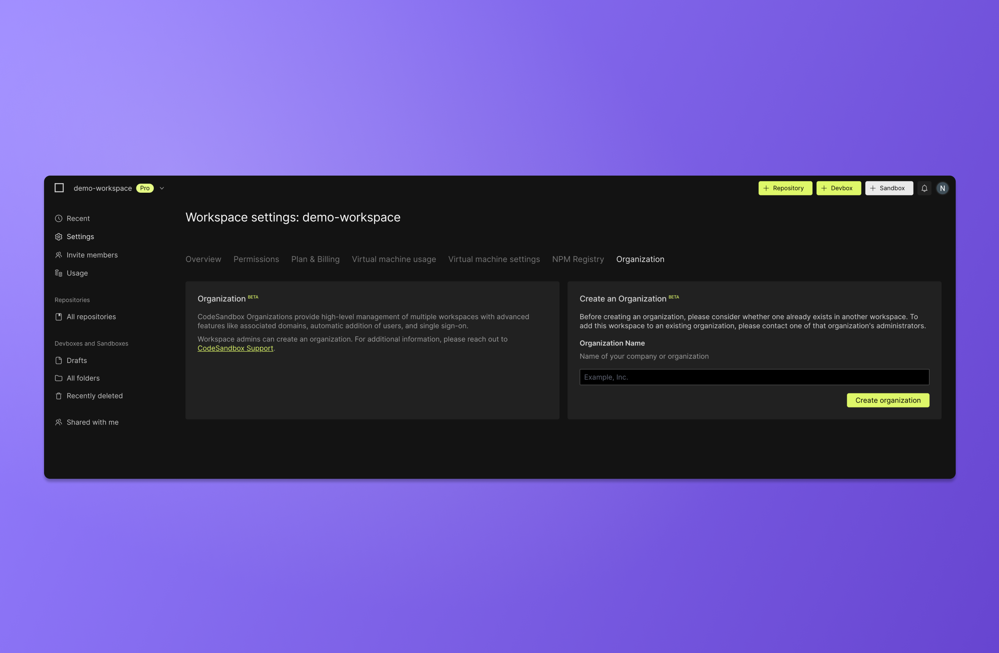
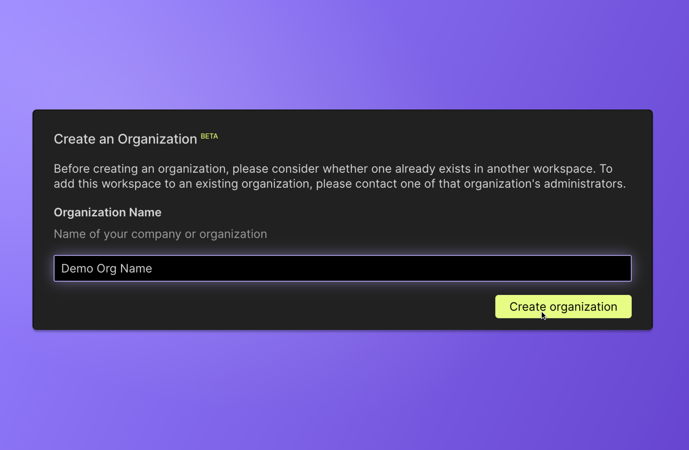
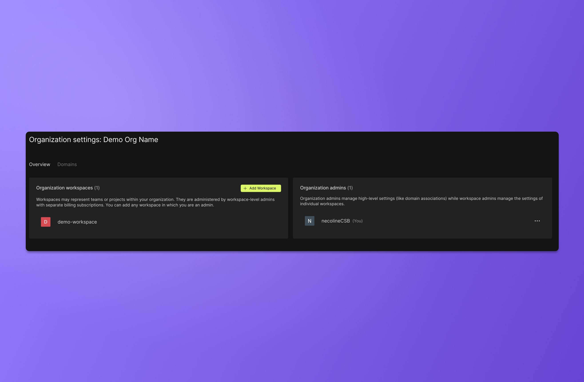
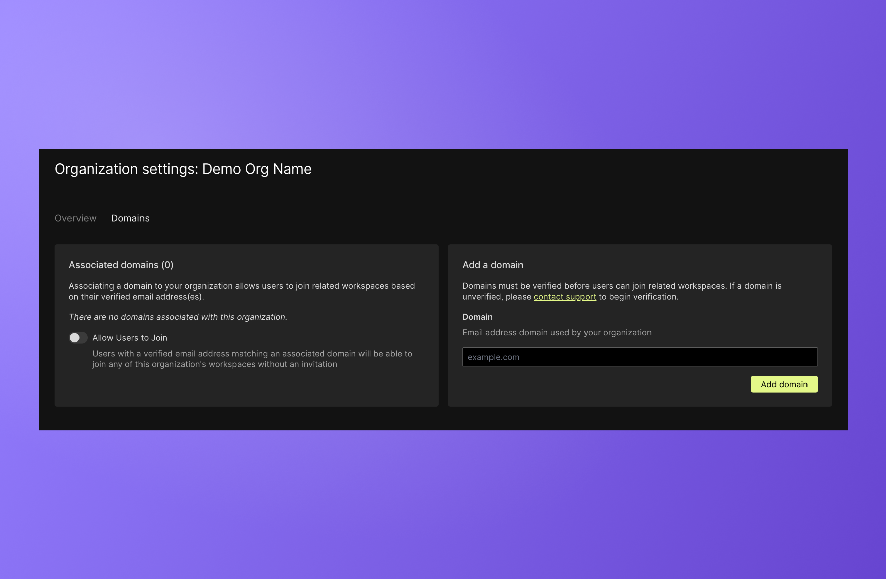
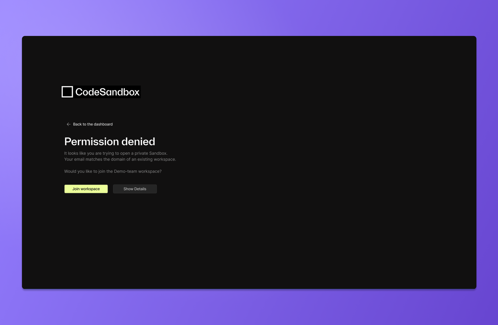
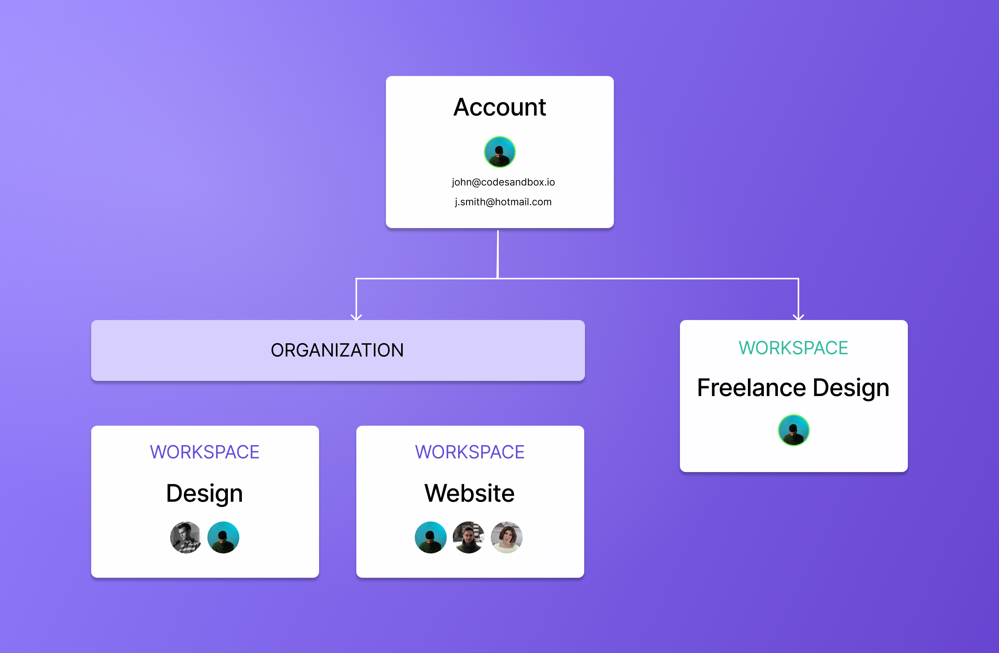

import { Callout } from 'nextra-theme-docs'

# Organizations & domains

Organizations provide a way to group and manage multiple workspaces under a single entity. This is particularly useful for companies, institutions or agencies that need to organize work into distinct teams.

Additionally, organizations make it possible to connect all the employees at a company using CodeSandbox in a single space based on the company's shared email domain.

## Creating an organization

You can create an organization from any active workspace that is not already part of an organzation. 
In the _Workspace settings_, open the [Organization tab](https://codesandbox.io/t/org) and enter a name for the organization. 

To prevent confusion, we recommend that you name your organization so it directly relates to your business’ name.

 

Once you have created an organization, it will automatically be linked to the workspace you created it from. However, you can choose to add additional existing workspaces to that organization.
You can also manage the organization admins. 

 

The [Organization settings](https://codesandbox.io/t/org) will always be discoverable through the _Workspace settings_.

## Setting an email domain

In the _Organizations settings_, open the `Domain` tab and add your email domain. 
The domain must be verified before being approved. This is an automated process that requires no action from you. 

Once the domain is approved, users who have CodeSandbox accounts connected to emails with a matching domain will be given the option to join the workspace.
Users may encounter the suggestion to join an eligible workspace when they are attempting to access projects in the workspace or when they log into CodeSandbox for the first time after the email domain has been approved. 

Below is an example of the message a user with a matching email domain will see when opening a private Sandbox from a workspace they are not yet part of.

## Accounts and domains
CodeSandbox accounts are tied to individual users. They grant access to shared workspaces and organizations, enabling collaboration with other CodeSandbox users.

With a single CodeSandbox account, users can create or join multiple workspaces and organizations to collaborate with various groups of CodeSandbox users; these workspaces and organizations are separate entities, each with a unique set of members and projects.

Since each workspace and organization are their own separate entities, members cannot see the other workspaces or organizations a user belongs to.

