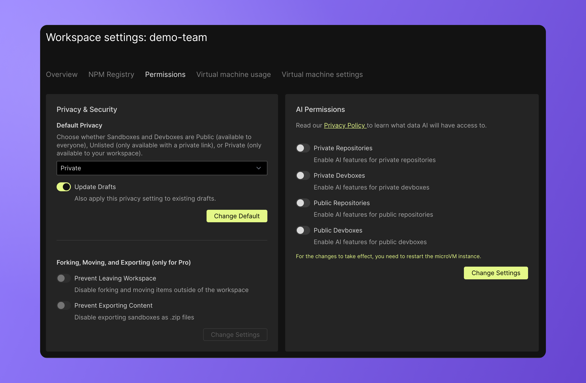

import { Callout } from 'nextra-theme-docs'

# User Permissions

Permissions vary slightly between repositories, which extend the settings from GitHub, and Sandboxes, which solely exist in CodeSandbox.

## Browser and VM Sandboxes
### Private
Private Sandboxes can only be accessed by members of the workspace that owns the Sandbox.

### Unlisted 
Unlisted Sandboxes are accessible by workspace members and non-workspace members with the URL.

### Public
Public Sandboxes are visible to everyone. Public Sandboxes are a great option for sharing content with people outside the workspace. Non-workspace members are able to open and run public Sandboxes. In order to edit, however, they will need to fork the Sandbox to their own workspace. 

<Callout emoji="⚠️">
VMs used to run public previews will be charged to the workspace that owns the VM Sandbox.
</Callout>

If you want to share a VM Sandbox publicly, consider turning it into a template. That way, the runtime of the VMs used to run the code and/or the preview won't be charged to your workspace.

Default privacy settings for Sandboxes can be set in the workspace portal in the [permissions tab](https://codesandbox.io/t/permissions)

## Repositories

### Users with write access

Users with write access to a repository can enjoy the full feature set available on CodeSandbox Repositories.

### Users with read-only access 

Users with read-only access to the repository can browse the content of the repository, check the previews and execute a few tasks. To introduce changes, they need to create a contribution branch or fork the repository. For more information, visit the [open source collaboration](/learn/getting-started/open-source) page.

### Anonymous users

Users without a CodeSandbox account can only browse the content of the project and interact with the previews.

## Feature comparative guide

The following table outlines the features available according to each permission.

| Feature | Write access | Read-only access | Anonymous |
|---------|-----------------------------|------------------|-----------|
|  Import repository       |               ✔️              |          ❌ - Fork only        |     ❌      |
|   Visit a public project      |             ✔️                |        ✔️          |      ✔️     |
|   Browse content in a public project      |             ✔️                |        ✔️          |      ✔️     |
|   Access previews for a public project      |             ✔️                |        ✔️          |      ✔️     |
|   Visit a private project      |             ✔️                |        ✔️  - with explicit permissions        |      ❌     |
|   Create new branch      |             ✔️                |        ❌        |      ❌     |
|   Perform any git operation      |             ✔️                |        ❌        |      ❌     |
|   Open the terminal      |             ✔️                |        ❌        |      ❌     |
|   Manage environment variables and secrets      |             ✔️                |        ❌        |      ❌     |
|   Run existing tasks     |             ✔️                |        ✔️        |      ✔️     |
|   Create new tasks     |             ✔️                |        ❌         |      ❌     |
|   Change exiting tasks     |             ✔️                |        ❌         |      ❌     |
|   Open DevTools    |             ✔️                |        ✔️         |      ✔️     |
|   Make changes    |             ✔️                |        ❌        |      ❌     |
|   Open a pull request    |             ✔️                |        ❌        |      ❌     |
|   Install the GitHub action    |             ✔️                |        ❌        |      ❌     |
|   Install the GitHub application    |             ✔️                |        ❌        |      ❌     |
|   Follow mode   |             ✔️                |        ✔️        |      ✔️     |