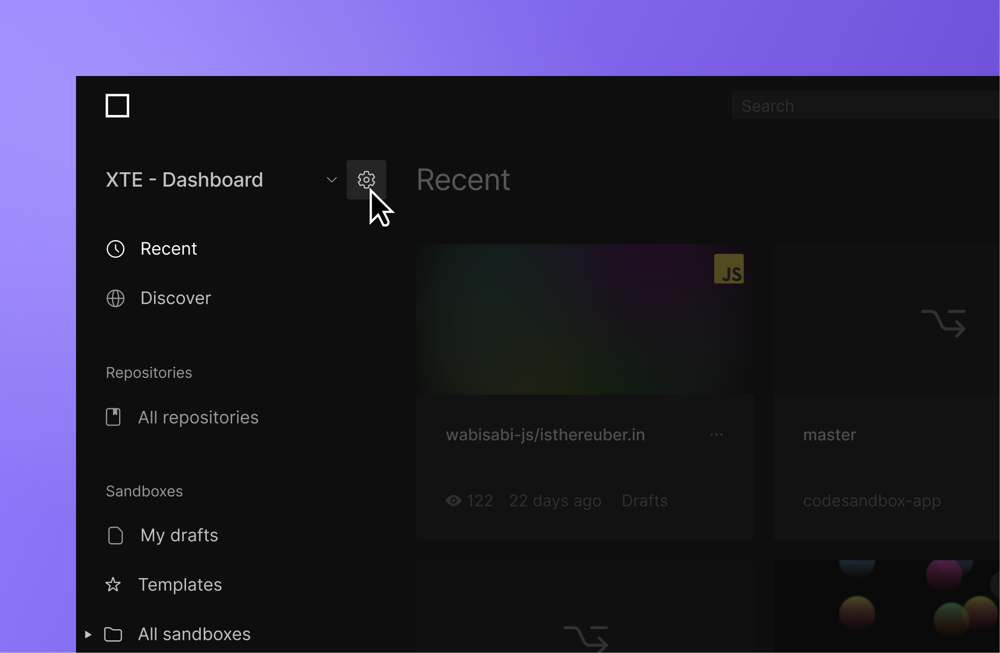

import { Callout } from 'nextra-theme-docs'

# Workspaces

A workspace provides a collaborative space where members can work on various projects. Members of a workspace that is part of an organization will also be members of the organization. Each workspace may have a unique list of members who may have different roles and permissions.

## Getting started with workspaces

When you create an account, you will be taken through a flow to create your first workspace. From here you can choose to upgrade this workspace to Pro or continue using the free workspace.

Free workspaces are a great way to get started with CodeSandbox.
You may add members to your workspace anytime by navigating to the workspace settings and sending an invite to their email.
You can also upgrade to Pro at any time to experience CodeSandbox without limits.

<Callout emoji="⚠️">
Currently, every account must be associated with at least one workspace. In the future, we will introduce more flexibility that will allow you to change and delete your primary workspace.
</Callout>

## Collaboration on workspaces

On Free, you are allowed up to 5 members on a workspace and on Pro, you are allowed 20 members. You can invite them when you are creating the workspace for the first time, or later through the subscription management view.

Users with an active CodeSandbox account will get a notification (the bell icon in the header) in CodeSandbox as well as an email.
From there, they can accept or decline the invitation.

You can also invite workspace members who do not have a CodeSandbox account. They will be sent an email inviting them to create an account where they will have access to the workspace.

#### Collaborating on Sandboxes

Anyone with edit permissions to the workspace can edit its sandboxes.

Sandboxes are tied to the workspace. Anyone in the workspace can move sandboxes between folders—however, only the creator of a sandbox can permanently delete a sandbox.
Admins may move sandboxes to different workspaces. This is done by right-clicking on a sandbox in the dashboard, selecting `Move to folder` and selecting a different workspace from the menu.

If you want to collaborate live with workspace members, you can start a [live session](/learn/getting-started/collaborate-share) (with a Pro subscription).

#### Collaborating on repositories

Similarly, anyone with edit access to the team workspace can edit its repositories — as long as they also have write access to the repository on the git provider (such as GitHub). Branches have their own development environments for each workspace, so files saved on `my-branch` of a repository in your personal workspace will not appear on `my-branch` in the team workspace until they are committed and pushed to the git provider.

Live collaboration on branches is restricted to members of the same workspace. If you don't see your collaboration partners working, you may be looking at the same branch in a different workspace. Otherwise, your work will be visible in every workspace as soon as it is committed and pushed to the git provider.

You can learn more about how to work with collaborators in the sections on [repository](/learn/repositories/collaborate-share) collaboration.

## Creating a new workspace

You can create a workspace directly from the workspace selector:

## Managing workspaces and subscriptions

You can create and manage workspaces from the dashboard settings page.
To find this, select your workspace and open the subscription page.

Here you can see the team overview with subscription details, team members and roles.
Admins can edit team member access and roles here as well as edit the subscription.

### Add or remove people from a workspace

1. Go to the [Dashboard](https://codesandbox.io/dashboard).
1. In the top left corner, select the **team** you'd like to edit in the dropdown.
1. Click on the **settings** icon next to the team.
1. Add or remove people through the **Members** section by inviting them via email or searching for their CodeSandbox username.

