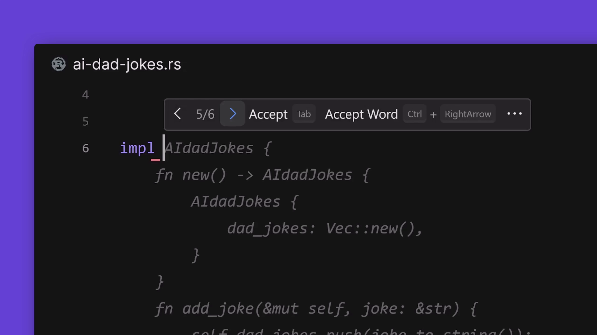

import { Callout } from 'nextra-theme-docs'

# Codeium code autocomplete

Codeium is an incredible AI-powered developer toolkit. Their code completion tool provides single and multi-line code generation with multiple suggestions to choose from. It supports 70+ programming languages, so it’s a perfect fit with our Devboxes, which can also run any type of project.

## Getting started

Codeium code completion is now available for free to every CodeSandbox user on [Devboxes](https://codesandbox.io/d/), [Sandboxes](https://codesandbox.io/s/) and [repositories](https://codesandbox.io/dashboard/recent?import_repo=true)

If you have your AI settings enabled, you will get AI autocomplete working in your code immediately. 
Note that we enable AI permission toggles by default on free workspaces. If you do not have have access to Codeium, visit the [workspace portal](https://codesandbox.io/t/permissions) and enable the AI settings

## Settings and configuration

In the workspace settings, you will see an option to turn on AI for Devboxes and Repositories in the workspace.
If you want to override these settings for a particular Repository or Devbox, you can open the editor, navigate to _Settings > Preferences_ and turn off the AI option. This will deactivate AI for all users accessing the Devbox or repo.

## Security & privacy 

By using Codeium you are accepting their terms and conditions. 
You can read more about their terms of service on the [Codeium website](https://codeium.com/terms-of-service-individual). 

Here is a short list of their security & privacy policies:
- Opt-out for code snippet telemetry.
- Never train generative models on private code.
- SOC 2 compliance.
- No training on non-permissively licensed code.