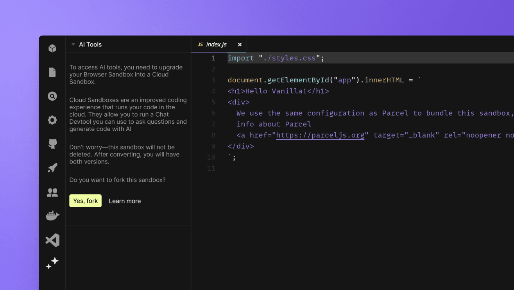

# Boxy FAQs

### How does Boxy differ from ChatGPT?

Although Boxy is built using GPT at its core, one key distinguishing factor is that Boxy is aware of the code in your sandbox or repository. As a result, Boxy's suggestions will consider existing patterns in your project's code.

### How do I get access to Boxy?

Boxy and all CodeSandbox AI-powered tools are available to Pro workspaces. You can [upgrade](https://codesandbox.io/pro) or start a free trial to experience development with Boxy.

### Is Boxy available in all CodeSandbox plans?

Yes. Boxy is available in all plans.

### Is Boxy available for Sandboxes?

No. Boxy is exclusively available in devboxes and repositories. However, you can easily [convert a Sandbox into a Devbox](/tutorial/convert-browser-sandbox-cloud) to get access to Boxy. This is available through the "Convert to Devbox" button at the top right of the Sandbox editor.

