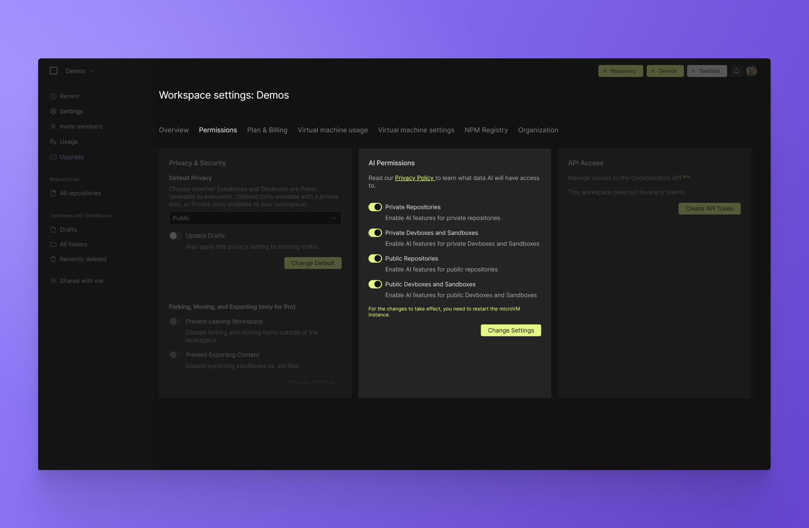

# Getting Started

All CodeSandbox AI tools are available to Free and Pro users. To enable these features, admins need to grant permissions in the [workspace settings](https://codesandbox.io/t/permissions).

Once you grant AI permissions, CodeSandbox will send information about the event to OpenAI for analysis. Under no circumstances will we send any event data to OpenAI without explicit instruction to do so. We will only share selected event data with OpenAI after you toggle on these permissions. OpenAI does not use the event data shared via this feature to train its AI models. To learn more about our privacy agreement with OpenAI, check out our [Privacy page](https://codesandbox.io/legal/privacy).

## Running AI

Once permissions have been granted, you need to restart the VMs for the changes to take effect. You can do this by selecting `Restart Branch` in the main menu. If you are in a Devbox, the option will read `Restart Sandbox`.
