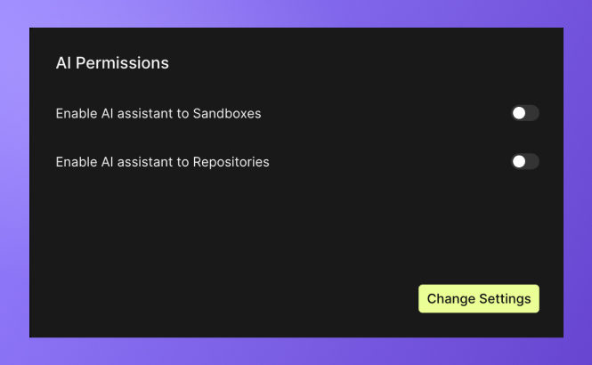

# Getting Started
All AI tools are available for Pro users. In order to enable these features, admins will need to grant permissions in the workspace settings.  

Once you grant AI permissions, CodeSandbox will send information about the event to OpenAI for analysis. Under normal circumstances we do not send data to a third party undisclosed in our [subprocessor list](https://codesandbox.io/legal/privacy). This is why we ask for explicit permission to enable the use Open AI on sandboxes and repositories. 
We will not send any event data to OpenAI without an explicit instruction to do so. Only by toggling permissions on will selected event data be shared with OpenAI. OpenAI does not use the event data shared via this feature to train their AI models. To learn more about our privacy agreement with OpenAI, check out our [privacy page](https://codesandbox.io/legal/privacy)

## Running AI
Once permissions have been granted, you will need to restart the VMs for the changes to take effect. You can do this by selecting `Restart Branch` in the main menu. If you are in a cloud sandbox, the option will read `Restart Sandbox`.

## Boxy for Sandboxes
Boxy is available only on repositories and cloud sandboxes. If you want the support of Boxy in your browser sandbox, you can easily convert your sandbox using the options in the toolbar. 

