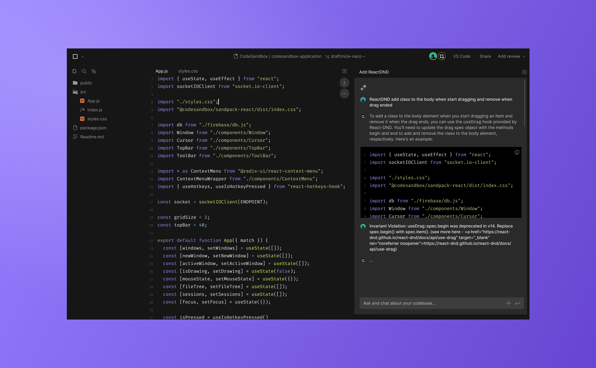
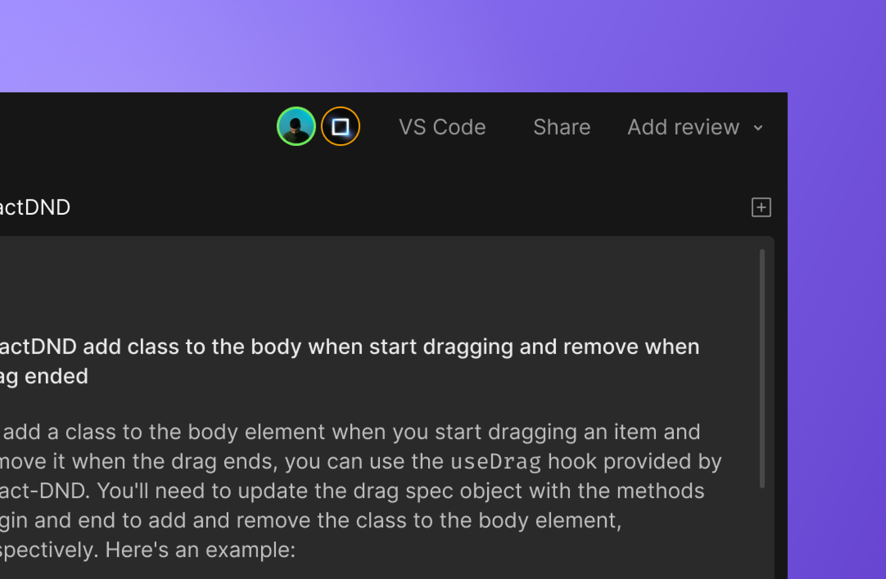
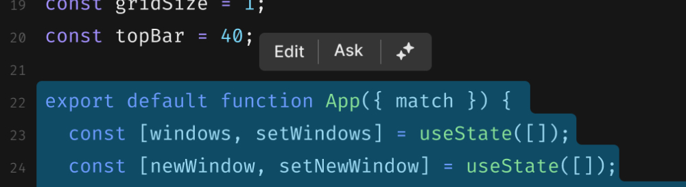

import { Callout } from 'nextra-theme-docs'

# Meet Boxy

Boxy is an experimental AI-powered chat tool that is built directly into your editor. Boxy is aware of your code and can answer questions and make suggestions that consider best practices and conventions that are specific to your project.  

## Boxy in the Editor
If you have granted AI permissions in the workspace settings. You will notice the newest addition to your team sitting next to your avatar. 

 

The easiest way to work with Boxy is to select a piece of code and choose a saved prompt. When you select the code, you will see a toolbar hover above the top line of the selected code. From there, you can either open the DevTool to chat with Boxy or run a saved prompt.

- **Edit** shows prompts related to refactoring code.
- **Ask** shows prompts related to chat actions.
- The **AI icon** opens a chat DevTool.

### Command Palette
Saved prompts are listed in the command palette. You can access them from the toolbar using `⌘ + ⇧ + H`. 
 
From here, you can search for or select a prompt from the list. Alternatively, you can type a custom prompt, which Boxy will quickly respond to. 
 
When you ask Boxy to perform an action like `Document Code` or `Improve Readability` and you have code selected in the editor, Boxy will make suggestions directly in the file.

If you ask Boxy to `Explain Code` or `Consider Security`, the chat DevTool will automatically open with Boxy's response.
 

## Boxy Chat
Open a chat DevTool to have a conversation with Boxy. You can open a chat in two different ways:
- select the AI icon in the toolbar.
- open a new DevTool and select `Chat with Boxy`.

You can have multiple chats open at the same time. If you need to change topics but don't want to lose your progress in your last conversation, simply select `+` in the input to create a new chat. 

Below are a few tips and tricks that can help you make the most of your interactions with Boxy.

## Tips and Tricks
### Tips
**Keep chatting**
Boxy remembers your previous conversations and takes them into account when providing responses. For example, if you have asked Boxy to include the file path for the suggested code repeatedly in the past, it will include it in future responses.

**Request response formats**
Do you prefer that Boxy always provides suggestions in insertable snippets? Or do you prefer to see the code situated within the full file? Ask Boxy to `"always respond with ___"` to receive suggestions in the way you like. 

**When in doubt, provide more context**
Boxy will give you what you ask for. They may make suggestions based on the way your frame your question. Boxy may have better responses when you ask them to consider specific files or libraries that may contain useful context for your question.

### Tricks
- use backticks for keywords or code segments
- use "again" to repeat your last prompt

## Commit suggestions
Say goodbye to nondescriptive or confusing commit messages. When you enable AI to work on repositories, Boxy will automatically generate commit messages based on the files changed in your branch. You can easily edit or remove these suggestions according to your preference.

