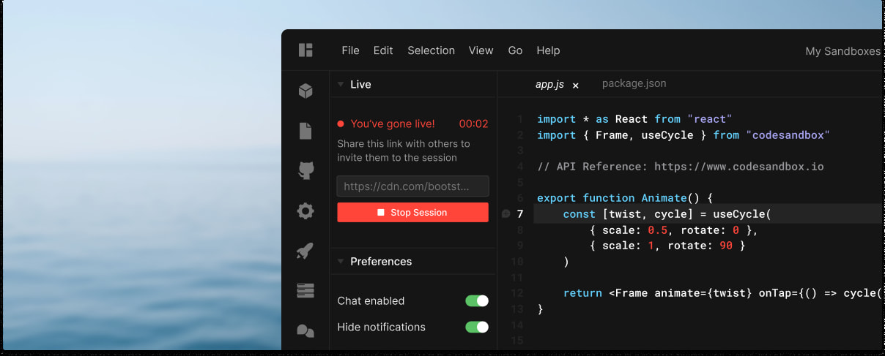
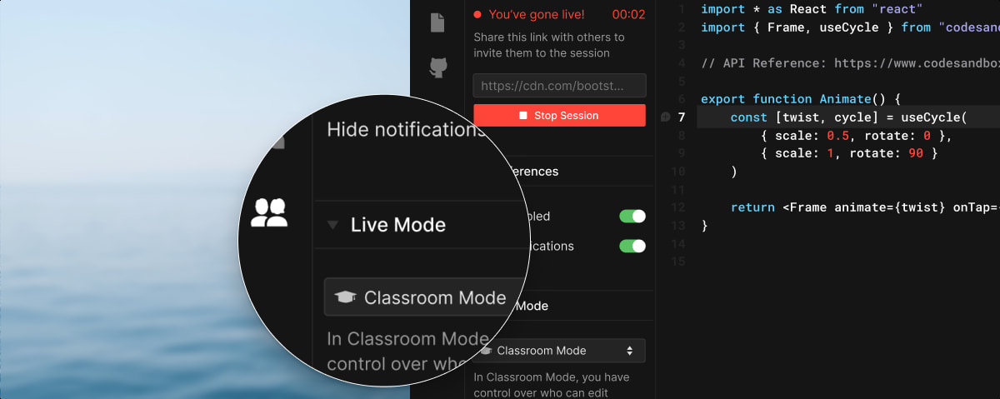

# Live Sessions

## What is Live?
All browser sandboxes on CodeSandbox are live, meaning you can share your sandbox with
others for real time collaboration on code. You can simultaneously create,
delete, edit and move files and code with others in a sandbox, as well as chat
about your changes. It's like Google Docs, but for coding.

       

### Going Live
All browser sandboxes are collaborative by default. You can invite contributors to join the
sandbox using the `Share` button at the top right of the editor.

Browser Sandboxes also allow you to make your sandbox "Live" to the entire world, including users that you haven't directly invited to contribute on a sandbox.

Whenever Live mode is activated from the _Live_ tab on the activity bar, you get a Live URL to share with other CodeSandbox users so that they can immediately join you to collaborate live.

Live editors can only make edits to the sandbox while they are in the
session, they cannot do this when just viewing the sandbox.

Invited editors can simultaneously edit, create, rename and update files and
code, as well as add and remove dependencies. You can also see in real time
the files that other collaborators are looking at and any code that they select.

       

### Classroom Mode
Classroom Mode is a specific mode of Live Sessions that allows you to define who can edit the sandbox. This is especially
useful when working with large groups. You will only see the cursors of the
users that have an 'editor' role.

You can enable Classroom Mode from the Live Mode drop-down menu.

You can give someone editor rights by pressing the '+' icon next to their name,
or make them a viewer by clicking the '-' icon next to their name.