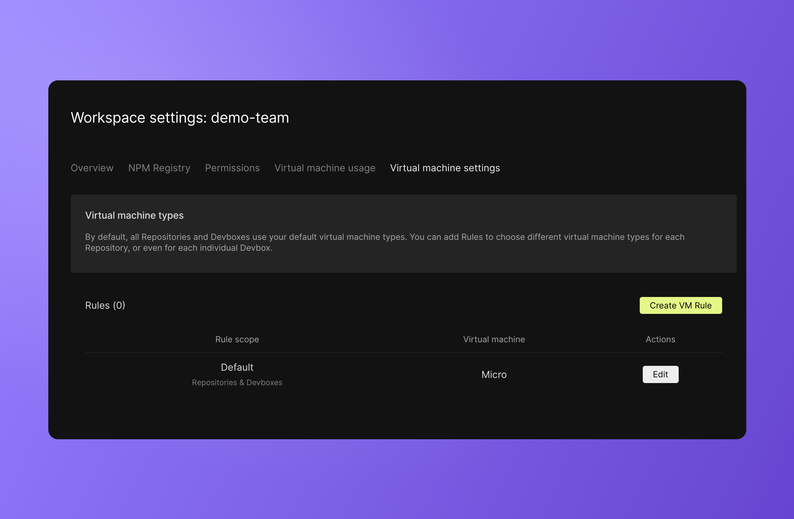

import { Callout } from 'nextra-theme-docs'

# Controlling VM Usage

A workspace can control the use of virtual machines in several ways. The functionalities described below allow workspace admins to increase predictability of VM usage and credit spend.

## Privacy

VM runtime is billed to the workspace that owns the Devbox or Repository. VMs are required to run the code regardless of whether or not the code is being actively developed. This means that workspaces are responsible for the runtime of any project in their workspace, including running previews or spinning up the code for `read-only` users.

Making Devboxes private allows workspace admins to have finer control over total VM spending. For this reason, Devboxes are created as private by default. Devbox and Sandbox privacy defaults can be controlled via the `Permissions` tab in the [workspace portal](https://codesandbox.io/t/permissions).

## Templates

VM runtime for templates is covered by CodeSandbox. By setting a Devbox as a template, you can share your work without worrying about the costs associated with non-workspace users running your Devbox. 
Once a Devbox is in a template state, it cannot be edited. If you want to continue making changes to the Devbox, you will need to switch it back out of template mode. 

## VM settings

Each workspace has a range of VM sizes to choose from. The range of options varies depending on the subscription tier of the workspace. 
By default, all Devboxes and repositories will run on [Micro](/learn/credit-usage/credits). The default VM size can be changed on the VM [settings page](https://codesandbox.io/t/vm_settings) in the workspace portal.

Individual Devboxes or repositories can be set to run on VMs other than the default. 
To set the VM of a Devbox or repositority, you can create a rule. This helps ensure that heavy compute projects get the power they need without increasing VM usage across the other projects.

## Spending limit
On-demand credits will never exceed the spending limit. 
Once subscription credits are used, the VMs will start running on on-demand credits. These credits will be aggregated and added to the end-of-month invoice.

Every Pro workspace is required to have a maximum spending limit to ensure that there are no surprise bills at the end of the billing cycle. 
The spending limit is initially set during the Pro subscription check-out flow. Workspace admins can adjust this spending limit in the workspace portal at any time. 

Once the on-demand credits hit that limit, all Devboxes and Repositories will enter a [frozen state](/learn/plans/pricing-faq#my-devbox-or-repository-is-frozen-what-does-that-mean) until more credits have been added or the next billing cycle begins.