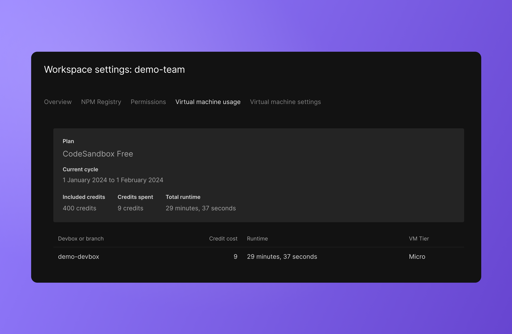

import { Callout } from 'nextra-theme-docs'

# Monitoring usage

VM usage is reported in the workspace portal under the [virtual machine usage tab](https://codesandbox.io/t/usage).
In this view, you can find information about the workspace credit spend during the current cycle as well as logs from each session.

## Understanding VM starts and stops

There are two different ways to wake up a VM:
- Through user interaction, such as spinning up a repository branch in the editor.
- Through automated jobs like making an HTTP wake-up call to start up a preview.

These job-related starts usually add up to a few minutes of VM time in a billing cycle. They are accounted for in the VM usage logs in the workspace portal. 

CodeSandbox automatically uses hibernation timeouts to conserve VM use. If a VM has not had any interactivity for 30 minutes, it will hibernate until woken up again.
