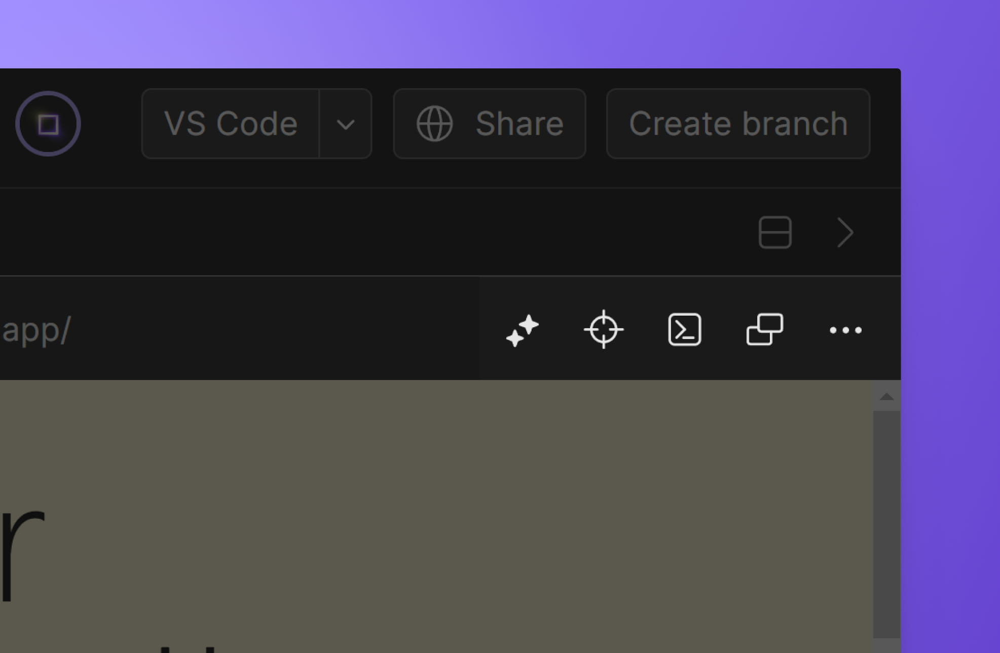

import { Callout } from 'nextra-theme-docs'

# Preview

When you run a task that opens a server on a port, that port will be attached to the [Task](./task), turning it into a preview-type [DevTool](./devtools). A list of all available previews is shown at the top of the DevTools tab. When opened, a preview will, by default, be displayed on the right side of the editor in a new tab.

As explained below, CodeSandbox automatically proxies the preview into a publicly-accessible URL using a structure similar to `https://:id-3000.csb.app`. This URL can be opened and shared with others to get standalone version of the preview.

{/* ## Primary Preview
Because a project may have several different previews, you can manually mark a specific one as a primary preview. One way to achieve that is by clicking the three dots icon at the right of the preview window and then click on "Set as primary preview".

Primary previews will open by default when the project is spun up. */}

## Preview Utilities

Previews come with a few built-in utilities that make it easier to interact with previews and edit their underlying code. These are presented as icons at the right side of the preview's address bar and will be described below in the order in which they are shown.

### AI Element Refactor
This preview utility, identified by the ✨ icon, is powered by [Boxy](/learn/ai/boxy). It allows selecting a component in the preview (by clicking the element) and then writing a prompt that will be used by Boxy AI to refactor the component.

<Callout emoji="⚠️">
This utility is only available on projects with certain stacks.
</Callout>

### Element Inspector
Shown at the right of the AI element refactor, the element inspector allows quickly finding the source code of a specific element shown in the preview. After clicking on the element inspector icon to activate it, you can then click an element on the preview to automatically open the corresponding code in the editor on the left.

<Callout emoji="⚠️">
This utility is only available on projects with certain stacks.
</Callout>

### Chrome DevTools

CodeSandbox previews also provide a built-in [Chrome DevTools](https://developer.chrome.com/docs/devtools/) utility.

This provides all the debugging functionality from Chrome DevTools, including the _Elements_, _Console_, _Sources_, _Network_ and _Application_ tabs.

<Callout emoji="⚠️">
Because this utility is powered by Chrome, it is not available on non-Chrome browsers such as Firefox and Safari.
</Callout>

### Opening preview on a new tab
The preview utility shown at the very right simply allows you to open a standalone preview in a new browser tab.

## How do Previews work?

### WebSocket Override

We’ve patched WebSocket to ensure that the right URL is always accessed when opening a websocket. In case you try to access [`http://localhost:3000`](http://localhost:3000) using a websocket, we’ll rewrite it to `https://:id-3000.csb.app` so the socket automatically connects to the right URL.

This will often make hot module reloading work out of the box for frameworks like Vite.

### Service Worker Proxy

If possible, we try to install a service worker in the preview that will proxy requests to [`localhost:3000`](http://localhost:3000) to the corresponding dev URL. The service worker only proxies URLs that are going to localhost, or URLs that go to e.g. `https://:id-3000.csb.app:4000`.

#### Configuring the Proxy

The service worker proxy is enabled by default, but you can turn it off in two ways:

1. Configure the dev server to respond with the `x-csb-no-sw-proxy` header when sending HTML responses (any value is possible)
2. Or, set `csbLocalProxyEnabled` to `false` in the localStorage: `localStorage.setItem('csbLocalProxyEnabled', 'false');`.

When the `x-csb-no-sw-proxy` header is set, we automatically add `localStorage.setItem('csbLocalProxyEnabled', 'false');` to the returned HTML from the dev server.
