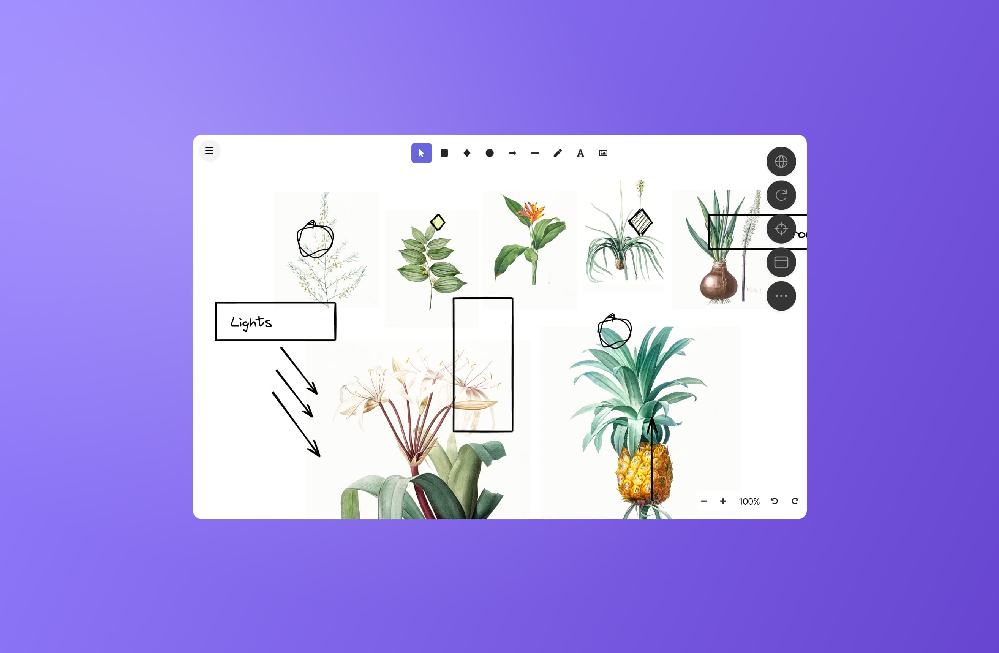

# Preview

When a running task that opens a server on a port, that port will be attached to the task, turning it into a Preview-type DevTool. Previews appear at the beginning of the list when you toggle the DevTools dropdown. 

## How do Previews work?

### WebSocket Override

We’ve patched WebSocket to ensure that the right URL is always accessed when opening a websocket. In case you try to access [`http://localhost:3000`](http://localhost:3000) using a websocket, we’ll rewrite it to `https://:id-3000.csb.app` so the socket automatically connects to the right URL.

This will often make hot module reloading work out of the box for frameworks like Vite.

### Service Worker Proxy

If possible, we try to install a service worker in the preview that will proxy requests to [`localhost:3000`](http://localhost:3000) to the corresponding dev URL. The service worker only proxies URLs that are going to localhost, or URLs that go to e.g. `https://:id-3000.csb.app:4000`.

#### Configuring the Proxy

The service worker proxy is enabled by default, but you can turn it off in two ways:

1. Configure the dev server to respond with the `x-csb-no-sw-proxy` header when sending HTML responses (any value is possible)
2. Or, set `csbLocalProxyEnabled` to `false` in the localStorage: `localStorage.setItem('csbLocalProxyEnabled', 'false');`.

When the `x-csb-no-sw-proxy` header is set, we automatically add `localStorage.setItem('csbLocalProxyEnabled', 'false');` to the returned HTML from the dev server.
