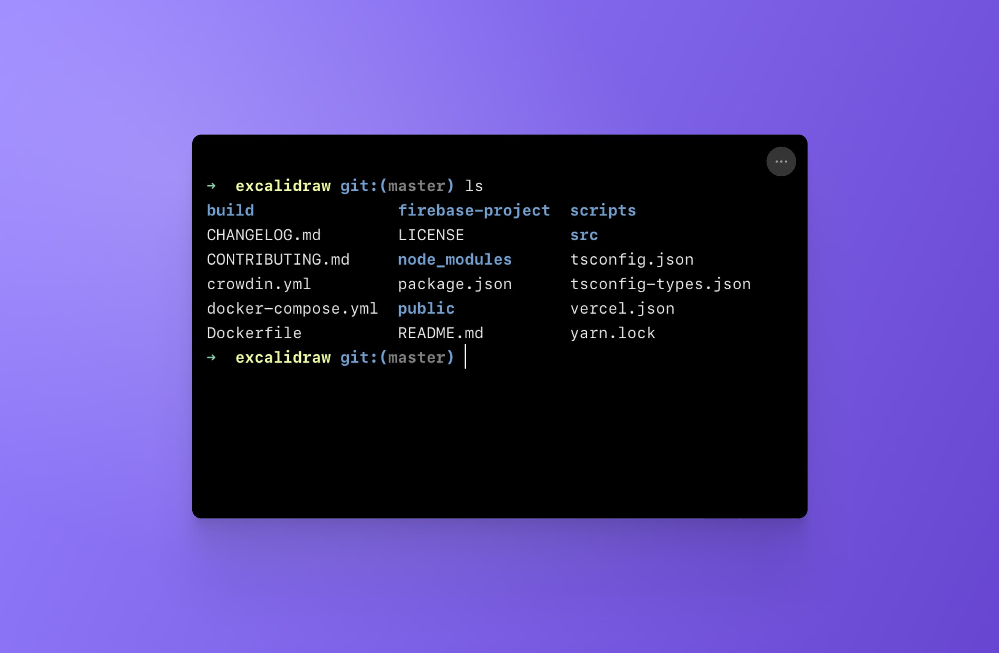
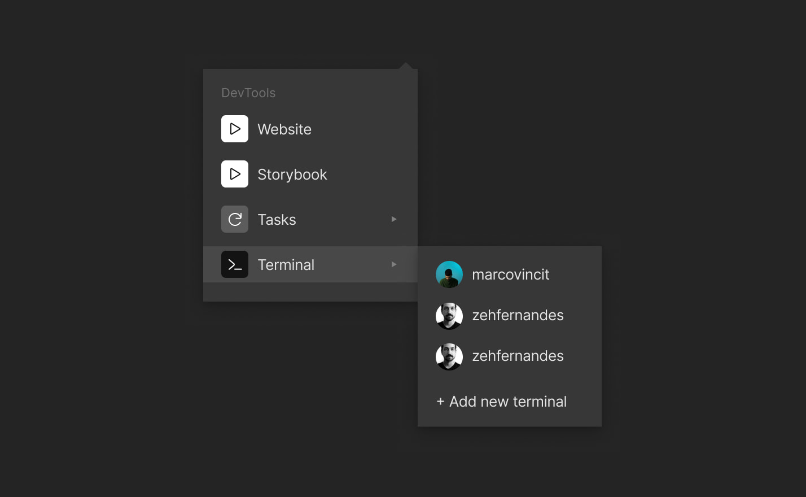

import { Callout } from 'nextra-theme-docs'

# Terminal

 
One of the benefits of working on CodeSandbox Repositories is running the terminal without ever leaving the Web Editor. The Terminal DevTool is connected to a Virtual Machine and behaves like your local terminal, accepting any commands you are used to running, such as:
- git operations
- bash scripts
- package-management commands
- start servers

Besides opening a fresh instance, you can also see other people's terminals. This is especially useful when someone on your team encounters errors or has a hard time fixing a problem. You can quickly jump in and instantly understand what is going on.

Because each branch is a new environment, commands you run in the terminal will not affect other branches.

<Callout emoji="⭑">
If you need to run commands that depend on sudo/root access,  check out our [tutorial about using nix](/tutorial/getting-started-with-docker)
</Callout>

