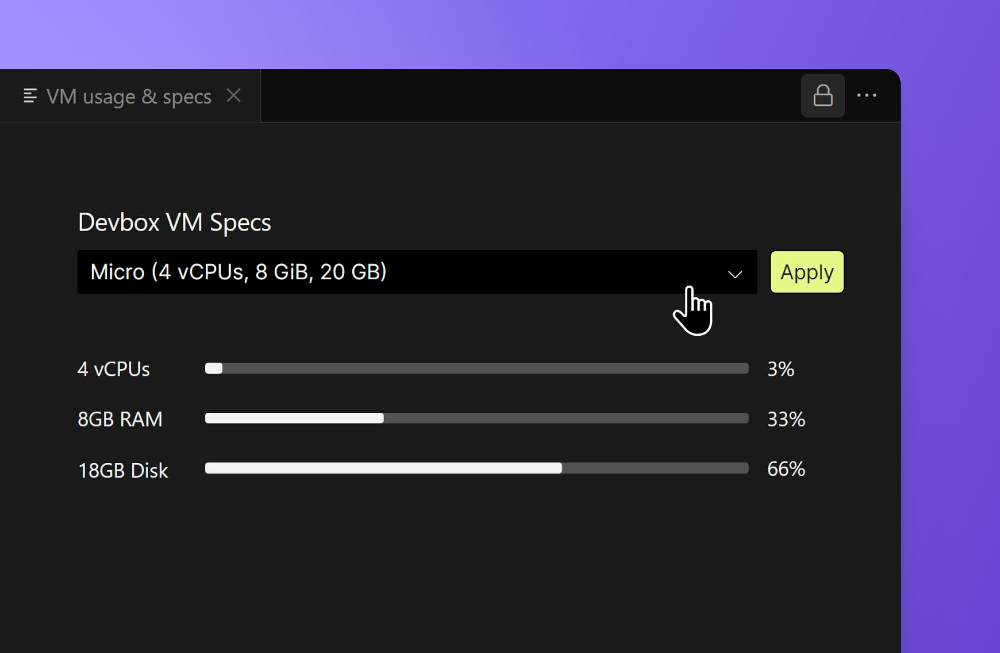

import { Callout } from 'nextra-theme-docs'

---

# Upload static files

You can upload static files (images, documents, videos, etc.) to your projects in CodeSandbox. To use this feature, drag the desired files from your computer and drop them into the file explorer on the sidebar. The files will then be automatically uploaded.

Alternatively, you can use the icons shown at the right of the _WORKSPACE_ heading (top of the file explorer), right-click the file explorer, or press `$mod+alt+F` to open the file input.

## Upload limits

CodeSandbox file upload limits vary depending on the runtime and plan.

For Sandboxes, the limits are:

- 50 MB total storage per user with a Free account.
- 1000 MB total storage per user with a Pro account.

<Callout emoji="⚠️">
The limits for Sandboxes are not specific to each Sandbox; they are shared across all Sandboxes created by the same user.
</Callout>

You can check your current Sandbox storage usage from your [Dashboard](https://codesandbox.io/dashboard/) by clicking your user avatar at the top right and then "Storage".

For Devboxes and repositories, the limits are:

- 20 GB total storage per Devbox or repository branch for all workspaces.

You can check your Devbox storage usage by clicking the CodeSandbox icon at the top left of the editor and then "Virtual machine". This will open a new DevTool displaying the current VM usage, including storage.

