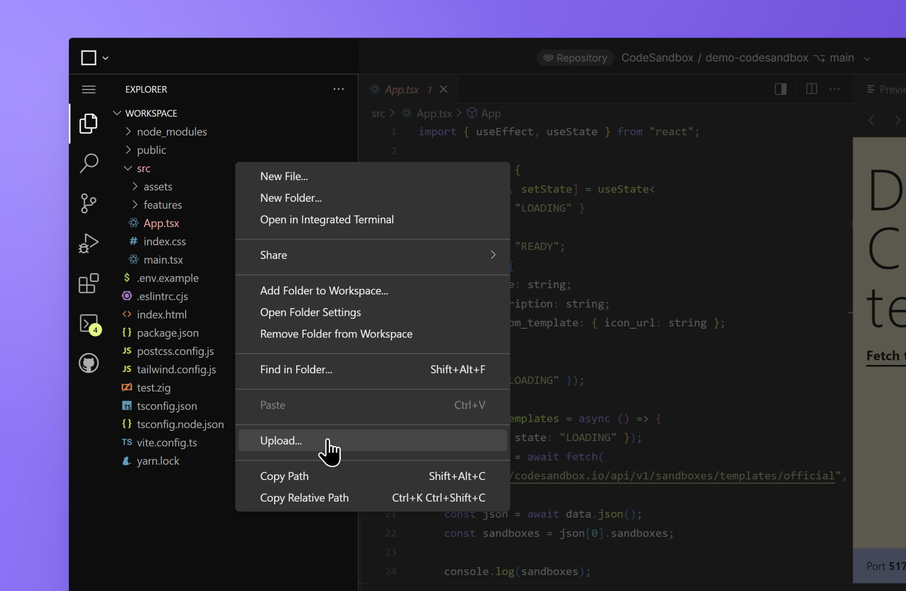

# Upload static files

You can upload static files to your projects in CodeSandbox. To use this feature, drag the desired files from your computer and drop them into the file explorer on the sidebar. The files will then be automatically uploaded.

Alternatively, you can use the icons shown at the right of the _WORKSPACE_ heading (top of the file explorer), right-click the file explorer, or press `$mod+alt+F` to open the file input.

CodeSandbox allows you to upload several different file types (images, documents, videos, etc.) with up to 7MB each in our Free plans and 30MB each in our [Pro plans](https://codesandbox.io/pricing).