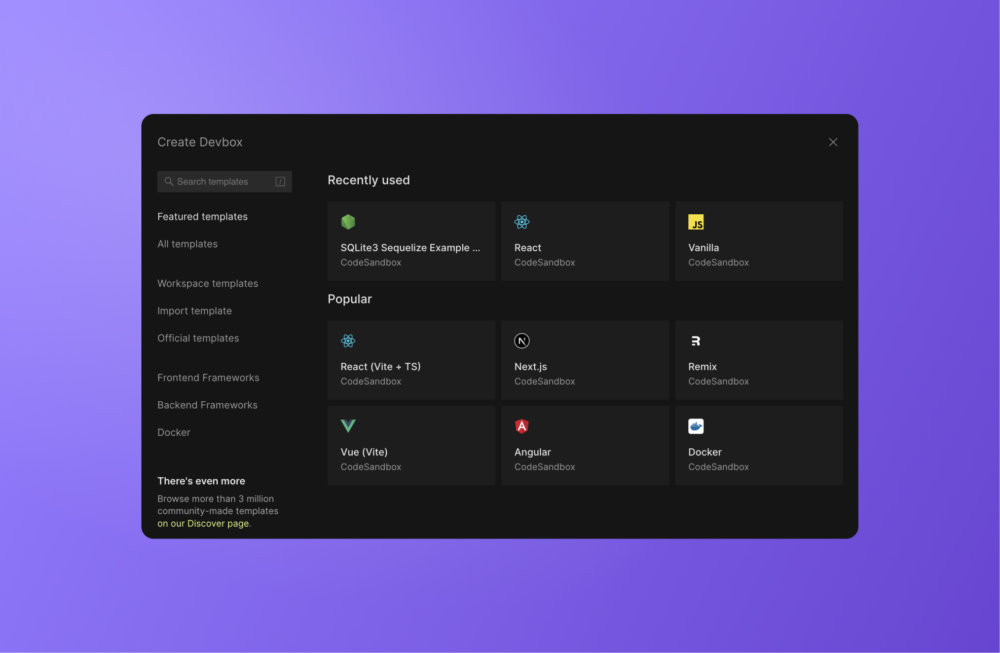

import { Callout } from 'nextra-theme-docs'

# Getting Started with Devboxes

CodeSandbox provides two development environments that are ideal for prototyping and rapid web development: [Devboxes](/learn/devboxes/overview) (which run in a microVM) and [Sandboxes](/learn/sandboxes/templates) (which run using browser resources).

For the majority of cases, we recommend starting your project as a Devbox (previously known as "Cloud Sandbox"), as they provide a faster experience with several unique features, since they run in our microVM infrastructure. You can find more about the differences of these two experiences on the [Devboxes Docs](/learn/devboxes/overview?tab=devbox).

This guide specifically focuses on Devboxes.

## Creating a Devbox

One of the best things about our Devboxes is that there are dozens of official templates you can use to start coding.

To get started, [open the `Create` Modal](https://codesandbox.io/d/) and browse through our selection of Devbox Templates.

The **`Create`** modal shows you collections of templates you can use as a base for your project. By default, "Featured templates" are shown first, a list that includes both the templates most recently used in your workspace and some of our most popular Devbox templates. You can also navigate the other tabs on the left of the modal for different collections of templates, or use the search at the top left.

Templates are automatically forked when you select them, so you can edit
and begin creating your own sandbox.

## Growing a Devbox into a Repository

When your prototype grows into a full project, you may want to add version control through git, to make updates and collaboration easier to manage.

CodeSandbox is specifically built to enable you to grow your project as big as you need.

You can scale your Devbox into a Repository by navigating to the git menu on the left sidebar and clicking _Create Repository_.

## Programmatically creating Devboxes

If you want to use our API to create Devboxes, refer to our [Define API](/learn/sandboxes/cli-api#define-api) documentation and be sure to add an additional `environment: "server"` parameter to the request body.