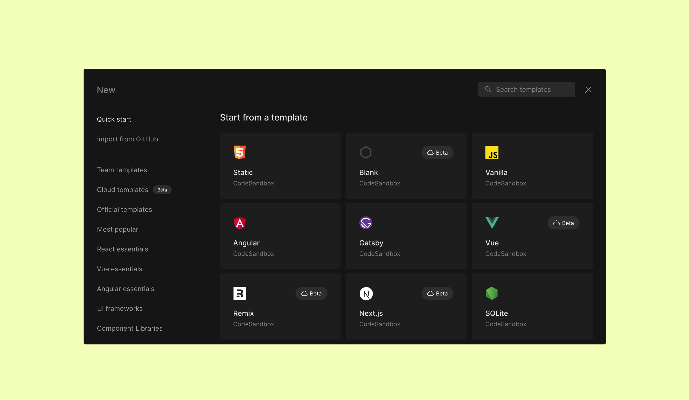
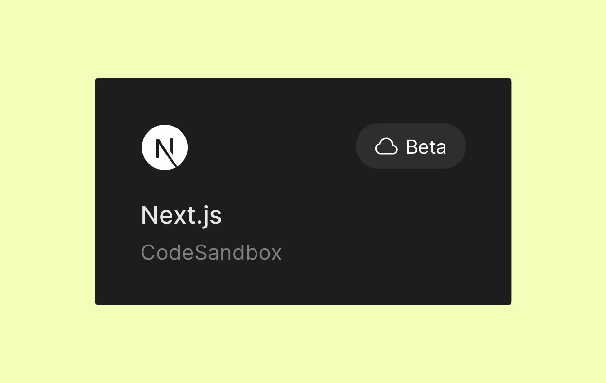

import { Callout } from 'nextra-theme-docs'

# Getting Started with Sandboxes

Sandboxes are a great way to get working on your idea with zero startup costs.

CodeSandbox provides both [Cloud Sandboxes](/learn/sandboxes/overview) (powered by microVMs, so they're more powerful) and [Browser Sandboxes](/learn/sandboxes/overview) (powered by your browser, so they are more limited).

The most popular way of creating a new Sandbox is the 'New' modal.

The **`New`** modal shows you collections of templates grouped first by relevance and then by broad category. This list is not comprehensive of all the Sandboxes that have been made by the community, however. If you want to browse other Sandboxes and Templates, you can explore everything in through the discover button at the top right of the dashboard sidebar.

All the cloud sandboxes have a cloud icon in the top-right corner of the card.

Templates are automatically forked when you select them, so you can edit
and begin creating your own sandbox.

## Using Cloud Templates

Cloud Sandboxes are an all-around great solution to help you prototype any app, regardless of the language you're using or the complexity of your project.

They have built-in [Docker support](/learn/environment/docker) and include several valuable features, such as collaborative [Terminals](/learn/repositories/terminal), [Tasks](/learn/repositories/task), and [VS Code integration](/learn/getting-started/setting-up-vscode).

<Callout>
Cloud sandboxes are built for scale. Our Free plan includes generous VM specs but you can easily [start a Pro trial](https://codesandbox.io/pro) to improve them.
</Callout>

One of the best things about our Cloud Sandboxes is that there are dozens of official templates you can use to start coding.

To get started, [open the `New` Modal](https://codesandbox.io/s/) and search through our selection of Cloud Sandbox Templates. You can recognize a Cloud Sandbox by the special _Cloud_ badge.

Templates are automatically forked when you select them, so you can edit
and begin creating your own sandbox.

  

## Growing a Cloud Sandbox into a Repository

When your prototype grows into a full project, you may want to add version control through git, to make updates and collaboration easier to manage.

CodeSandbox is specifically built to enable you to grow your project as big as you need.

You can scale your Cloud Sandbox into a Repository by navigating to the git menu on the left sidebar and clicking _Create Repository_.

## Programmatically creating Cloud Sandboxes

If you want to use our API to create Cloud Sandboxes, refer to our [Define API](/learn/sandboxes/cli-api#define-api) documentation and be sure to add an additional `environment: "server"` parameter to the request body.