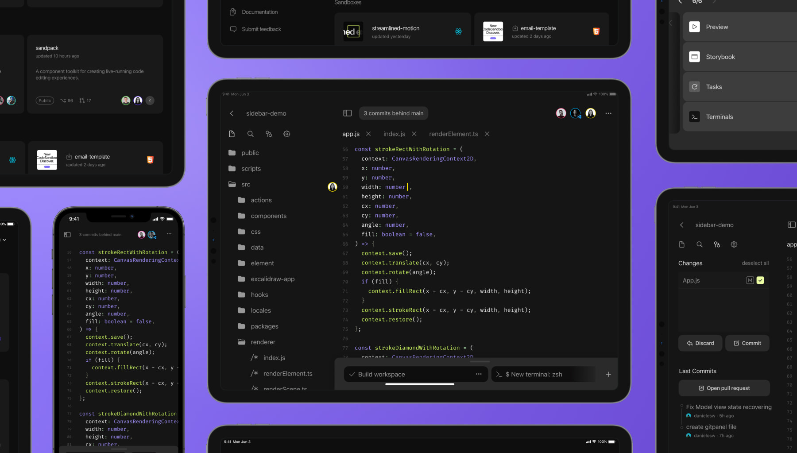

import { Tabs, WrapContent } from '../../../../../shared-components/Tabs'
import { Callout } from 'nextra-theme-docs'

# Editors

We provider many alternatives for you to code. Each option is built to help you focus on what matters: getting the work done without friction.

<Tabs tabs={["Web Editor", "VS Code", "iOS"]}>

<WrapContent>

## Cloud Web Editor

Introduced in 2022, the cloud web editor leverages the power of micro virtual machines to run project of any type and size. We recommend it as the first choice for daily development, reviewing code or quickly spinning up prototypes.

[Learn more](/learn/devboxes/editors?tab=devbox)

## Browser Sandbox Editor

Known and loved for years, this editor was built for rapid web development using only the power of the browser. Our cloud editor is gradually building out all the the features in placei in place within the browser editor. However, the browser editor remains available to everyone who still calls this home.

[Learn more](/docs/learn/devboxes/editors?tab=sandbox)

</WrapContent>

<WrapContent>
## Easily move between web and VS Code

Any project running in a Devbox may also be run in VS Code. Work from your local environment with your own configurations and shortcuts whilst remaining connected to the CodeSandbox development environment.

**Install the CodeSandbox VS Code extension and open any branch or Devbox directly in your VS Code editor.** 

[Install VS Code Extension](https://marketplace.visualstudio.com/items?itemName=CodeSandbox-io.codesandbox-projects)

## Opening a branch in VS Code

To start working in a branch on VS Code, open the branch in the Editor and click on the `Open in VS Code` button positioned in the bottom left corner. This will prompt you to install the CodeSandbox extension responsible for making the connection to our cloud development environment.

### Learn more

To get the most from your local setup, check our [VS Code Extension documentation](/learn/editors/vscode/overview).

</WrapContent>

<WrapContent>
## Keep working in the iPad or iPhone

<Callout emoji="ℹ️">
The CodeSandbox for iOS app is currently not supported.
</Callout>

**CodeSandbox for iOS** is a fully native development environment that brings the power of modern software development to your iOS device. Use your iPhone or iPad to develop any kind of application or collaborate in real-time with others.

[Go to the App Store](https://apps.apple.com/us/app/codesandbox/id1423330822)

</WrapContent>
    
</Tabs>
