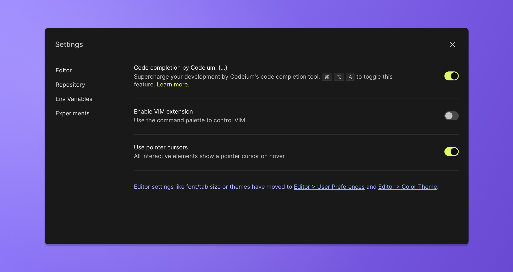
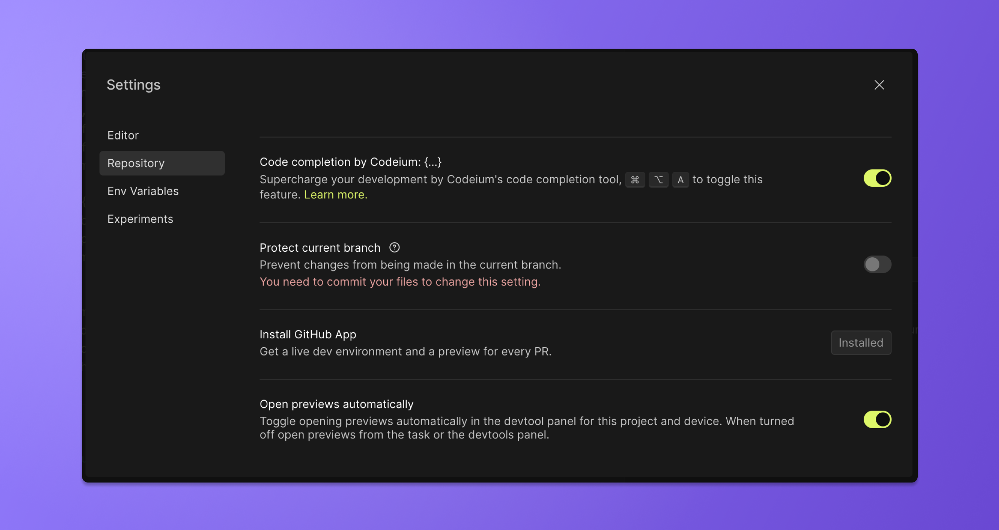
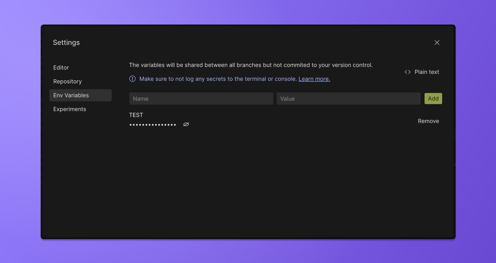

import { Tabs, WrapContent } from '../../../../../shared-components/Tabs'

# Settings

<Tabs tabs={["Web", "Desktop"]}>
    <WrapContent>
        ## Web editor settings
        Under the main menu you will find the editor settings. This view contains settings the editor and repository as well as management tools for environment variables and options to toggle on and off experiments. 

        ### Editor settings

        #### Codeium code completion
        
        Codeium code completion is turned on by default in most cases. If at any time you want to disable this feature, you can do so here.

        #### VIM
        
        For all the VIM users, this setting enables the use of the command palette to control VIM

        #### Pointer cursor
        Enabled by default, this setting determines if the cursor shows as a pointer over interactive elements

        

        ### Repository settings
        If developing on a repository, this settings panel provide option to 
        * toggle Codeium code completion for the specific repository
        * protect the current branch
        * install the GitHub App - once installed this provides a live dev environment and preview for every PR
        * manage default behavior for previews

        

        ### Environment variables
        This tab holds the environment variables set to a Devbox or Repository. 
        Learn more about secret management [here](/learn/environment/secrets)

        

        ### Experiments
        The product team will often launch experimental features as an opt-in experience. This tabs lists all the current experiments. You can toggle each these to explore what's cooking.  


    
    </WrapContent>
    <WrapContent>

        ## Default workspace extensions

        You can create the file `.vscode/extensions.json` in your repository to define the default extensions that should be installed for the repository. An example:

        ```json
        {
        "recommendations": ["esbenp.prettier-vscode", "dbaeumer.vscode-eslint"]
        }
        ```

        This will make sure that Prettier and ESLint are installed whenever someone opens the branch in VS Code.

        ## Default user extensions

        In case you have any personal extensions that you want to have in every branch, you can define those in your VS Code settings under the setting id `remote.SSH.defaultExtensions`. To change this setting, you can open VS Code settings (`CMD/Ctrl + ,`) and search for `remote.SSH.defaultExtensions`.

        You can copy your favourite VS Code extension ids, and put them in that setting. From then on, these extensions will be automatically installed in your branches.

        ## VS Code setting sync

        To sync your settings and keybindings between branches, you can enable VS Code Setting Sync. To learn more about how to set this up, you can check [here](https://code.visualstudio.com/docs/editor/settings-sync).

    </WrapContent>

</Tabs>
