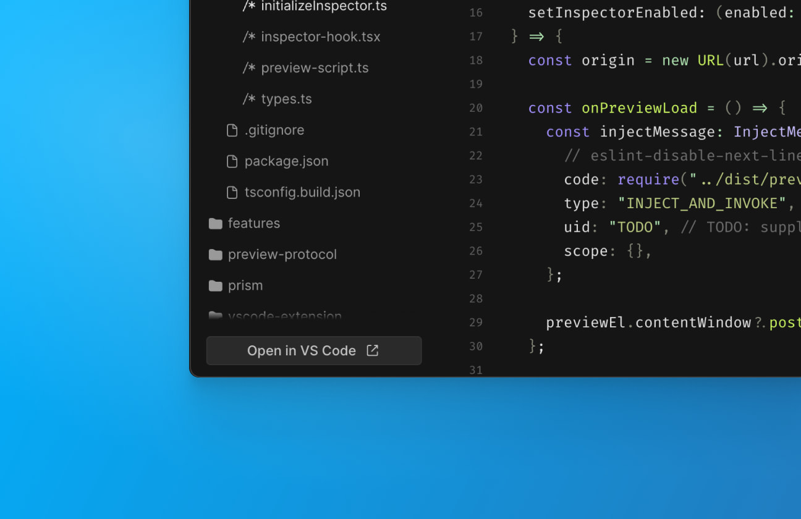
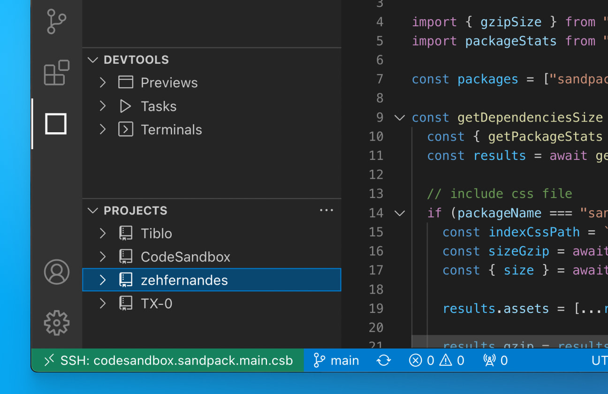
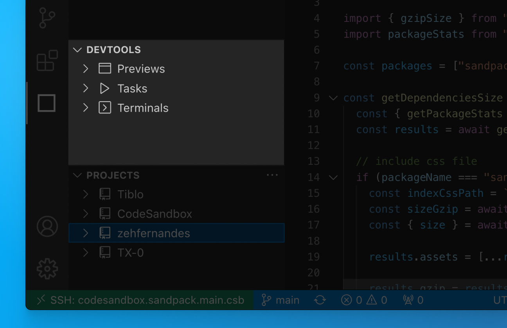
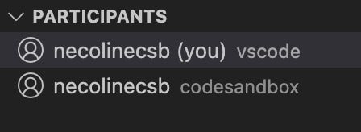
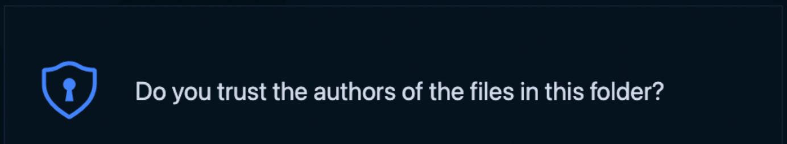

import { Callout } from 'nextra-theme-docs'
import Video from '../../../../../../shared-components/Video'

# VS Code


Open any branch directly in your local VS Code and use all the extensions and keybindings that you’ve already configured. On top of this, all editors can collaborate seamlessly, so your team members can follow your steps on VS Code without leaving the Web Editor.

<br/>
## Open your branch in VS Code

You can jump to VS Code at anytime from the browser



> We also support opening the branch [Using Visual Studio Insiders](./insiders).

Alternatively, you can do all your work in VS Code without accessing CodeSandbox on the web

1. Open the extension
2. Sign in if you haven’t already
3. Select the ‘Projects’ panel and select the project you want to work on. From there you can open a new branch or select an existing branch to open



You will only be able to select from a list of repositories that have been imported to CodeSandbox. If you don’t see your project in the list, check your dashboard on CodeSandbox to make sure everything is set up there first.

If at any point, you want to switch to the CodeSandbox editor, simply click ‘Open in CodeSandbox’ under the ‘Branch Control Panel’

<br/>
## DevTools

Just like in the CodeSandbox editor, you have access to running ports to view code changes in the browser. The available ports are listed in the panel. Clicking on a port will open a tab in your default browser



<br/>
## Live Collaboration

<br/>
### View collaborators

Once you are connected to the branch, you will be able to see a list of teammates that are active on the branch. You can see the list of collaborators as well as the environment they are working from. 



In this case, I am active in both VS Code and the CodeSandbox editor. 

### Multiplayer Changes

Changes that are made to a file are reflected in the editor of every user. Select the name of a collaborator to focus on the file and line that they are working on

<Video src="../../vscode-following.mp4" />
<br/>
## Reviewing PRs in VS Code

You can review PRs directly from VS Code while connected to CodeSandbox. To do this, you should install the [GitHub App of CodeSandbox](/learn/integrations/github-app). With this app, every PR will have a link to open the branch in VS Code.

We also recommend to install the [GitHub Pull Request](https://marketplace.visualstudio.com/items?itemName=GitHub.vscode-pull-request-github) extension, and configure it as a default extension in your user settings (as outlined [here](#default-user-extensions)). With this extension you can put comments on GitHub directly from your editor.

<br/>
## Settings & Extensions

### Default Workspace Extensions

You can create the file `.vscode/extensions.json` in your repository to define the default extensions that should be installed for the repository. An example:

```json
{
  "recommendations": ["esbenp.prettier-vscode", "dbaeumer.vscode-eslint"]
}
```

This will make sure that Prettier and ESLint are installed whenever someone opens the branch in VS Code.

### Default User Extensions

In case you have any personal extensions that you want to have in every branch, you can define those in your VS Code settings under the setting id `remote.SSH.defaultExtensions`. To change this setting, you can open VS Code settings (`CMD/Ctrl + ,`) and search for `remote.SSH.defaultExtensions`.

You can copy your favourite VS Code extension ids, and put them in that setting. From then on, these extensions will be automatically installed in your branches.

### VS Code Setting Sync

To sync your settings and keybindings between branches, you can enable VS Code Setting Sync. To learn more about how to set this up, you can check [here](https://code.visualstudio.com/docs/editor/settings-sync).

<br/>
## FAQs

### What to do about that recurring trust modal?



This modal shows up every time you launch a project folder in a new container. Since every branch will be opened with a unique SSH url, VS Code will ask you to verify that you trust the connection. This is an important security notice used to confirm that the user understands the  connection being established before opening the code. You can read more about the modal [here](https://code.visualstudio.com/blogs/2021/07/06/workspace-trust).

### Do I have to be connected to live session on CodeSandbox in order to work on a branch?

It is possible to work in an “un-synced” state. In order for CodeSandbox features to work, the branch needs to established on a remote connection AND connected to Pitcher (see How it works for more information

### Who can access my code?

Only people on your CodeSandbox team with permissions to the repository may join as a collaborator. Repository permissions are carried over from GitHub. To add someone new to the team, provide access on GitHub and add them to the CodeSandbox. From there, they can access the code in the browser or follow the steps above to use VS Code.

### More Questions?

For questions and support, please use the community [Discord server](https://discord.gg/R32XxEGp4s).

