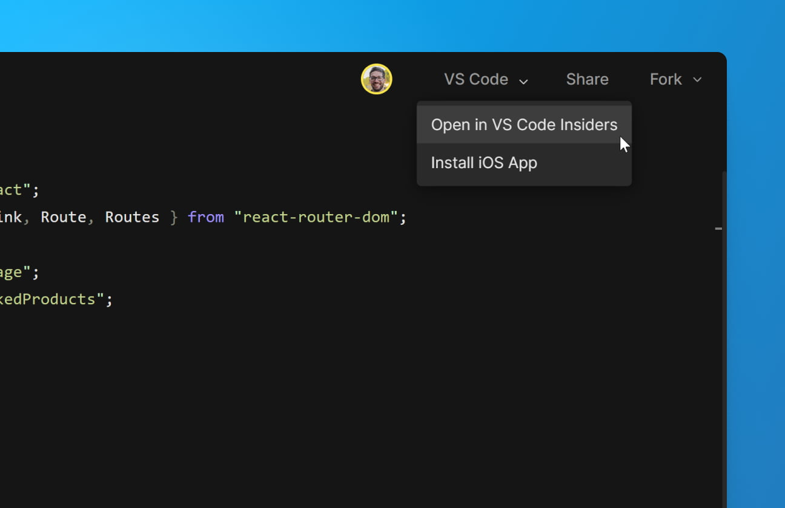
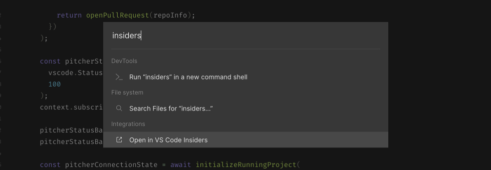

import { Callout } from 'nextra-theme-docs'

# Setting up VS Code

The CodeSandbox VS Code extension allows you to use VS Code to edit sandboxes and repositories on CodeSandbox.

This allows you to keep using your own extensions, keybindings and themes, while live collaborating with other people using CodeSandbox.

## Getting Started

1. If needed, install [Visual Studio Code](https://code.visualstudio.com/) for Windows *(7+)*, macOS *(10.11 +)*, or Linux.
2. Download and install the [CodeSandbox extension](https://marketplace.visualstudio.com/items?itemName=CodeSandbox-io.codesandbox-projects) for Visual Studio Code.
3. Wait for the extension to finish downloading and then reload VS Code when prompted.
4. Click on the CodeSandbox icon on the side menu and log in.
5. Connect to your project.

 
## How it works

When you connect to your CodeSandbox account and open a branch, a virtual container is spun up with [Remote - SSH](https://marketplace.visualstudio.com/items?itemName=ms-vscode-remote.remote-ssh) to allow you to access your code. At the same time, a connection is established with a CodeSandbox API called Pitcher. This is the service that powers all of the collaboration features across different editors, including the web and mobile editors. 

It is possible to work on the SSH connection while disconnected from Pitcher, but you should be mindful that other team members may be making changes to your branch while you are in an un-synced state, so be sure to commit often.

<Callout>
Only people on your CodeSandbox team have access to these repositories. 
</Callout>

So the VS Code extension connects directly to the container with an SSH connection, bypassing Pitcher, where it operates directly with the FileSystem.

On top of this, we also connect to Pitcher, just like we do in the browser, where we "tie it together".

 
 

## Using Visual Studio Code Insiders

You can also open your work in [Visual Studio Code Insiders](https://code.visualstudio.com/insiders/) straight from the editor.

 
### In the editor

Once you open the branch, follow these steps:

1. Click on the dropdown icon of the "Open in VS Code" button.
1. In the dropdown menu, click on the "Open in VS Code Insiders" option.

 
### In the command palette

1. Open the command palette: MacOS: <kbd>SHIFT+CMD+P</kbd>; Windows: <kbd>SHIFT+CTRL+P</kbd>;
1. Type "insiders" into the command palette prompt;
1. Under the "Integrations" section, click on the "Open in VS Code Insiders" option.

 
### Preferences

CodeSandbox will remember your choice of IDE and will use it as the default button action next time you wish to open your project in Visual Studio Code.

You can reset your choice at any time by selecting a different option from the "Open in VS Code" dropdown menu.

## VS Code Tips and Tricks

To get the most out of VS Code, like automatic extension installation, we recommend you to follow these [tips and tricks](/learn/getting-started/setting-up-repository#vs-code-configuration).