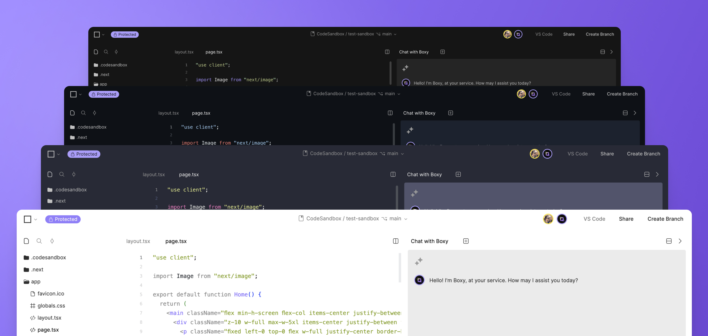

import { Callout } from 'nextra-theme-docs'

# Themes

The cloud editor provides several preset themes you can choose from to change the color scheme of your editor.

## Overview

CodeSandbox provides some popular themes created by the dev community that you can apply to the cloud editor. Currently, we only offer a few preset themes, with dark and light options:

- CodeSandbox (dark / light)
- [GitHub's Default (dark / light)](https://marketplace.visualstudio.com/items?itemName=GitHub.github-vscode-theme)
- [Vesper (dark)](https://marketplace.visualstudio.com/items?itemName=raunofreiberg.vesper)
- [Dracula (dark)](https://marketplace.visualstudio.com/items?itemName=dracula-theme.theme-dracula)
- [poimandres (dark)](https://marketplace.visualstudio.com/items?itemName=pmndrs.pmndrs)

## Changing the theme

There are two ways to change themes:

- Open the Project settings and select the **Themes** tab.
- Access the command palette in the editor using <kbd>⌘</kbd> + <kbd>K</kbd> and search by `themes`.

