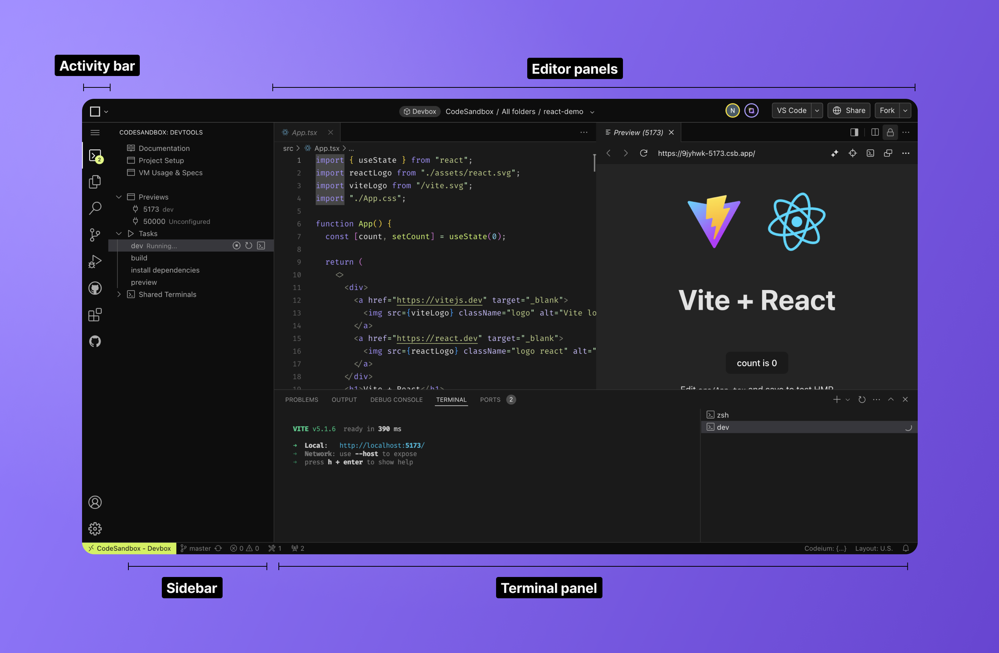
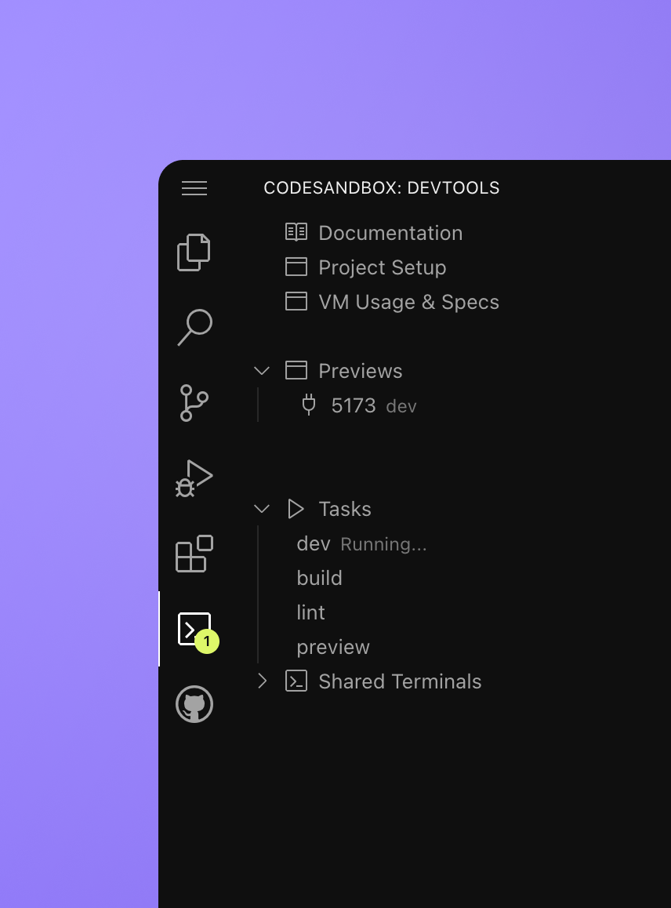
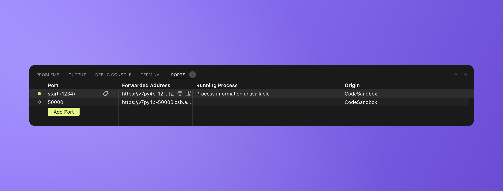
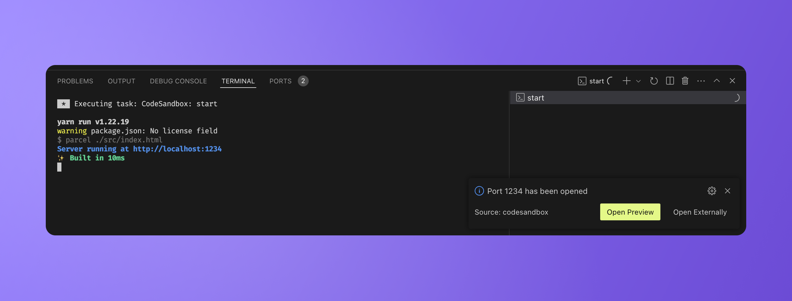
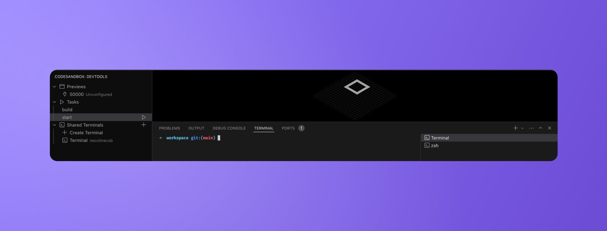

import { Callout } from 'nextra-theme-docs'

# VS Code for the web

Productivity is key when working in an editor. For this reason, we have embedded our CodeSandbox features within the powerful and well loved VS Code.

The web editor looks and functions like VS Code for the web, with a few built-in CodeSandbox tools.

The activity bar holds all the tools for managing your developer experience. The web editor will always contain the standard VS Code tools, namely the File explorer, Search, Source Control, Run and Debug and the Extension marketplace.

The web editor also comes with a CodeSandbox Devtool extension which provides access to all the unique Code Sandbox features (more on that later).

In the Terminal panel, you can see all the running tasks, private terminals, and shared terminals (managed by CodeSandbox).

While the layout is entirely customizable, the standard layout opens previews, and support tools like documentation and setup tools in the right editor panel.

## Things to know when switching over

All CodeSandbox DevTools, such as previews, tasks, and shared terminals, are now nested under the “CodeSandbox DevTools” panel on the left sidebar. From there, you can manage all these DevTools when needed, but most of these actions will still be performed automatically, just like before. For example, if your project has a task configured that runs the dev server on VM startup, it will automatically open the preview for you when you open the project.

## Tasks, Terminals and Previews

Preview ports, Tasks and shared terminals are controlled through the devtool extension in the sidebar.

**Tasks**

Tasks set in the `tasks.json` file will be listed in the Devtool extension. Here you can see all the tasks, run, stop or restart the tasks.

**Previews**

Tasks that spin up previews will be accessible in a port listed under `Previews`

You can also see the list of ports in the terminal panel under `Ports`

**Terminals**

There are three types of terminals:

1. Native terminal: This is managed by VS Code when you open a terminal. It is a private terminal to you that others don’t see.

2. Tasks: These are run by Pitcher, an internal CodeSandbox service. The output of a task is streamed to a terminal window and displayed as a VS Code task so it is easily distinguishable from a terminal.

   

3. Shared terminal: In the sidebar, you can open a shared terminal. This terminal is managed by Pitcher, allowing others to see it.

   
