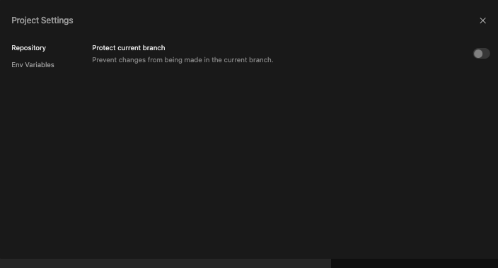
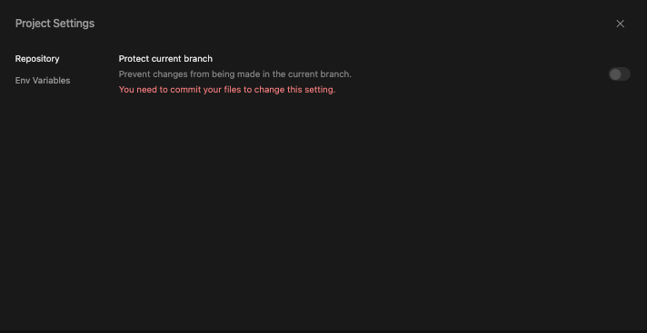

import { Callout } from 'nextra-theme-docs'

# Branch Protection 

You can toggle the branch protection status for your projects in CodeSandbox. This works for both Devboxes and repositories.

The `main` branch of a project is protected by default to prevent unauthorized or accidental changes. However, you might want to change this setting if you want to commit directly to `main`, namely if you're working as a solo developer or on a smaller project. 

To change this setting for your project, take the following steps:

1. Open your project in the web editor 
2. Select the menu on the top left 
3. Select `Project Settings` and click on `Repository` 
4. Toggle on or off 

<Callout emoji="💡">
   	 If you unprotect your main branch, you would need to commit any changes to be able to toggle the protection on again. 
</Callout>

