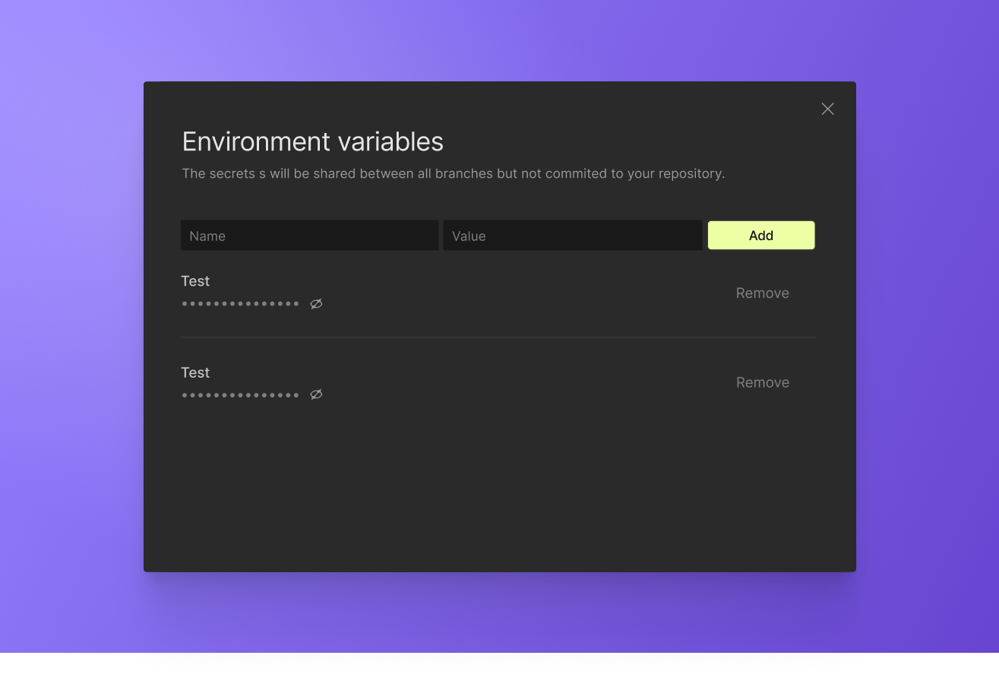
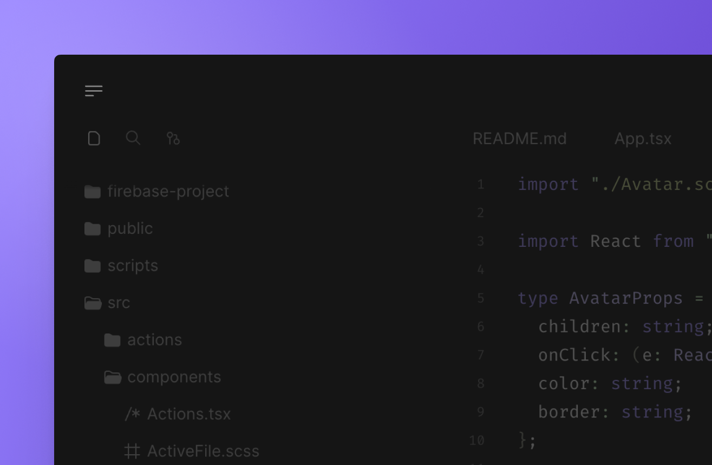
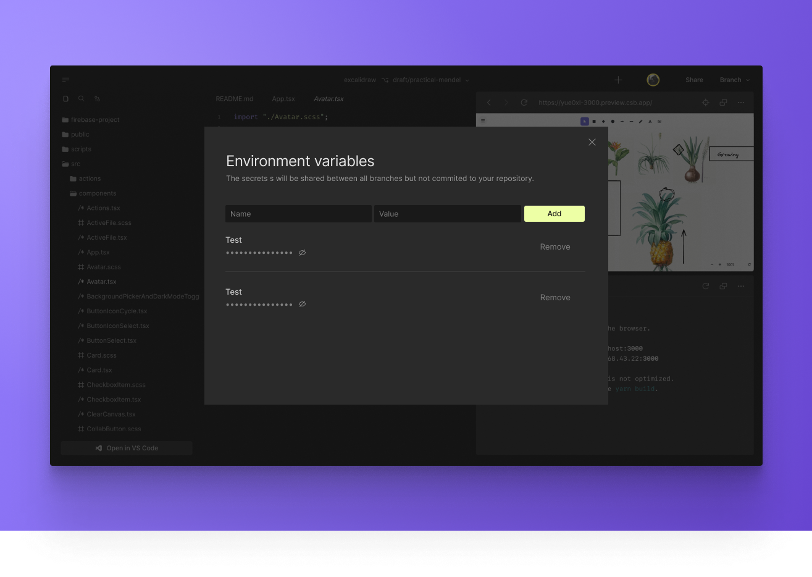

import { Callout } from 'nextra-theme-docs'
import Video from '../../../../../shared-components/Video'

# Environment variables and secrets

You can configure environment variables and secrets in your project, such as settings for your project or access tokens for APIs.

This works both for Devboxes and repositories.

### Repository Configuration

Secrets and environment variables are shared across all branches, but you need to restart your VM instance after making changes for them to take effect.

### Devbox Configuration

When setting environment variables for Devboxes, we ensure that any fork of this sandbox will not include these environment variables. Because of this, forks will be a bit slower, as we cannot clone the memory snapshot.

### Storage and Encryption

Environment variables are stored in our database, AES-encrypted. The encryption key is rerolled from time to time on an unannounced schedule and it is stored separately from the database.

### Privacy

Environment variables will only be viewable by people who have write access to the project. However, keep in mind that for public projects (sandboxes or repositories), any user can still view logs of your running tasks. So make sure to not log any sensitive information.

We also make sure that environment variables do not travel to forks of VMs, and we'll make sure not to use memory snapshotting for clones.

### Best Practices

If you want to only add environment variables that are not secret, we recommend setting them using a `.env` file instead of using our secrets modal. The advantage of using `.env` is that forks will remain fast, as we can use a memory snapshot, and you can configure environment variables per branch.

If you're planning to store secrets, we recommend using the secrets feature.

## Setting env variables and secrets
### From the UI

1. Open your project in the Web Editor.
2. Open the **Menu** through the icon in the top left corner.

3. Click on the **`Env variables`** item.
4. Add your configurations.

5. From the Editor's menu, press `Restart` to reload the workspace.

### From the command palette

1. From the Editor, open the command palette using <kbd>⌘</kbd> + <kbd>K</kbd>. 
2. Type `Add environment variables`.

3. Add your configurations.
4. From the editor's menu, click to `Restart` the workspace.

### Manage environment variables and secrets

You can review and change the existing environment variables and secrets by following the steps above.

Don't forget to restart your workspace so that any changes take effect.