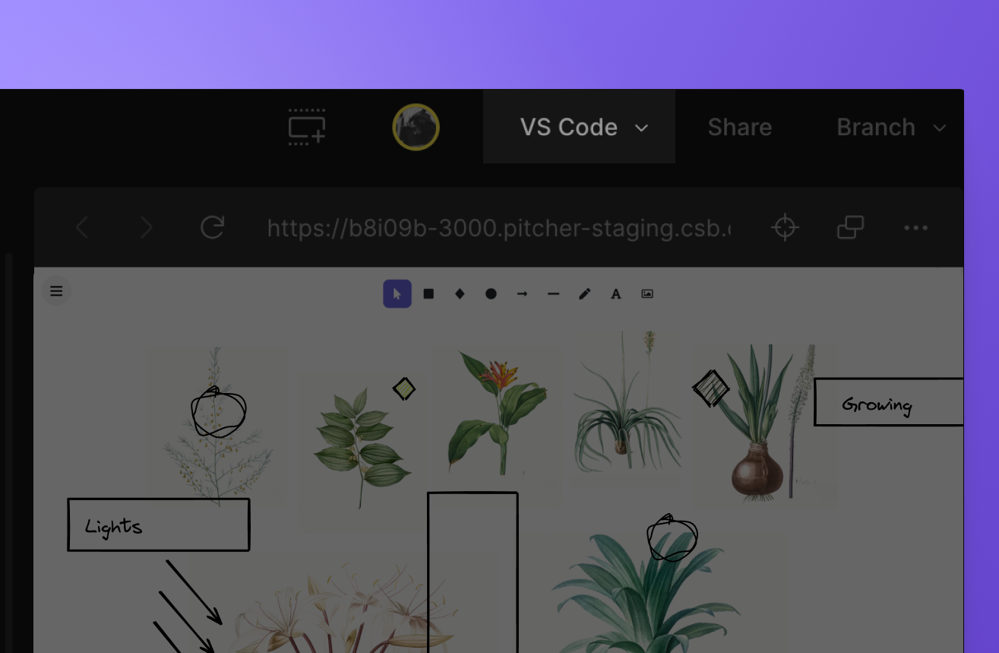

import Callout from 'nextra-theme-docs/callout'
import ButtonDoc from '../../../components/ButtonDoc'
import { VSCODE_DOCS_URL, IOS_DOCS_URL } from "../../../../../shared-components/contants.js"

# Keep working on VS Code

CodeSandbox Projects has a first-class integration with the VSCode editor. This means that you can open any branch directly in your local VSCode editor, where you can use your own extensions while being connected with the CodeSandbox development environment. In addition, our extension provides you additional collaboration and workspace related features.

    <ButtonDoc title={<>Go and install the  VS Code Extension</>} cta="Install" description="" link="https://marketplace.visualstudio.com/items?itemName=CodeSandbox-io.codesandbox-projects" />
    <ButtonDoc title={<>Learn more about  VS Code and Projects</>} cta="Read documentation" link={VSCODE_DOCS_URL} />

## Opening in VSCode

There are multiple ways to open a branch in VSCode. The easiest way is to open the branch in the CodeSandbox editor, and by clicking on "Open in VSCode" in the bottom left.

As soon as you click the button, you will be prompted to install the CodeSandbox extension which is responsible for making the connection with the cloud development environment.

### Learn more

To get the most from your local setup <a href={VSCODE_DOCS_URL}>go check the VS Code Extension documentation</a>
