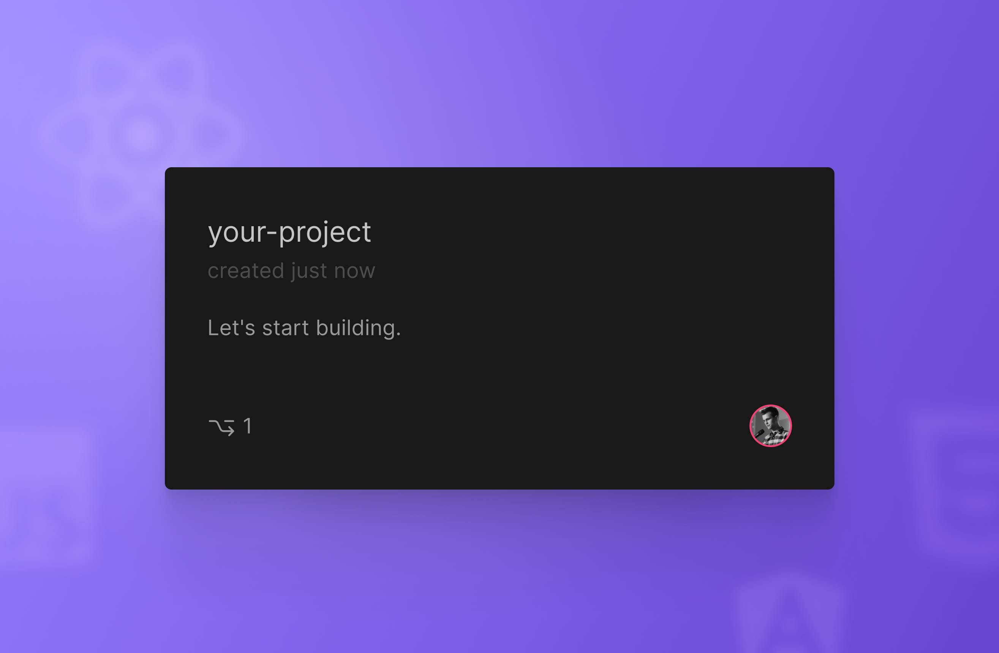

import Callout from 'nextra-theme-docs/callout'

# Your first project

You can start working on a project by importing an existing repository from GitHub or creating from a template.

    
## Importing a project

1. Go to the new **[Projects Dashboard](https://codesandbox.io/p/dashboard)**.

2. From the left sidebar, click on the **team** (personal or another) you want to import your project into. New teams can be created through the [Sandbox Dashboard](https://codesandbox.io/dashboard).
  
3. Click on the **`New Project`** button.
    
4. Enter a valid **GitHub URL*** or choose a repository from the pre-loaded **repository list**. 

 <Callout emoji="*⃣️">
    **Valid GitHub URLs**
    
    `https://` `github.com/` `:org/` `:repo`
    - Include the protocol, such as `https`;
    - Don't include branch name;
    - for example `https://github.com/facebook/react`.
  </Callout>

    - If the search does not return any matches, click on the **`Show all`** button under the last repository visible in the list to load more repositories.

    - If not all your GitHub organizations are listed in the dropdown, click on **`Manage GitHub integrations`** and grant the required permissions.
  
 
6. Click on **Import**. 

## Creating from a template

1. If you wish to create from a template, go to your team's page and click on the **`New Project`** button.
    
1. Choose a template from our selected list of templates displayed in the right column.
 
1. Select in which **GitHub organization** you wish to create this repository.

1. Choose a **Repository name**. This name will be the same one used in Projects and GitHub.

1. Click on **`Create project`**.

## Troubleshooting
   
#### **Permission errors while importing a project**
    
    - Check your team's permission to open CodeSandbox Projects.
    
    - Check your **repository permission on GitHub**. 
    You need to have `write` permission on Github to be able to import the project. Currently, we’re working on enabling the import of public repositories where you only have `read` access.
    
    - Check your **GitHub permissions**. 
    CodeSandbox Projects requires full git access to be able to import and commit. If you face any you might face some authentication errors, follow the steps to reset your github permissions.
    
    
#### **Resetting Github permissions**

1. Go to the **[Sandboxes Dashboard](https://codesandbox.io/dashboard).**

1. Click on the **Menu icon** at the top right of the screen.

1. Click on **Preferences**.

  
  
4. Go to **Integrations**. 

5. **Sign out from GitHub and sign in again** to reconnect your GitHub Account. This will fix all potential permission issues. 
  

#### **Invalid authorization code on Firefox and Safari**
    
    Safari and Firefox block popups by default. Please make sure you give the domain permission (through browser settings) or refresh the page after you opened the popup and try again.

    
    