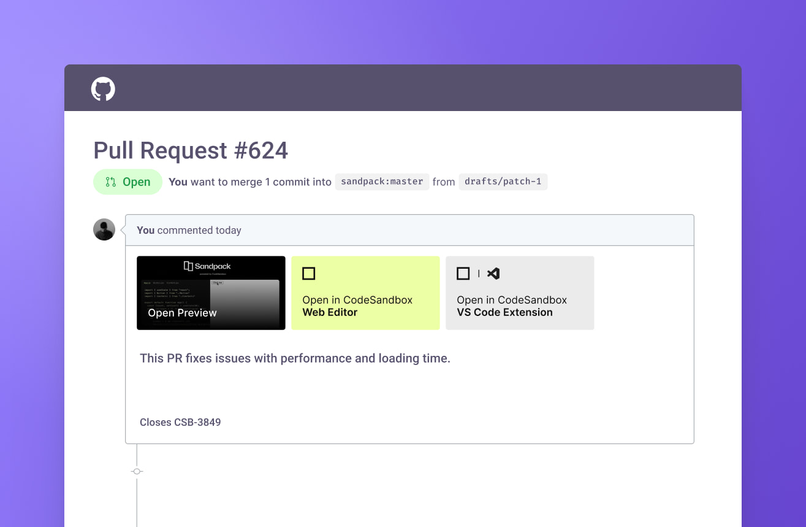
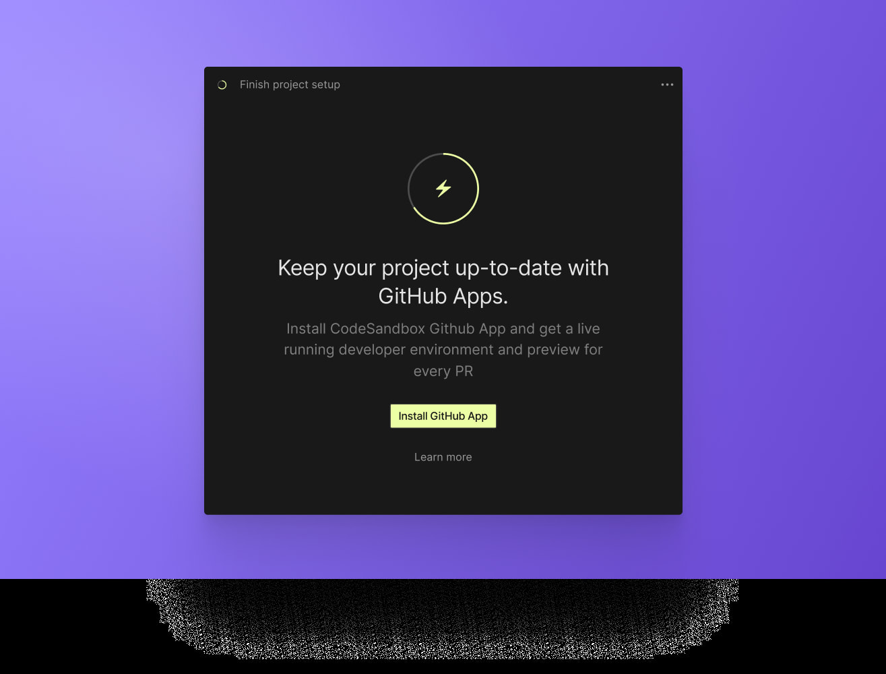
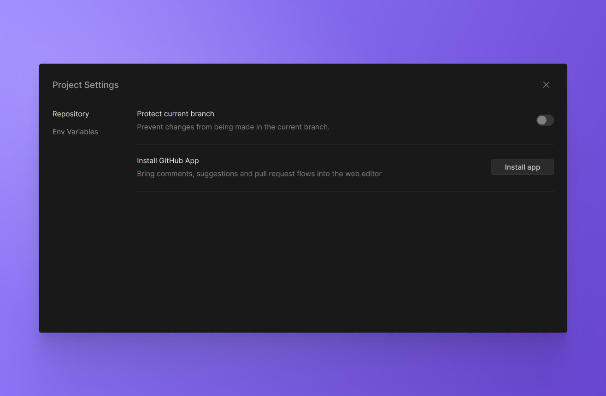

# GitHub App

The CodeSandbox GitHub App allows you to streamline your development and review process.

It brings a [higher level of integration](#i-approved-a-github-oauth-app-when-i-created-my-codesandbox-account-why-do-i-need-another-github-integration) between CodeSandbox and GitHub, with several benefits to your project:

- Automatically add links to open your code in CodeSandbox or jump right into a preview of the running code from any pull request.
- Add previews of the running code as **Deployments** in the GitHub UI, enabling access for reviewers and CI tools.

We're always looking for ways to make CodeSandbox a seamless part of your development workflow, and our GitHub App can really accelerate how you review PRs.

### Pull Request Links

The integration between CodeSandbox and GitHub allows you to automatically add links to each pull request to accelerate the review process.

{/* NOTE: Project settings not yet available in the client */}

{/* This functionality can be enabled or disabled in your project settings. */}



#### Open in Web Editor

This link opens the branch in the CodeSandbox web editor.

Because branches running in CodeSandbox are fully collaborative, you will be able to see any running previews, tests, or other DevTools that the PR's author left open to assist with the review process.

#### Open in VS Code Extension

If VS Code (or VS Code Insiders) is your preferred development environment, you can open the branch directly from this link, which uses [remote-ssh](https://code.visualstudio.com/docs/remote/ssh).

#### Open Preview(s)

These links will take you directly to a preview environment—or a standalone DevTool of a running preview task—depending on your task configuration.

### Deployments

If your project has preview tasks configured, CodeSandbox can add [Deployments](https://docs.github.com/en/repositories/viewing-activity-and-data-for-your-repository/viewing-deployment-activity-for-your-repository) to GitHub for easy access to running previews.

These deployments provide easy access for individuals, as well as programmatic access for CI tasks using the [GitHub API](https://docs.github.com/en/rest/deployments).
Look for entries like the following:

```json
{
    // Deployment fields...
    "environment": "CodeSandbox (Task Name)",
    "payload": {
        "provider": "CodeSandbox",
        "codesandbox": {
            "preview_url": "...",
            "shortid": "...",
            "task": "..."
        }
    }
}
```

Don't worry if you have other services creating deployments for your project; CodeSandbox will only manage deployments with `"provider": "CodeSandbox"` in the payload.

For more complicated projects, CodeSandbox will create one deployment for each task configured with a preview.

Make sure to [configure the `preview` field](/learn/repositories/tasks#preview-field) in your tasks for them to show up in the deployments.

{/* NOTE: Project settings not yet available in the client. */}
{/* This functionality is disabled by default, and can be enabled in your project settings. */}

## Installing the CodeSandbox GitHub App



The CodeSandbox GitHub App can be installed by...

- An individual user, for some or all of the repositories owned by that user.
- An organization admin, for some or all of the repositories in that organization.
- A repository admin, for that specific repository.

However, it is possible to request the installation of the CodeSandbox GitHub App in repositories where you don't have the necessary permissions. Organization owners and repository admins will receive a notification on GitHub and via email asking them to approve or deny the request.

Whenever you open a repository that doesn't have the CodeSandbox GitHub App configured, you will see a modal (as pictured above) with an "Install GitHub App" button, which will take you through the setup.

You can check the status of the installation at any time by navigating to a repository on CodeSandbox, clicking the CodeSandbox icon on the top left, then going to _Project Settings_, and finally checking the details shown under _Install GitHub App_.



Alternatively, you can configure the CodeSandbox GitHub App through its official [GitHub App Page](https://github.com/apps/codesandbox).

## Privacy and Permissions

Our GitHub App allows CodeSandbox to retrieve some information about your GitHub account and, in some circumstances, to make changes on GitHub on your behalf.

You can select specific repositories or grant access to all repositories in an organization.
This selection can be changed at any time in the [GitHub Settings](https://docs.github.com/en/authentication/keeping-your-account-and-data-secure/authorizing-github-apps).

For more information, check out the [GitHub App documentation](https://docs.github.com/en/authentication/keeping-your-account-and-data-secure/authorizing-github-apps).

## FAQs

#### I approved a GitHub OAuth App when I created my CodeSandbox account. Why do I need another GitHub integration?

This GitHub App is different from the OAuth integration required by Sandboxes and Repositories. The [OAuth integration](https://gitHub.com/settings/connections/applications/c07a89833b557afc7be2) allows CodeSandbox to import repositories from GitHub, while the CodeSandbox GitHub App allows CodeSandbox to provide the features listed above.

#### Why is the CodeSandbox GitHub App asking for additional permissions after I've already installed it?

Occasionally, we need to modify the permissions of the CodeSandbox GitHub App in order to support new features.
GitHub requires users to approve the new permissions before they take effect.

Following are some additional details about changes we've made:

- **31 August 2022**: Added `deployments` permission in order to add a deployment to the GitHub UI for each preview task.
  This feature will only be active if (1) branch deployments are enabled for the project, and (2) task previews are configured in `.codesandbox/tasks.json`.

You can review the App's permissions at any time by choosing **Configure** from the official [CodeSandbox GitHub App Page](https://github.com/apps/codesandbox).
