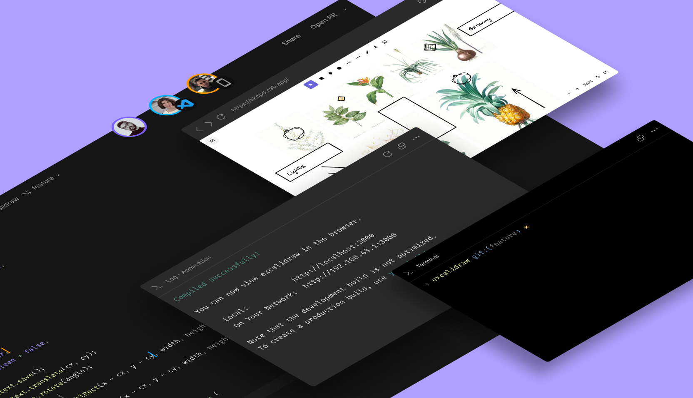

import ButtonDoc from '../../../components/ButtonDoc'
import Hero from "../../../../../shared-components/Hero.js"
import { Tabs, WrapContent } from '../../../../../shared-components/Tabs'

<Hero 
  title={<>Code anything from idea to production.</>}
  subtitle="CodeSandbox is a cloud development platform that empowers anyone to code, collaborate, and ship projects of any size from any device in record time."
/>

CodeSandbox provides many alternatives for you to code. Each option is built to help you focus on what matters: getting the work done without friction. 

<Tabs tabs={["Web Editor", "VS Code", "iOS"]}>

<WrapContent>
## Browser Sandbox Editor
  Known and loved for years, this online editor is built for rapid web development. Use this editor to prototype quickly, experiment easily, and share creations with a click. 
   
  [Learn more](/learn/sandboxes/editors) 
   
## Cloud Web Editor
    Our new web editor is part of a larger effort at CodeSandbox to increase the accessibility of complex tools like git, setup, review flows, contributions, and visualizing components. 
     
  [Learn more](/learn/repositories/editors) 
    
</WrapContent>

<WrapContent>
## Keep working on VS Code

**Install the CodeSandbox Projects VS Code extension and open any branch or cloud sandbox directly in your VS Code editor.** Work from your local environment with your own configurations and shortcuts whilst remaining connected to the CodeSandbox development environment.

    <ButtonDoc title={<>Get the  VS Code Extension</>} cta="Install" description="" link="https://marketplace.visualstudio.com/items?itemName=CodeSandbox-io.codesandbox-projects" />

## Opening a branch in VS Code

To start working in a branch on VS Code, open the branch in the Editor and click on the `Open in VS Code` button positioned in the bottom left corner. This will prompt you to install the CodeSandbox extension  responsible for making the connection to our cloud development environment.

### Learn more

To get the most from your local setup, check our [VS Code Extension documentation](https://codesandbox.io/docs/vscode).    
</WrapContent>

<WrapContent>
## Keep working in the iPad or iPhone

**CodeSandbox for iOS** is a full-fledged development environment that brings the power of modern JavaScript development to your iOS device. Use your iPhone or iPad to develop and run your Node.js applications or collaborate in real-time with others.

    <ButtonDoc title={<>Download  the iOS app</>} cta="Go to the App Store" description="" link="https://apps.apple.com/us/app/codesandbox/id1423330822" />

</WrapContent>
    
</Tabs>

