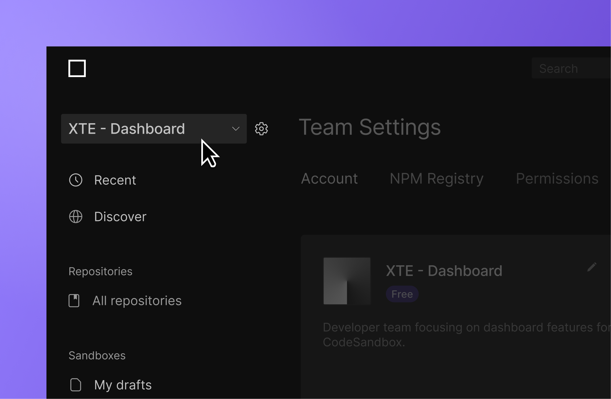
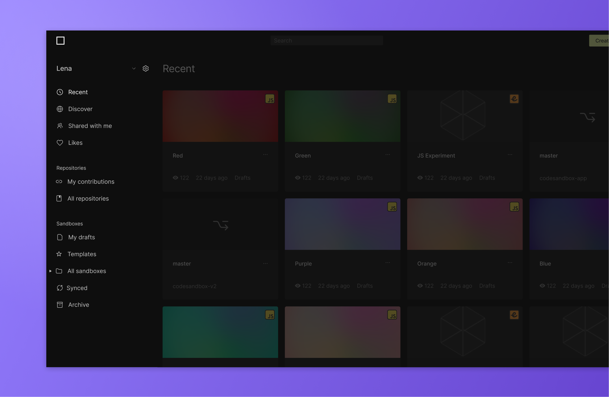
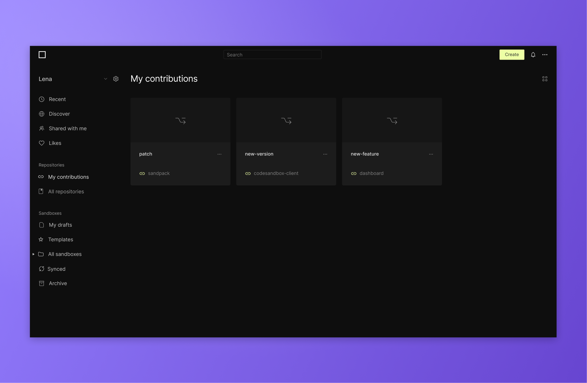
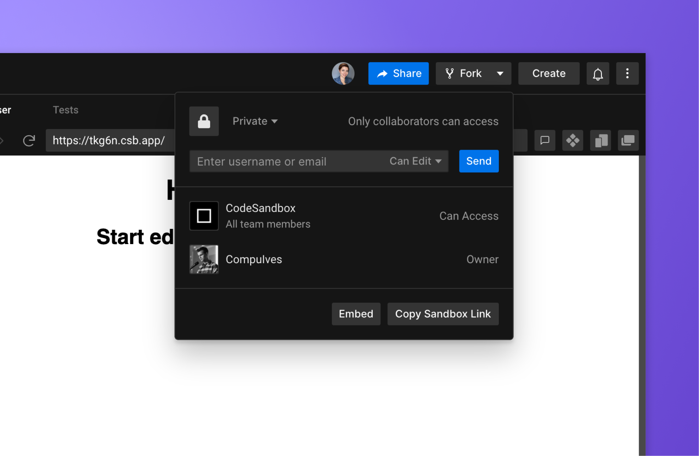
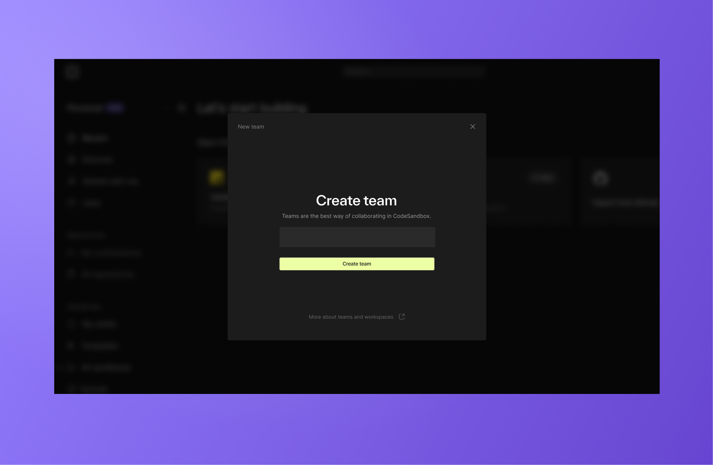
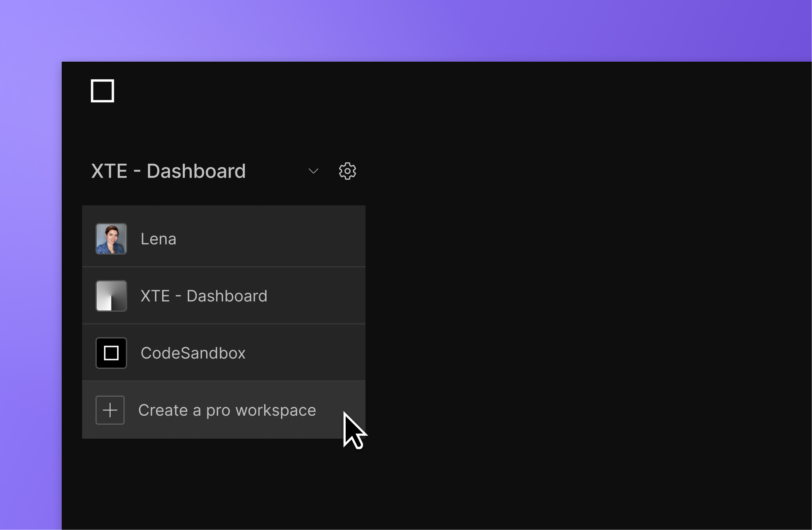
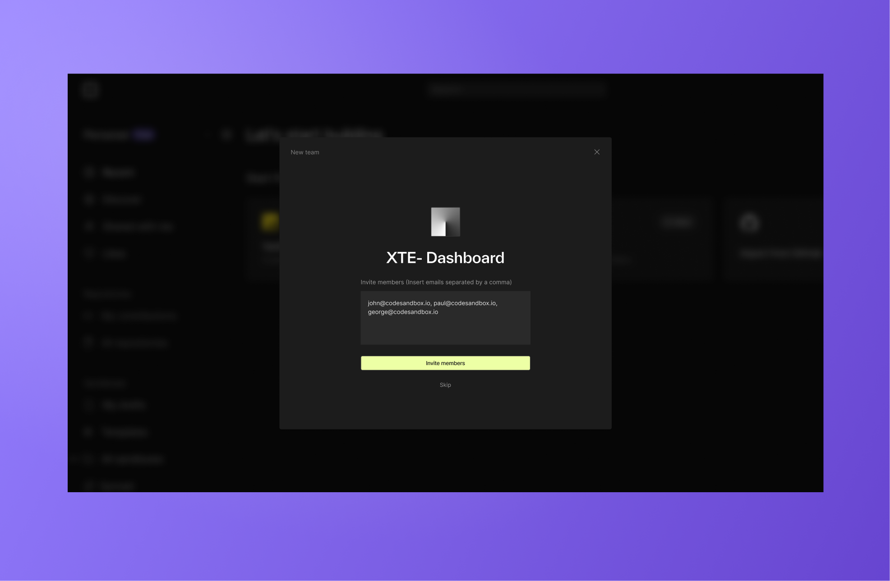
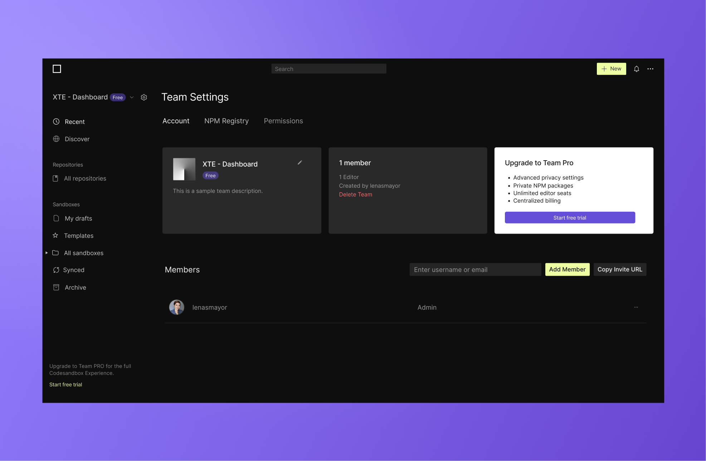
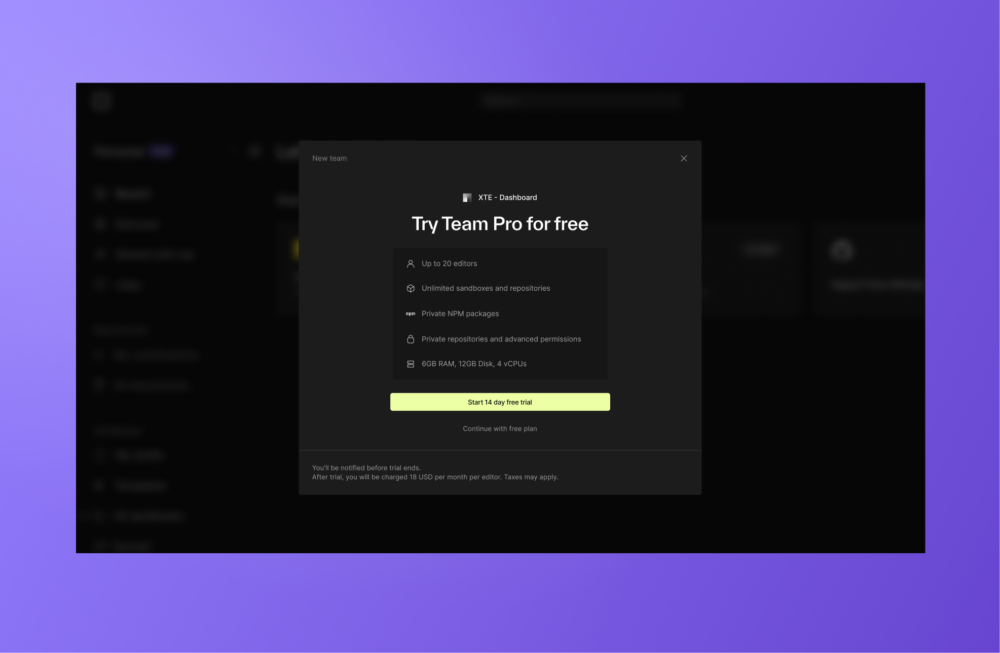

# Workspaces

## Personal Workspace

By default, when you set up an account, you will get a free personal workspace. This is a private space to create, prototype and build anything you like. You can think of this workspace as your local development transferred to the cloud. The personal workspace contains any public Sandboxes and Repositories you added while active in your workspace.

It also contains a section for your [open source contributions](/learn/getting-started/open-source#introducing-contribution-branches).

### Personal Pro
By upgrading to Personal Pro, you can expand your personal development experience in a number of ways: 

**Add Private Sandboxes and Repositories**

Personal Pro allows you to import your private Repositories or mark your Sandboxes as private. This accelerates your personal and professional endevours by extending access to your work beyond your local machine while keeping the code secure.

**Access more VM Specs**
Depending on the size of your projects, you may need an increase in memory and processing power. Personal Pro provides this increase so that you can work without friction.

Learn more about subscription differences on our [pricing page](https://codesandbox.io/pricing) 

## Team Workspace 

Team workspaces are where collaboration happens. 
If you want to work together with a friend or colleague on a Sandbox or Repository, create a team and invite them to join you. 

### Creating a Team

Creating a team is free and simple. You can create a team when you sign up:

Or create a team from the workspace selector:

### Inviting People to a Team

Team size varies depending on the subscription. Free teams may have up to 5 editors while Team Pro can have up to 20 editors. If you need more than 20 editors, please contact us for a customized plan that fits your needs. 

You can invite others by entering the email address that is connected to their account. They will
get a notification (the bell icon in the header) in CodeSandbox and an email when
invited to a new team. From there, they can accept or decline the invitation.

You can also invite team members that do not have a CodeSandbox account. They will be sent an email inviting them to create an account where they will have access to the team.

Team member invites can be sent during the team creation flow or anytime after through the team settings page.

### Managing Teams and Subscriptions

You can create and manage teams from the dashboard Settings page.
To find this, select your workspace and open the Subscription page.

Here you can see the team overview with subscription details, team members and roles.
Admins can edit team member access and roles here as well as edit the subscription. 

**Free Team**

Free Teams are a great way to get started with collaboration and test out team features. Free teams can work with public Sandboxes and Repositories, access the team workspace dashboard and synchronously work on branches together.

**Team Pro**

Team Pro opens the doors to full-scale team development by allowing access to private repositories and sandboxes. It also has better VM specs for a smooth experience working with large or complex codebases.

**Team Pro Trials**

If you aren't sure if Team Pro is right for you, you can start a free trial, allowing you and your team to try out Team Pro for free before making the jump.

### Collaboration on Teams

#### Sharing Sandboxes

You can choose which team you're in from the team drop-down at the top-left on
the dashboard. You can create new sandboxes directly from here or from a
different team, select one or more sandboxes, right-click and select 'Move to
Folder', where you can choose the team and folder you want to move them into.
All sandboxes in a team can be seen or edited by other team members, depending
on their permission levels. We keep track of who created the sandbox, though,
and only the original creator of the sandbox can delete it.

#### Collaborating on Sandboxes

You and other members can open a sandbox at the same time and see each other's
cursor to work together. You can still invite other people who aren't members of
the team to the sandbox or host a [live session](/learn/getting-started/collaborate-share).

#### Collaborating on Repositories

While Sandboxes are directly tied to a team, Repositories can exist in multiple workspaces at once. This means that users with write access to a repository may import it to their Personal Pro account while another team may import the same repository to work on it together.

Collaboration on branches will be restricted to the users that are accessing the Repository on their team account, but they will be able to read all branches connected to the Repository regardless of the workspace they are accessing it through.

 
