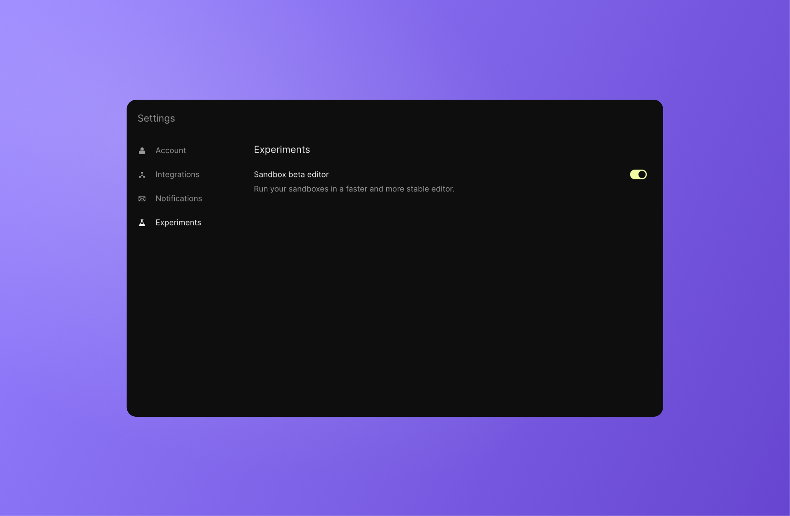

# Legacy Sandboxes

As of Nov 20, 2023, the Sandbox editor was replaced with a new unified editor experience that blends seamlessly into the Devbox experience. Legacy sandboxes will be supported during the beta era of the new editor (until the end of 2023). 

If for any reason, you want to go back to the old editor, you may do so by turning off the "Beta editor" feature through your user settings.

