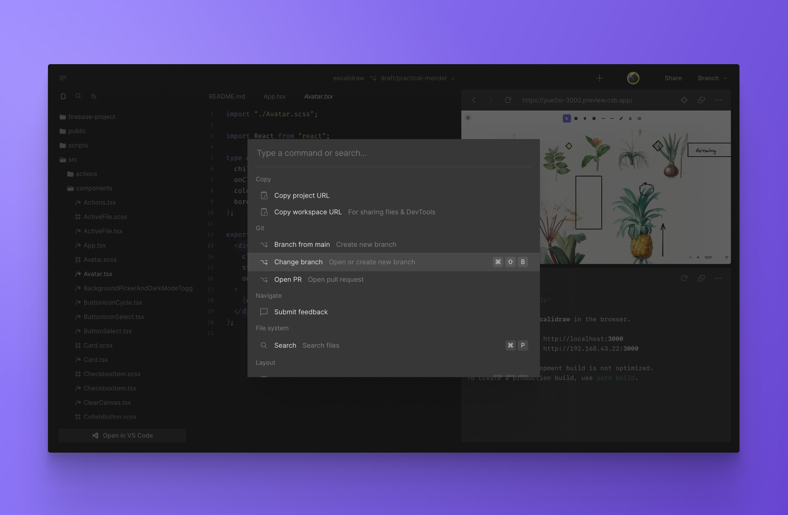
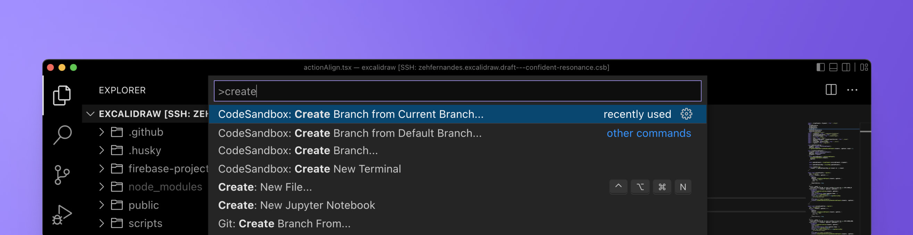

import { Callout } from 'nextra-theme-docs'
import Video from '../../../../../shared-components/Video'

# Command Palette

You can access nearly all the functionalities of CodeSandbox from your keyboard. Bring up the Command Palette on the Dashboard or in the editor using <kbd>⌘</kbd> + <kbd>K</kbd> and type away.

With the Command Palette, you can:
- Search files by path
- Change the editor layout
- Run tasks
- Manage env vars
- Run git operations
- Switch branches or create new ones

You can also run commands in the terminal directly from the Command Palette. Just type the command and CodeSandbox Repositories will open a terminal and execute it.

<Video src="../../command-runscript.mp4" />

If you use the [VS Code extension](https://marketplace.visualstudio.com/items?itemName=CodeSandbox-io.codesandbox-projects), CodeSandbox functionality is also available in VS Code’s command palette (<kbd>⇧</kbd> <kbd>⌘</kbd> <kbd>P</kbd>).

Keyboard shortcuts are also supported for the most common operations. For the complete list, go to the [Keyboard Shortcuts](./shortcuts) page.