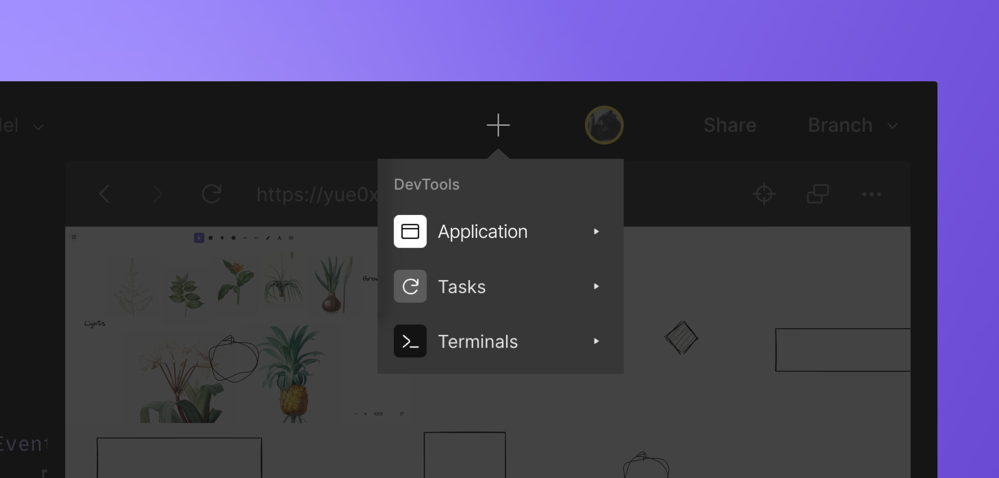
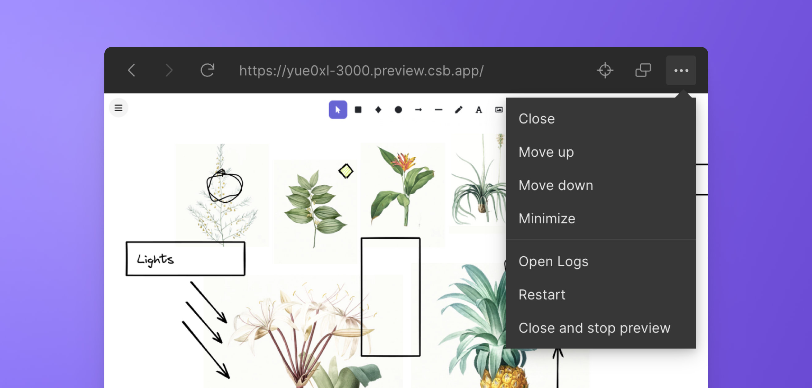

import { Callout } from 'nextra-theme-docs'

# DevTools
 

Devtools are tools for developers to work faster and more efficiently. They are useful for debugging, testing, and developing. They are collaborative by default, allowing you to share their content: a terminal output, a preview error, a console log...

Add as many devtools as you want. For one or two devtools, the layout will adapt to the viewport; more than three items will create a scroll. 

## Start a Devtool

You can add a Devtool by clicking on the `+` button on the header or by pressing <kbd>Cmd/Clt</kbd> <kbd>shift</kbd> <kbd>o</kbd> to open the DevTool menu.

## Manage your DevTool 

#### Minimize

Minimize the Devtool by clicking on the `...` icon in the top left corner and selecting the option `Minimize`. A minimized view is useful when you have limited viewport space and would like to still track some processes. 

#### Close 

Close the Devtool by clicking on the `...` in the top left corner and selecting the option `Close`. You can also close all devtools through the command palette (<kbd>Cmd/Clt</kbd> <kbd>K</kbd>) by typing `close all devtools`.

<Callout emoji="→">
Closing a devtool will not stop it, it will keep running in the background. If you want to stop the process, you must select the option `Close and stop`. 
</Callout>

#### Reorder

Drag and drop to reorder the Devtools, or click on the `...` button in the top right corner, then choose `Move up` or `Move down`.

#### Configure

You can control the name, position and what Devtools to run when you open the Web Editor. Check the [`tasks.json`](./task) documentation for more information on how to configure the Devtools.

<Callout emoji="⭑">
Setting up the Devtools makes it easier for non-developers to access and run your project.
</Callout>

## Available DevTools

- **[Preview](./preview)**
- **[Task](./task)**
- **[Terminal](./terminal)**

We are working on supporting other DevTools in the future, which may include:

- Test runner UI
- Viewing / editing [Design Tokens](https://css-tricks.com/what-are-design-tokens/) in a project
- Viewing components in isolation and changing their props from a UI
- [Postman](https://www.postman.com/) integration
- Bundle size analyzer

If you would like to collaborate on building a DevTool, please reach out to us at [support@codesandbox.io](mailto:support@codesandbox.io).