import { Callout } from 'nextra-theme-docs'
import Video from '../../../../../shared-components/Video'
import { Tabs, WrapContent } from '../../../../../shared-components/Tabs'

# Editors

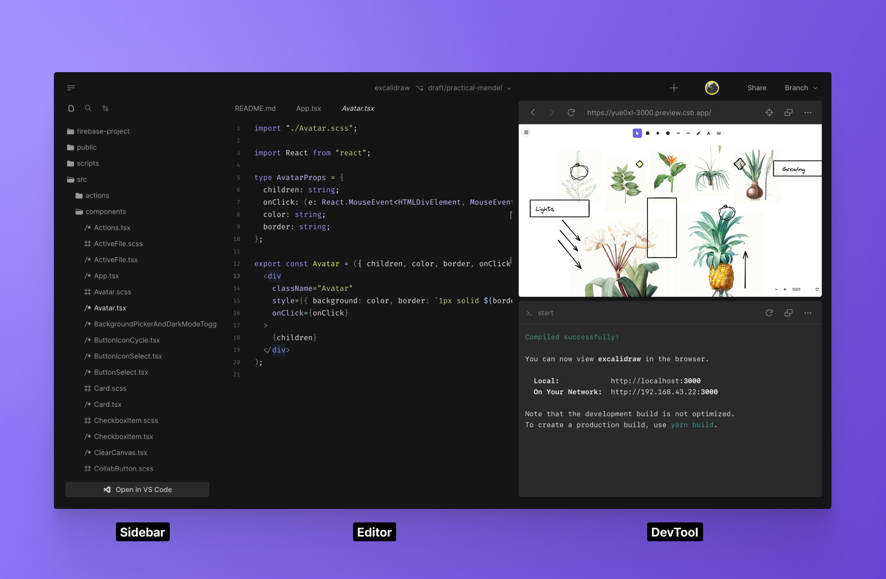

CodeSandbox has [many alternatives for you to code](../introduction/overview). One of the tools is our unique and opinionated **Web Editor**, built from scratch and optimized to help the developer focus on what matters: getting the work done  without friction. 

<Tabs tabs={["Web", "VS Code", "iOS"]}>
    <WrapContent>
The Web Editor contains a set of features to increase the accessibility of complex tools like git, setup, review flows, contributions, and visualizing components. 

Here is an overview of the web editor structure:

### Header

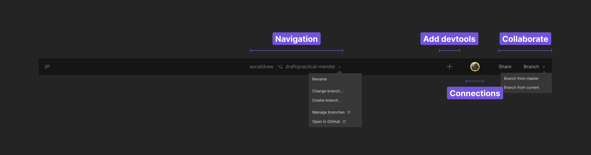

The header is where you perform general operations on your Repositories.

**1. Navigation**
    - **Repositories**: Click to return to the Repositories level.
    - **Branch**: Checkout to other branches.

**2. Devtool menu**
    - **Add Devtools**: Set up devtools to facilitate your work and automatize repetitive tasks.

**3. Connections**
    - **Avatars**: See who's currently online and click to follow their steps.

**4. Collaborate**
    - **Share**: Invite friends to work together.
    - **Branch**: Quickly start a new branch and propose changes.


### Sidebar

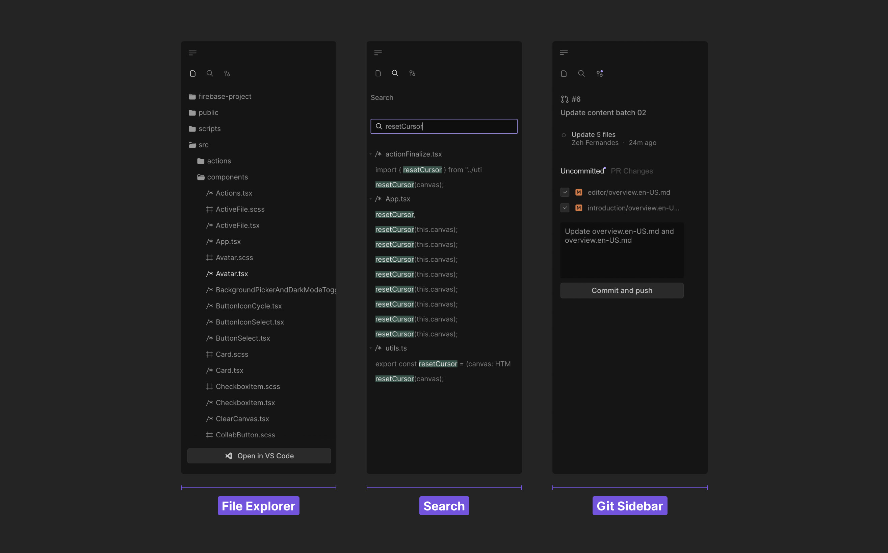

The sidebar is a quick way to operate and navigate your codebase. It allows you to:

- View and manipulate your files
- Search inside your Repository
- Interact with source control

You can change the sidebar view using the icons at the top. 

<Callout emoji="⭑">
    You can drag and drop elements and shift or command click to select multiple items in the lists. 
</Callout>

### Code Editor

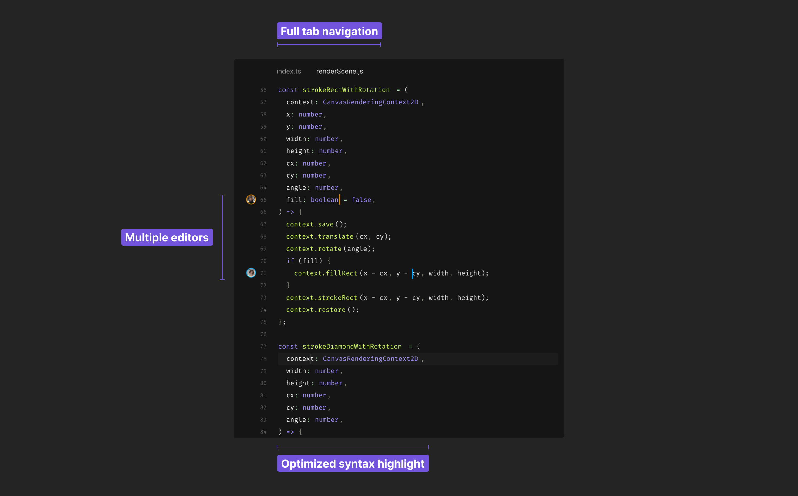

The code editor is where the magic happens ✨. We provide a base experience for all developers, with support for:

- Code formatting (Prettier or ESLint)
- LSP
- Intellisense
- Code completion
- Optimized syntax highlight
- Ligatures
- Multiple Editors
- Diff view

 If you want more advanced features, you can download our [VS Code extension](https://marketplace.visualstudio.com/items?itemName=CodeSandbox-io.codesandbox-projects) and [open the Repository in your local IDE](../introduction/overview?tab=vs-code#keep-working-on-vs-code) with your own customizations.

### DevTool

CodeSandbox signature layout with three columns and a runnable preview is back with superpowers. The new panel on the right supports useful tools to help you complete your work faster and more efficiently. Read more about it [here](devtools).

### Layout

<Video src="../../overview-resize.mp4" />

CodeSandbox Web Editor allows you to customize the three-panel layout to maximize the space for the task you are working on. Hover the mouse near the edge of each column to see the resize cursor; click and hold to change the layout. 

After reaching the proportional limit, keep dragging to hide the entire column. 

**Keyboard Shortcuts**

Press <kbd>Cmd/Ctrl</kbd> <kbd>B</kbd> to hide the Sidebar.

Press <kbd>Cmd/Ctrl</kbd> <kbd>.</kbd> to hide the DevTools. 
    </WrapContent>
    <WrapContent>
       
       Open any branch directly in your local VS Code and use all the extensions and keybindings that you’ve already configured. On top of this, all editors can collaborate seamlessly, so your team members can follow your steps on VS Code without leaving the Web Editor.
       
<br/>
       ## Open your branch in VS Code

You can jump to VS Code at anytime from the browser


> We also support opening the branch [Using Visual Studio Insiders](./insiders).

Alternatively, you can do all your work in VS Code without accessing CodeSandbox on the web

1. Open the extension
2. Sign in if you haven’t already
3. Select the ‘Projects’ panel and select the project you want to work on. From there you can open a new branch or select an existing branch to open


You will only be able to select from a list of repositories that have been imported to CodeSandbox. If you don’t see your project in the list, check your dashboard on CodeSandbox to make sure everything is set up there first.

If at any point, you want to switch to the CodeSandbox editor, simply click ‘Open in CodeSandbox’ under the ‘Branch Control Panel’

<br/>
## DevTools

Just like in the CodeSandbox editor, you have access to running ports to view code changes in the browser. The available ports are listed in the panel. Clicking on a port will open a tab in your default browser


<br/>
## Live Collaboration

<br/>
### View collaborators

Once you are connected to the branch, you will be able to see a list of teammates that are active on the branch. You can see the list of collaborators as well as the environment they are working from. 


In this case, I am active in both VS Code and the CodeSandbox editor. 

### Multiplayer Changes

Changes that are made to a file are reflected in the editor of every user. Select the name of a collaborator to focus on the file and line that they are working on

<Video src="../../vscode-following.mp4" />
<br/>
## Reviewing PRs in VS Code

You can review PRs directly from VS Code while connected to CodeSandbox. To do this, you should install the [GitHub App of CodeSandbox](/learn/integrations/github-app). With this app, every PR will have a link to open the branch in VS Code.

We also recommend to install the [GitHub Pull Request](https://marketplace.visualstudio.com/items?itemName=GitHub.vscode-pull-request-github) extension, and configure it as a default extension in your user settings (as outlined [here](#default-user-extensions)). With this extension you can put comments on GitHub directly from your editor.

<br/>
## Settings & Extensions

### Default Workspace Extensions

You can create the file `.vscode/extensions.json` in your repository to define the default extensions that should be installed for the repository. An example:

```json
{
  "recommendations": ["esbenp.prettier-vscode", "dbaeumer.vscode-eslint"]
}
```

This will make sure that Prettier and ESLint are installed whenever someone opens the branch in VS Code.

### Default User Extensions

In case you have any personal extensions that you want to have in every branch, you can define those in your VS Code settings under the setting id `remote.SSH.defaultExtensions`. To change this setting, you can open VS Code settings (`CMD/Ctrl + ,`) and search for `remote.SSH.defaultExtensions`.

You can copy your favourite VS Code extension ids, and put them in that setting. From then on, these extensions will be automatically installed in your branches.

### VS Code Setting Sync

To sync your settings and keybindings between branches, you can enable VS Code Setting Sync. To learn more about how to set this up, you can check [here](https://code.visualstudio.com/docs/editor/settings-sync).

<br/>
## FAQs

### What to do about that recurring trust modal?


This modal shows up every time you launch a project folder in a new container. Since every branch will be opened with a unique SSH url, VS Code will ask you to verify that you trust the connection. This is an important security notice used to confirm that the user understands the  connection being established before opening the code. You can read more about the modal [here](https://code.visualstudio.com/blogs/2021/07/06/workspace-trust).

### Do I have to be connected to live session on CodeSandbox in order to work on a branch?

It is possible to work in an “un-synced” state. In order for CodeSandbox features to work, the branch needs to established on a remote connection AND connected to Pitcher (see How it works for more information

### Who can access my code?

Only people on your CodeSandbox team with permissions to the repository may join as a collaborator. Repository permissions are carried over from GitHub. To add someone new to the team, provide access on GitHub and add them to the CodeSandbox. From there, they can access the code in the browser or follow the steps above to use VS Code.

### More Questions?

For questions and support, please use the community [Discord server](https://discord.gg/R32XxEGp4s).
    </WrapContent>
     <WrapContent>
     CodeSandbox for iOS support for Sandbox development is powered by the app’s Node.js port, it enables offline development but it is limited by the restrictions imposed by iOS. To unleash the full potential of developing on iOS you can use CodeSandbox Repositories. Repositories allows you to have the same experience across different devices but making the most of each platform’s potential.
     <br/>
        ## Dashboard

The Dashboard is the place where you can browse and manage your Repositories and the branches in your Repositories. 

The "Repositories" view allows you to see at the fist glance all the Repositories in a team, which team members are working actively on a Repository, whether the Repository is public or private, the number of branches of the Repository and the number of pull requests that are currently open.


### Kanban view

This screen shows you an overview of all the branches on a Repository’s repo split by the stage in a common development workflow the branches are in. 

- The “Stage” column contains the default branch of your repository, which is usually protected.
- The “Review” column shows all branches with an open Pull Request.
- The “Drafts” column contains all the other work in progress branches.

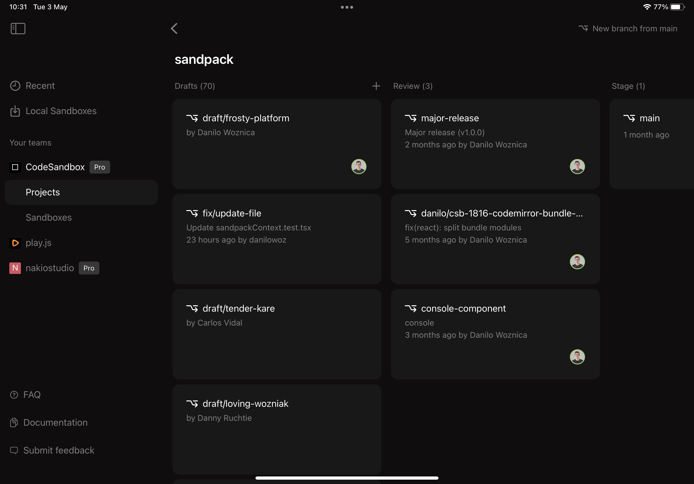

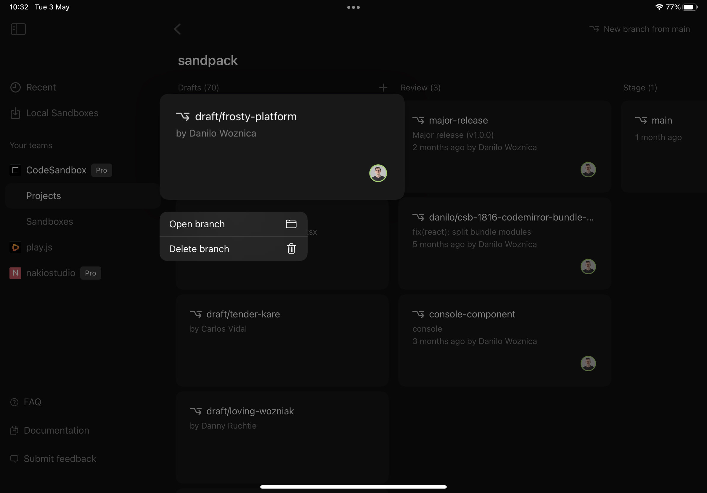

### Command palette

Every dashboard action enumerated here is also available in the command palette which you can access by double tapping anywhere in the screen with two fingers or via the `⌘ + K` shortcut.

## Development Environment

If you have checked the “Sandboxes” section of this documentation you should be familiar with the different parts of the IDE. Here, we will show you the main differences between the Sandboxes and the Repositories IDE and how the new components work.

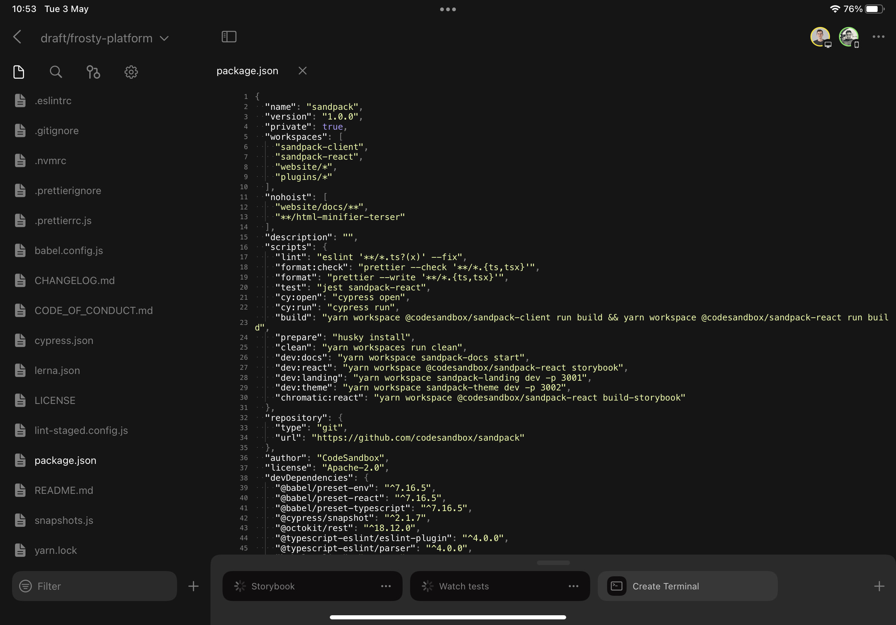

### Sidebar

**Branch Picker**

Sitting at the top of the sidebar you can see the name of the current branch. Tap on it to access the “Branch Picker” where you can change branch, create a new one, delete existing ones or rename the currently selected branch.


**Content Search**

In the second tab of the sidebar, the “Content Search” screen allows you to search in the entire Repository a term or matching result for a regular expression.


**Git Client**

Unlike the “Git Client” for Local Sandboxes, the remote repository is configured for you and push operations take place automatically when a new commit is made.
The small files picker allows you to select which files you want to commit or discard changes from. 

In this screen you can also find the commits introduced since the target branch was forked and a button to quickly create a new Pull Request for the current branch.

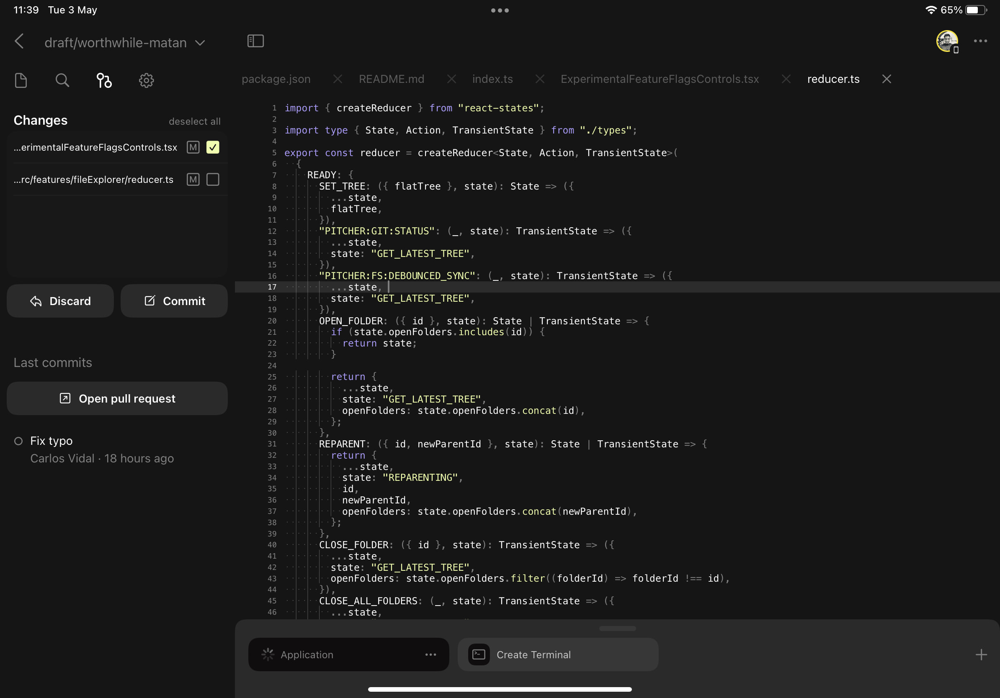

### Editor

There is some differences between the Repositories and the Sandboxes editor that we will outline below.

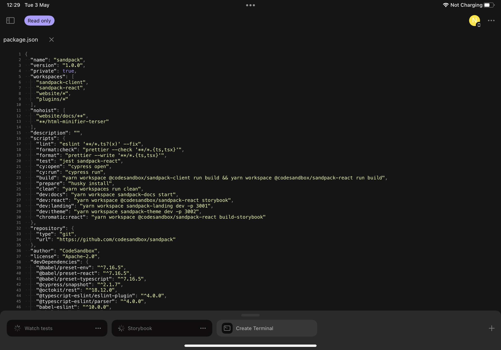

**Repository Status**

At the right of the button to toggle the sidebar there is the status pill. This component informs you about the current state of the Repository and also about background actions being performed on your Repositories. These are the different states possible:

- Protected: the current branch is protected and no changes can be performed.
- Reconnecting: the internet connection was lost and the application is trying to reconnect to Pitcher.
- Offline: the attempts to reconnect timed out and the Editor is in offline mode where no changes can be performed. Tapping on the status pill triggers new reconnection attempts.
- Commits behind main branch (i.e. “4 commits behind main”): New commits have been merged onto the main branch and the current branch is a number of commits behind the HEAD of the main branch. Tapping on the status pill merges the main branch into the current branch.
- Merge Conflicts: indicates that merge conflicts arose as a result of pulling or merging the main branch onto the current branch.
- Commit Error: indicates that a pre-commit hook failed halting the commit operation. Tapping on the status pill opens a shell with the output of the failed commit operation.

**Live Collaboration**

Every time you access a branch, through the Dashboard or a universal link, you will join a live editing session. At the top-right corner of the screen you will see who has joined the session and by tapping on their avatar you will be able to follow their activity as they work on the current branch.


**IntelliSense**

The Editor interacts with Pitcher’s language server. The application only consumes the auto-completion service but new features will be added in the future.

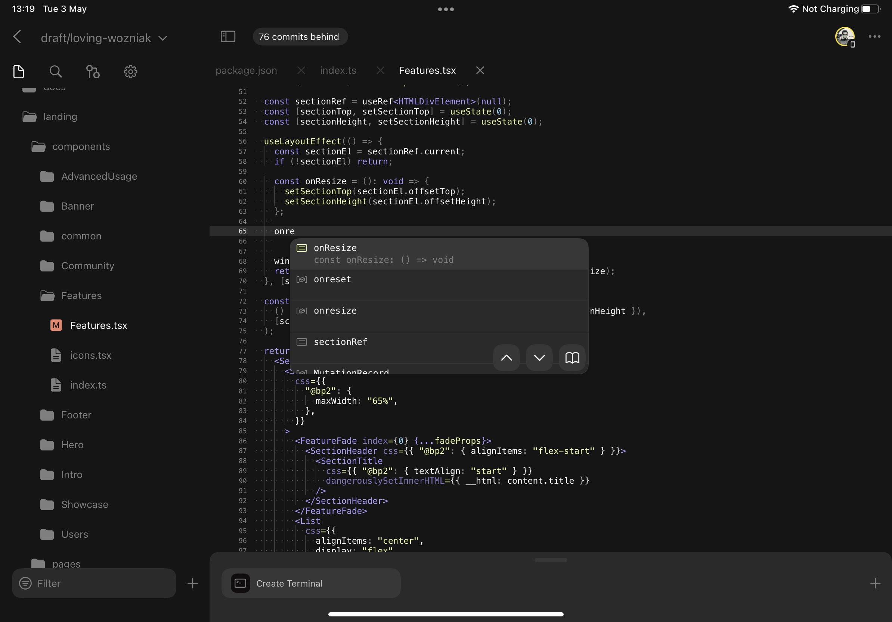

**Conflict resolution**

The Editor detects conflicts in a source file and allows you to quickly pick a conflict resolution by tapping on the chevron located at the left of the first conflicting line.

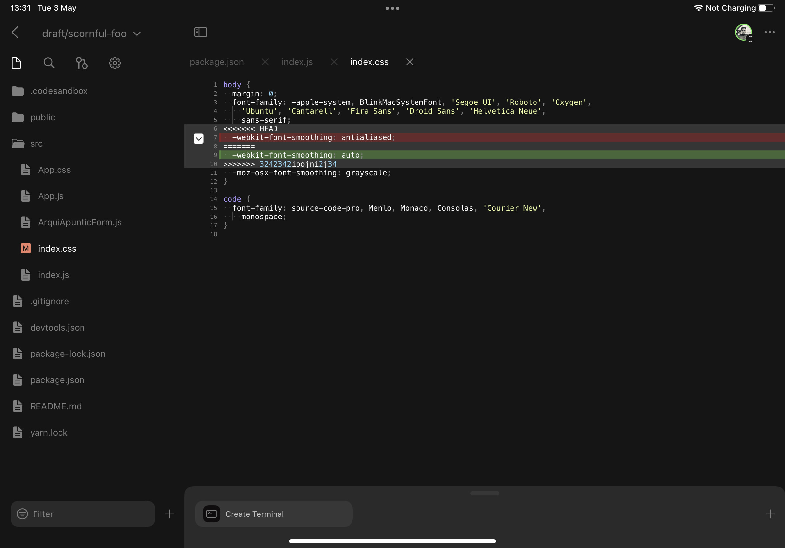


### DevTools

**Tasks**

At the bottom of the screen you can find the DevTools area. This component allows you to easily launch tasks defined in your `package.json` or  `.codesandbox/tasks.json` files, check their output or stop their execution. 

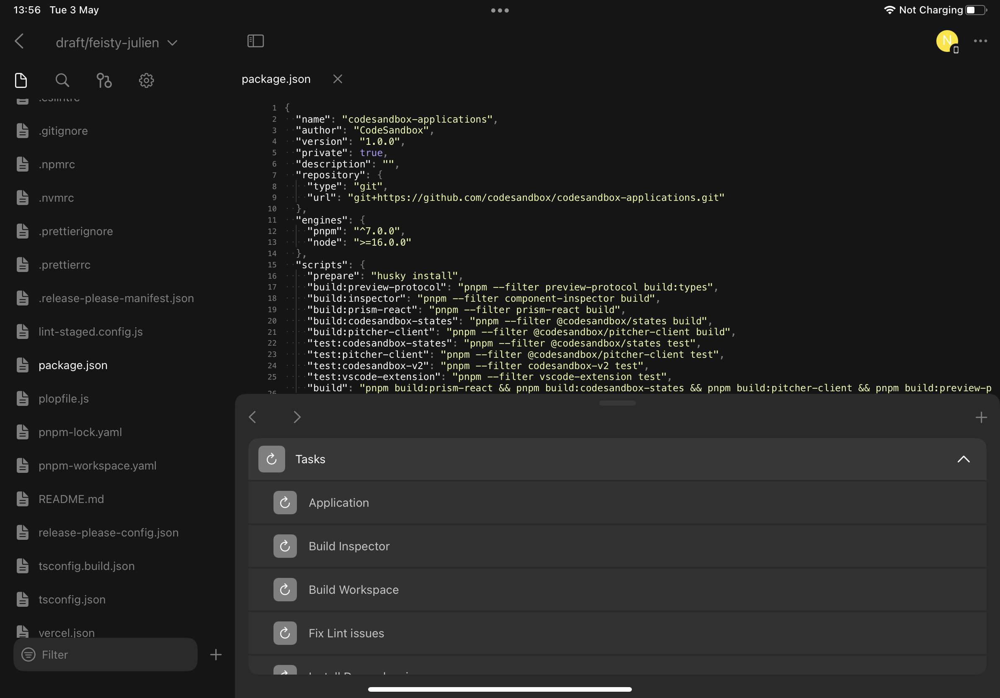


**Previews**

Every time a port is open a new preview will become accessible from the “Previews” section and if possible it will show the name of the task that created the port. Tapping on any of these entries will open app the in-app web browser and load the content that port is serving.


**Terminals**

Lastly, the Terminals section lets you pick among all the running shells and also create new ones.

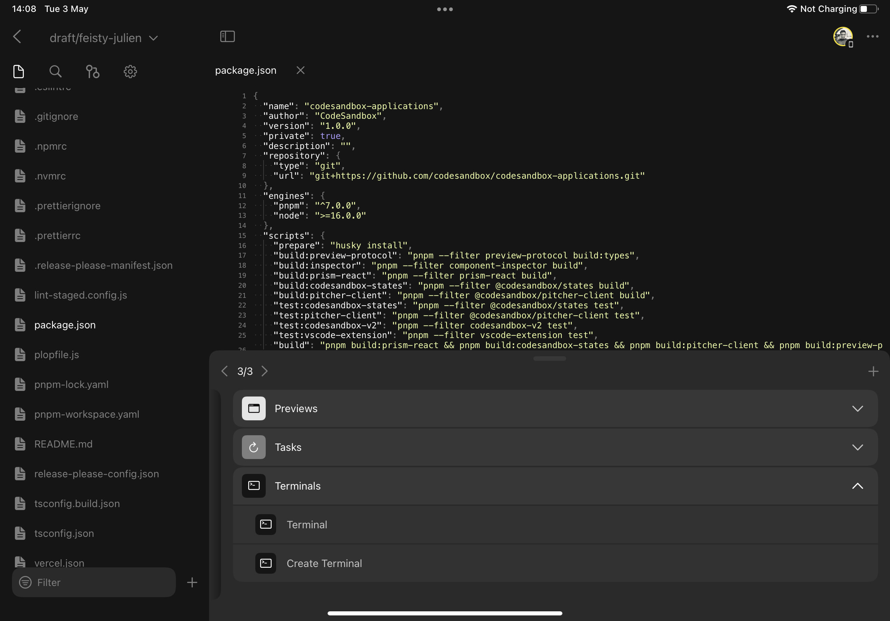
    </WrapContent>
</Tabs>