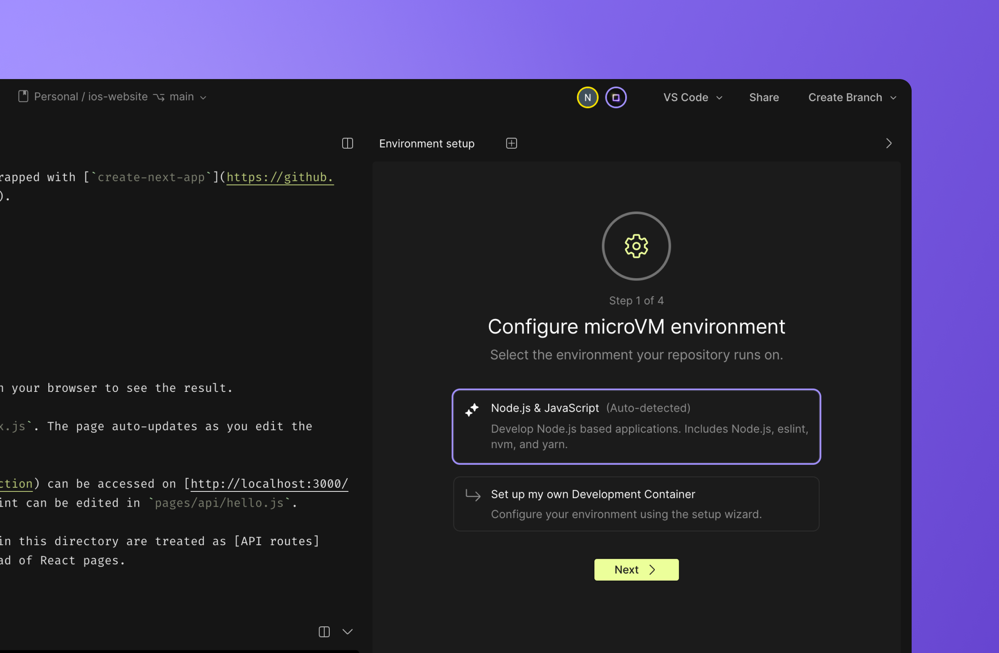
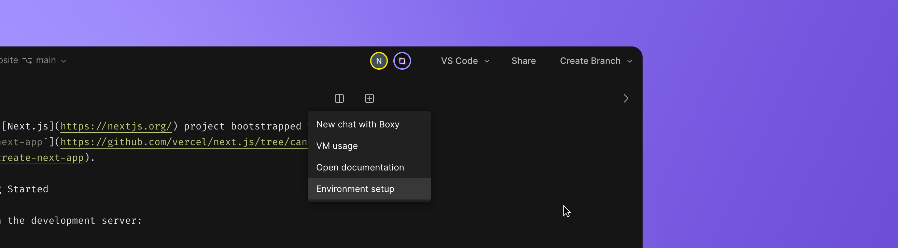
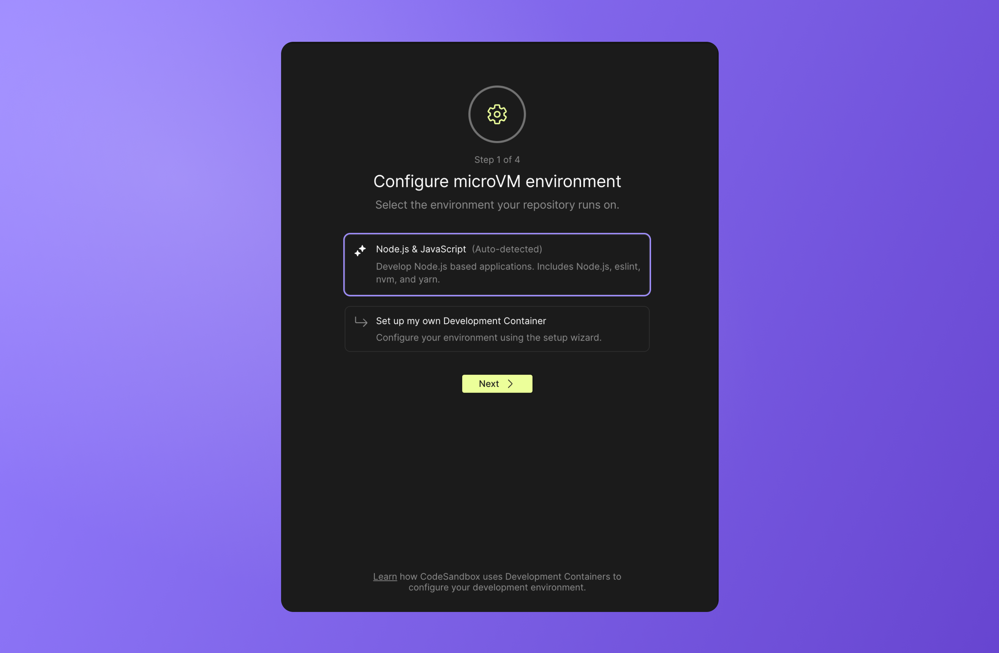
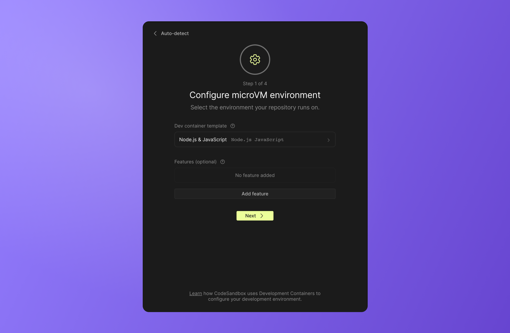
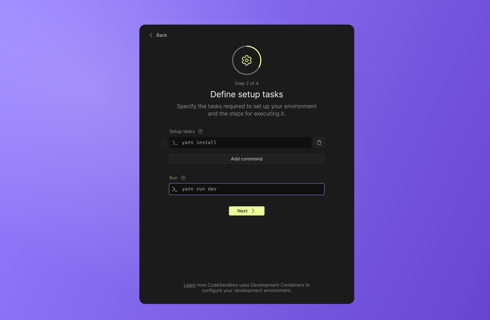
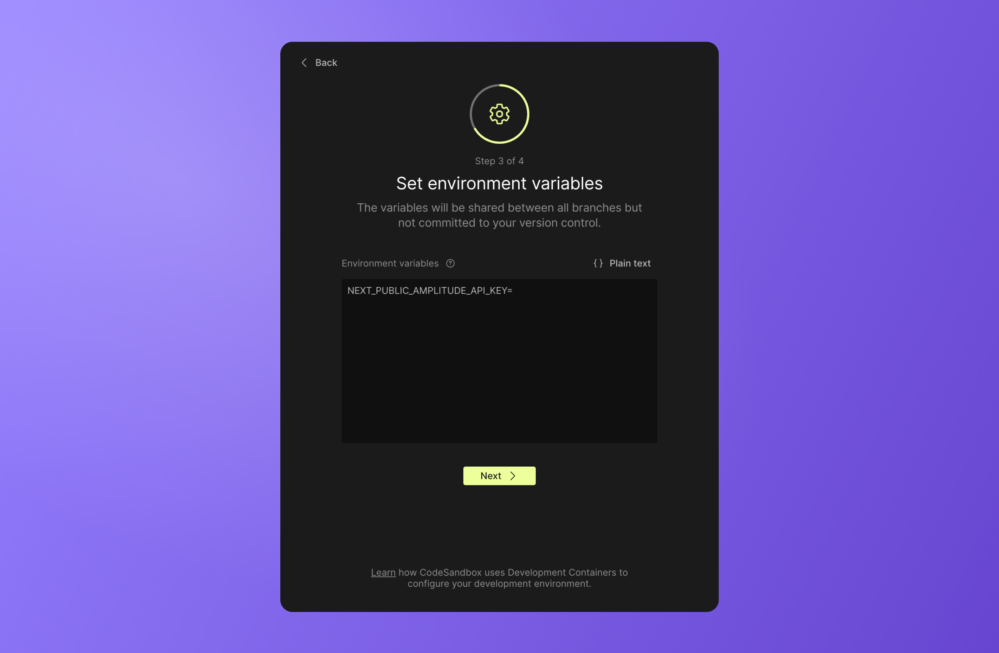
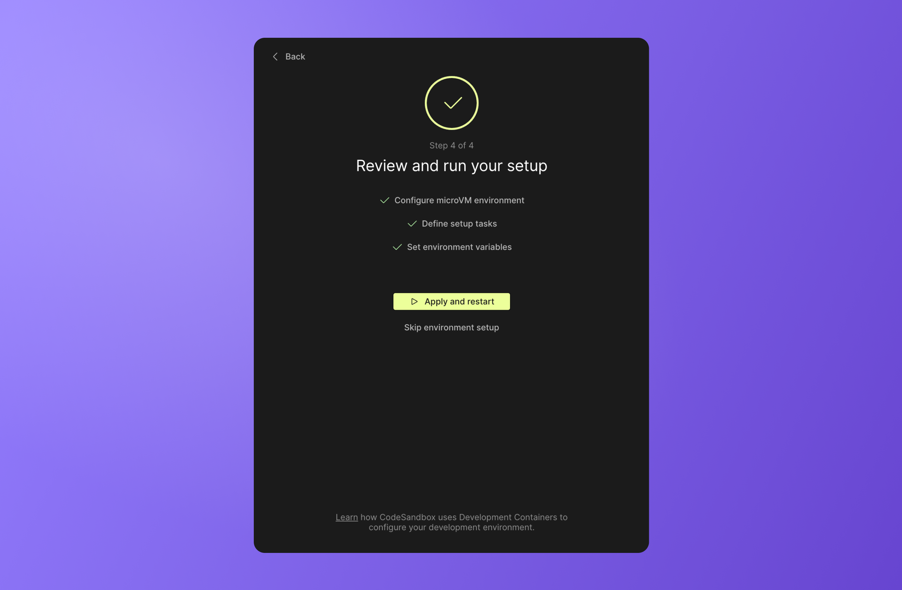

import { Callout } from 'nextra-theme-docs'

# Environment setup

If this is your first time setting up this repository in CodeSandbox, you should notice an onboarding tool in the DevTool window. 
We highly recommend completing the setup steps, but if for any reason, you don't finish and want to find this tool again, you can see the option to resume these steps by accessing this button in the devtool menu.

#### About the environment setup

When you run your repository in CodeSandbox, you are running it on a micro virtual machine (microVM). This means that we need some basic configuration to set the environment in which your repository will run. To do this, we take advantage of the open-source [Development Containers](https://containers.dev/). 

In this section, we will walk through how to identify the best environment for your project and explain how each of the steps work together to create an automatic setup process for everyone accessing your repository in the future. 

## Step 1: Select the environment 

When importing a repository for the first time, CodeSandbox will examine the files in the repo to determine the environment that it is running on. CodeSandbox will also check to see if the repository has pre-existing configuration files that can be used to run the repository. 

Based on the findings, you will see a few options to choose from. 

The auto-detected environment is a Dev Container template that is likely to work for your repository. If you want to configure your own Dev Container, you can use our Dev Container wizard to select a [template](https://containers.dev/implementors/templates/) and add [features](https://containers.dev/implementors/features/) as needed to customize your Dev Container image. 

## Step 2: Select setup tasks

Setup tasks are a list of terminal commands that run when a VM boots or when a new commit comes in on a protected branch (like `main`). 
In this setup, you can select which terminal commands you would like to automatically run when booting a VM. By setting these tasks, you'll ensure that the environment works by default. Other developers won't have to figure out what setup to do, or what commands to run to get started.

<Callout emoji="⭐">Tasks are not started as your user, but by a global user named `pitcher-host`.</Callout>

In this example, we auto-detected `yarn install` as a likely command from the `package.json` file.

A **run** command is the terminal command to run the project–in this case, we will run `yarn run dev` to spin up the dev process.

<Callout emoji="⭐">During the final step, this setting will generate a `tasks.json` file. There are many more ways to use this file for advanced configuration that are described [here](../task)</Callout>

## Step 3: Set environment variables

Several repositories require setting environment variables—either to connect to an external service or as the configuration of the environment itself.

These environment variables will be encrypted and stored in our database. After you've set the environment variables, they will be available for any branch in the repository after a restart. 

You can learn more about our environment variable support under [Secrets](/learn/environment/secrets).

<Callout emoji="💡">Tip: If there is a `.env.example` file in the repository, this step will reference the variable names to help you determine which variables should be added.</Callout>

## Step 4: Run your setup
In this step, you can review your setup steps and make changes before running the environment. Once you have run your setup steps, you should see some new files added to your branch. After you have read through the files and adjusted the final details, you are ready to commit your changes and create your first PR. 

You can do this either by clicking “Create PR” in the header or by committing from the Git panel in the sidebar.

<Callout emoji="⚠️">New branches are not automatically created on GitHub. We only push the branch to GitHub when you create a commit or rename the branch.</Callout>