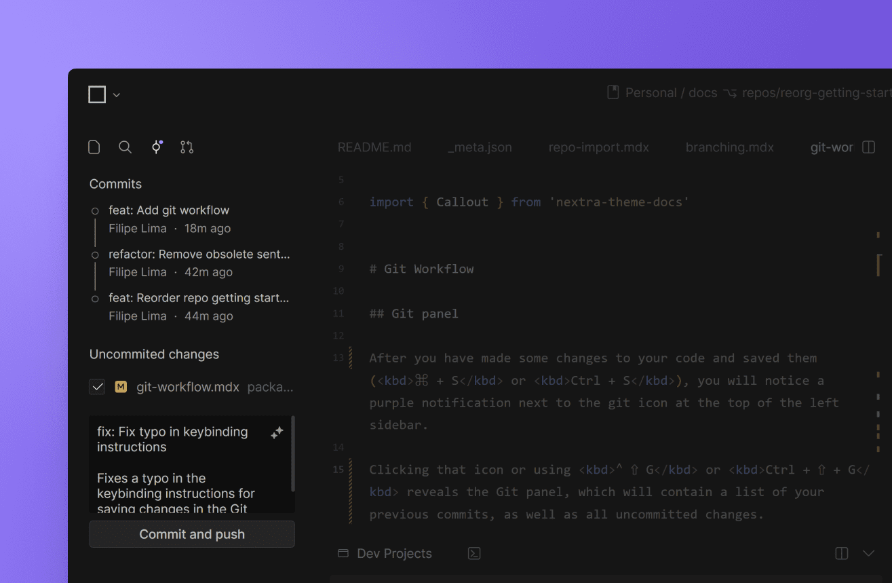
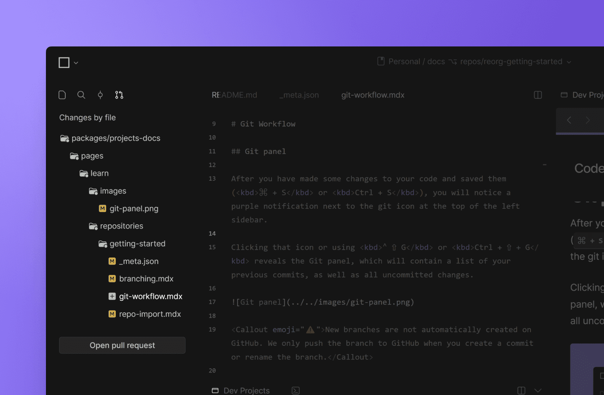

import { Callout } from 'nextra-theme-docs'

# Git workflow

## Terminal

Working locally you where likely using the terminal to interact with Git. You can still use your terminal, with one exception: `git checkout`.

Since each branch on CodeSandbox is its own MicroVM and environment, we will rather navigate you to the respective MicroVM when doing a `git checkout`. Normally this is just another way of navigating to a branch, but if you
use `git checkout` related to updating your branch from your target, you will need to conform to the following:

- If you use `rebase` you should use the following command: `git rebase origin/main my-current-branch`. This is [a more efficient way](https://stackoverflow.com/a/56840200) and bypasses the need for a checkout
- If you use `merge` you should use the upper left pill which appears automatically when you are behind your target

## Git panel

After you have made some changes to your code and saved them (<kbd>⌘ + S</kbd> or <kbd>Ctrl + S</kbd>), you will notice a purple notification next to the git icon at the top of the left sidebar.

Clicking that icon or using <kbd>⌃ ⇧ G</kbd> or <kbd>Ctrl + ⇧ + G</kbd> reveals the Git panel, which will contain a list of your previous commits, as well as all uncommitted changes.

<Callout emoji="⚠️">New branches are not automatically created on GitHub. We only push the branch to GitHub when you create a commit or rename the branch.</Callout>

## Committing changes

Under the "Uncommitted changes" section, you will find a text field where you can input a commit message. If you have the [Boxy AI assistant](/learn/boxy/overview) enabled, Boxy will automatically suggest a commit message based on the changes you made. Optionally, you can click the sparkles icon at the top right of the text box to generate a new commit message using Boxy.

Finally, when you click the "Commit and push" button, we commit the changes to the branch on GitHub.

<Callout emoji="💡">You can also commit changes using the terminal. This is especially useful if you're working with a repository from GitLab or another non-GitHub git provider, as our git panel currently only supports GitHub repos.</Callout>

## Opening a pull request

After you have committed some changes, you can open the "Pull request" tab at the top of the left sidebar (or using <kbd>⌃ ⇧ I</kbd> or <kbd>Ctrl + ⇧ + I</kbd>), which will display a list of all the files that have been changed.

When you're ready to open a PR, you can either click the "Open pull request" button at the bottom of the "Pull request" tab or click “Create PR” at the top right of the web editor.

Then, you will be redirected to GitHub, where you will be able to add the final details of the PR.

## Reviewing a PR

CodeSandbox has a unique set of features that improve the PR review process.

Setting this up requires some additional one-time configuration, so see more details about this setup and workflow on the [code reviews](/learn/repositories/review) page.