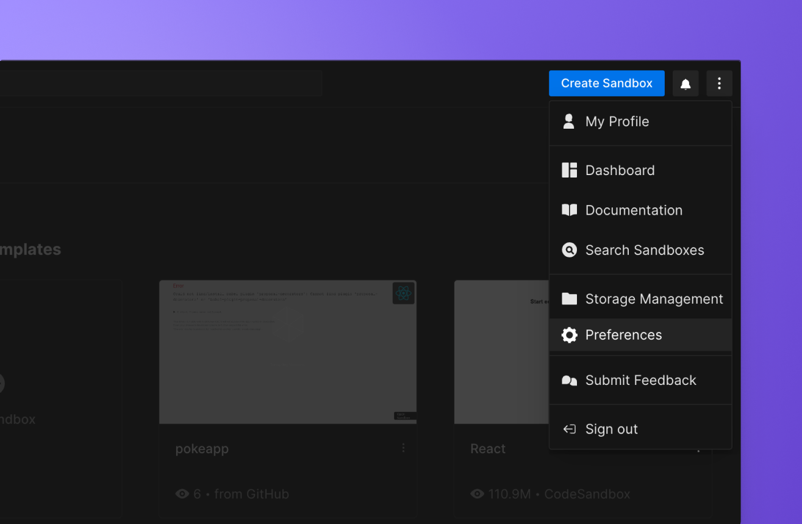

import { Callout } from 'nextra-theme-docs'

# Troubleshooting
   
## **Permission errors while importing a project**
    
- Verify your team's permission to open CodeSandbox Repositories.

- Verify your **repository permissions on GitHub**. 
You need to have `write` permission on GitHub to be able to import the project. Repositories where you only have `read` access can only be forked.

- Verify your **GitHub permissions**. 
CodeSandbox requires full git access to be able to import and commit. If you face any authentication errors, follow the steps listed below to reset your GitHub permissions.
    
## **Resetting GitHub permissions**

1. Go to the **[Dashboard](https://codesandbox.io/dashboard)**.

1. Click on the **Menu icon** at the top right of the screen.

1. Click on **Preferences**.

  
4. Go to **Integrations**. 

5. **Sign out from GitHub and sign in again** to reconnect your GitHub account. 
  
#### **Invalid authorization code on Firefox and Safari**
    
Safari and Firefox block popups by default. Please make sure you give the domain permission (through the browser settings) or refresh the page after you opened the popup and try again.