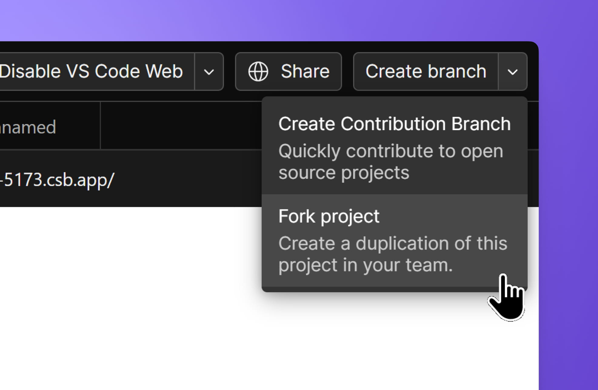
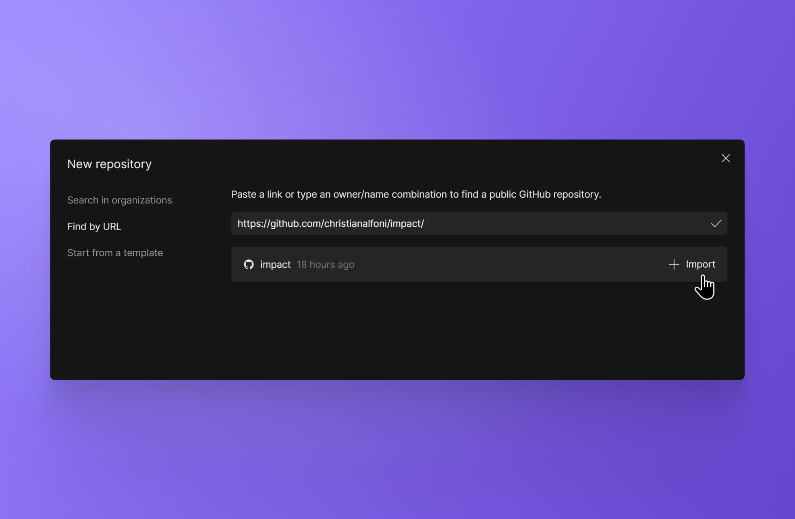
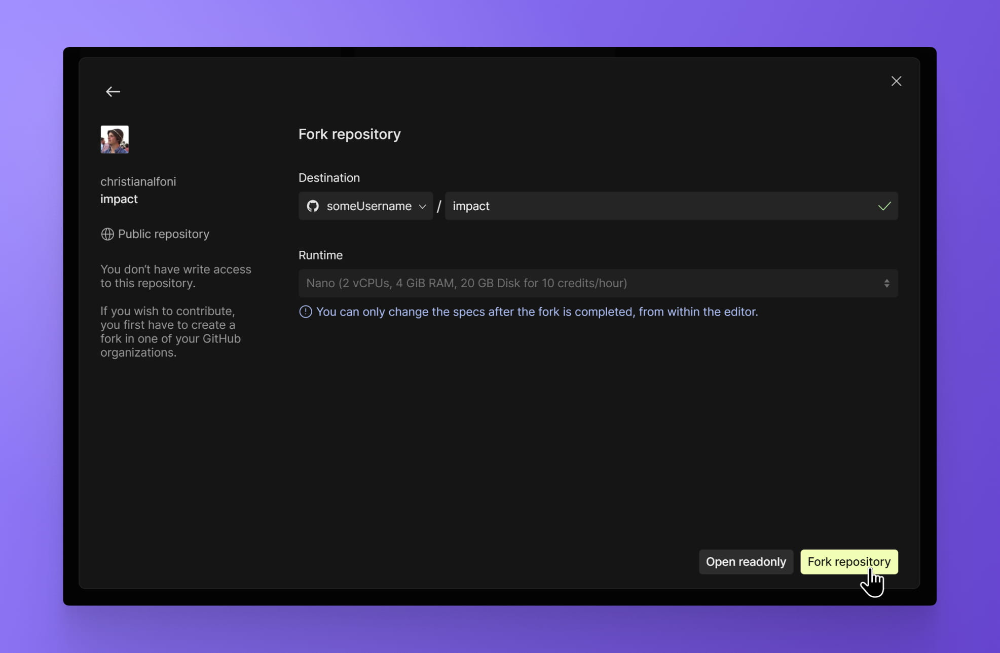
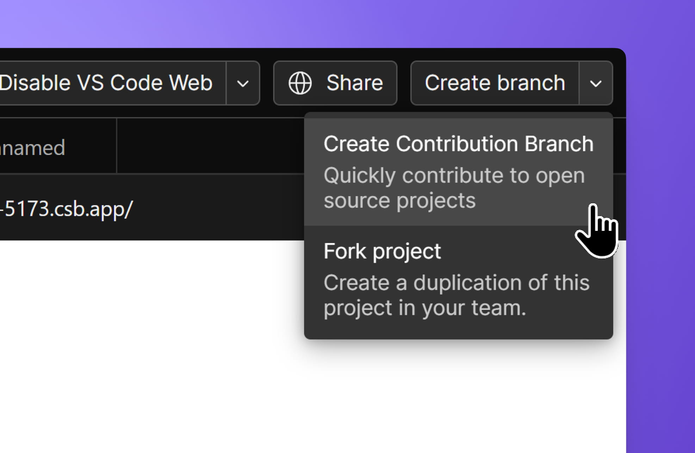

import { Callout } from 'nextra-theme-docs'

# Open Source Collaboration

Working with your favorite open-source repositories is easier with CodeSandbox. Whether you are just checking out a repository, testing out an idea or formally proposing a feature, CodeSandbox can eliminate tedious steps in your process and get you working on your ideas faster.

## Viewing open-source repositories

Explore any open-source repository through CodeSandbox simply by adding the repository's GitHub URL to the end of the CodeSandbox URL, in the format below:

<Callout emoji="">**`codesandbox.io/p/` `github/[org]/[reponame]`**</Callout>

For example, try [codesandbox.io/p/github/codesandbox/sandpack/](https://codesandbox.io/p/github/codesandbox/sandpack).

## Forking Open Source Repositories

Traditionally, contributing to an open-source repository happens through forking. You can fork an open-source repository by opening it in the editor, clicking on the `Create branch` dropdown in the top right corner of the editor and selecting the `Fork project` option.

You can also create a fork by importing the repository using the `Import repository` button on the Dashboard. If you try to import a repository you don't have write access to, CodeSandbox will prompt you to either open a read-only version of the repo, or fork it to your workspace.

By default, when opening a PR from a forked repository, it will point to the `main` branch of your repository. If you want to target the parent repository, you can do so through the GitHub PR UI.

## Contribution Branches

Easier and faster than forking repositories, contribution branches allow you to interact with code and open PRs without the need to import or create a project.

Contribution branches are standalone branches designed to simplify the contributing process. PRs created from them will always target the parent repository, showing up in the maintainers' list like any regular PR.

To create a contribution branch, open the repository in the editor and click the toggle next to the `Create branch` button on the top right corner. Then, pick `Create Contribution Branch`.

If you try to import a repository to which you don't have write permission, a new fork will be automatically created. However, during the import process, you can select the option to `Create Contribution Branch` to start working immediately.

Your contribution branches are accessible anytime through your primary workspace in the [Dashboard](https://codesandbox.io/dashboard), under _All Repositories_.
