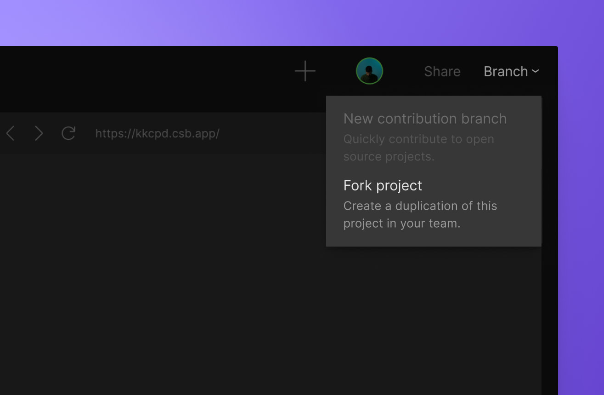
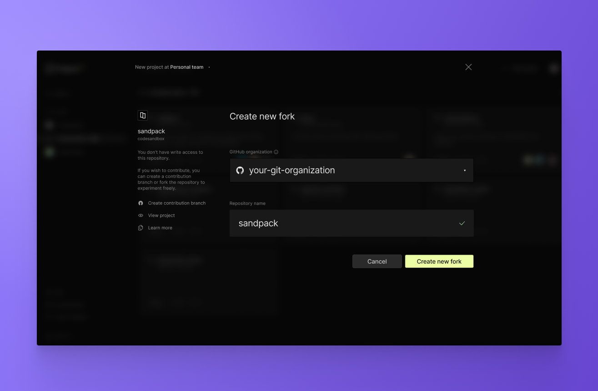
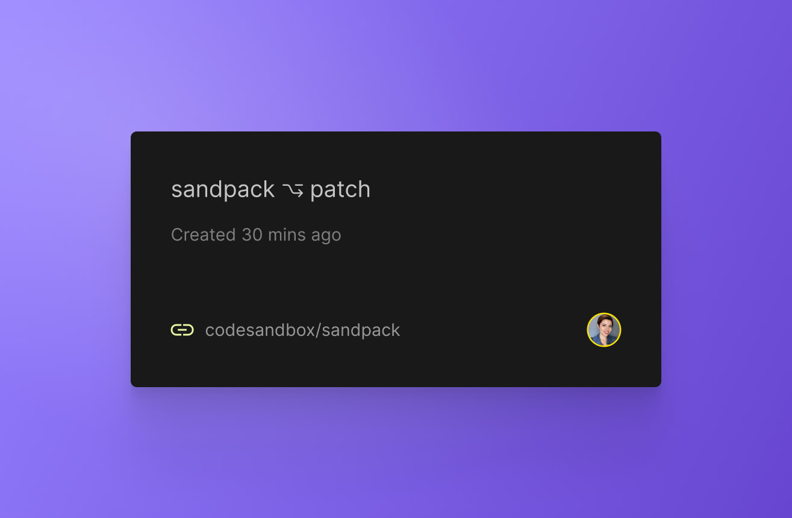
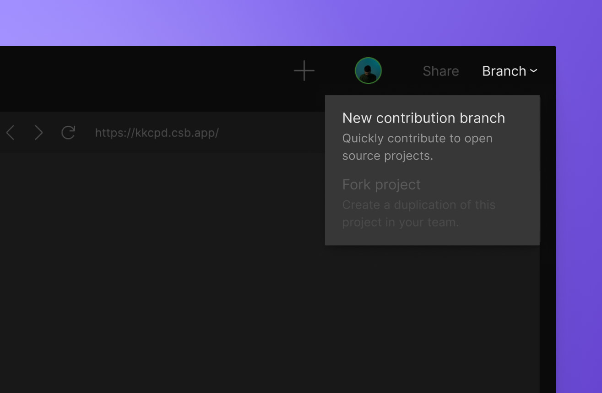

import { Callout } from 'nextra-theme-docs'

# Open Source Collaboration

Working and Contributing with your favorite Open Source repositories is easier with CodeSandbox. Whether you are just checking out a repository, testing out an idea or formally proposing a feature, CodeSandbox can eliminate tedious steps in your process and get you working on your ideas faster;  In fact you may have come here after clicking 
 Button. 

## Viewing Open Source repositories
To make all of this easier, we allow you to explore any open source repository through CodeSandbox simply by adding the repository's GitHub URL to the end of the CodeSandbox URL, in the format below:

<Callout emoji="">**`codesandbox.io/p/` `github/[org]/[reponame]`**</Callout>

For example, try [codesandbox.io/p/github/codesandbox/sandpack/](https://codesandbox.io/p/github/codesandbox/sandpack).

## Forking Open Source Repositories
Traditionally, contributing to an open-source repository happens through forking. You can fork an open source repository by opening it in the editor, clicking in the `Branch` dropdown in the top right corner of the editor and selecting the `Fork project` option.

You can also create a fork by importing the repository using the `Import repository` button on the Dashboard. If you try to import a repository you don't have write access to, CodeSandbox will automatically create a new fork in the GitHub organization of your preference. 

By default, when opening a PR from a forked repository, it will point to the `main` branch of your repository. If you would like to target the parent repository, you can do so through the GitHub PR UI.

## Introducing Contribution Branches
Easier and faster than forking repositories, contribution branches allow you to interact with code and open PRs without the need to import or create a project. 

Contribution branches are standalone branches designed to simplify the contributing process. PRs created from them will always target the parent repository, showing up in the maintainers' list like any regular PR. 

To create a contribution branch, open the repository in the editor and click on the `Branch` button on the top right corner. By default, the option `New contribution branch` will be selected.

If you try to import a repository you don't have write permission to, a new fork will be automatically created. However, during the import process, you can select the option to `Create a Contribution Branch` to start working immediately.

Your contribution branches are accessible anytime through your personal workspace in the [Dashboard](https://codesandbox.io/dashboard), under _All Repositories_ when forking and My Contributions when `Create a Contribution Branch`.

## Fork / Create a Contribution Branch / and Branches Differences 

Branches here on CodeSandbox work just a little be differently even though they server the same purpose see [here](/learn/repositories/collaborate-share) for more info. 
It is generaly recommend to use `Fork` for most project when you start
`Create a Contribution Branch` are just ment for quick fixes such as a spelling errors or one time fixes when you are not going to spend much time on them.  Forks have many advatages , such as keep you code in sync with GitHub or GitLab,  and with Github we will info you when a commit comes in.  Since changes often come in quickly, it is often important to see who change what so you can match there style as you go. 
