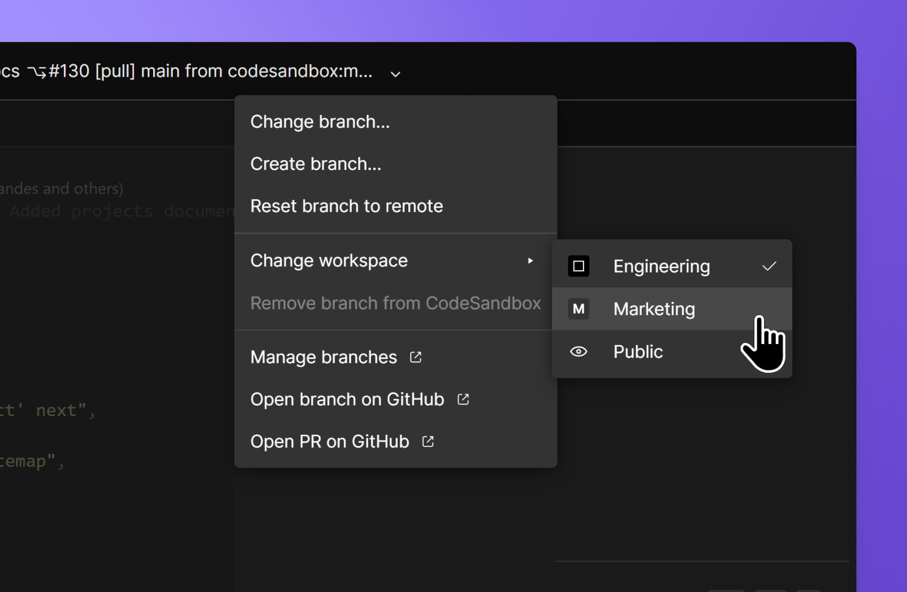

import Video from '../../../../../shared-components/Video'
import { Callout } from 'nextra-theme-docs'

# CodeSandbox Repositories

CodeSandbox allows you to instantly spin up a cloud development environment for any branch in your GitHub repository. It has a focus on speed and collaboration and allows you to create a workspace to be experienced by multiple people at the same time.

## Tailored for your project

Much like [Devboxes](/learn/devboxes/overview), repositories are run in CodeSandbox VMs that enhance productivity and make overall development more accessible for developers of all levels.

## Integrated with source control

CodeSandbox brings a unique approach to cloud development by giving a dedicated VM to every branch, which can be shared with a URL. This means that you can share your branch and it will always be running, even if you’re offline.

This feature is specially useful when you’re working on a branch and need to quickly [review a PR](./review). Don't worry about stashing, running `yarn install`, or rolling back migrations on your current branch. Just open the PR in a new window and start reviewing!

## A running environment in seconds

When you press `Create Branch`, we automatically create a new branch and set up a development environment with running dev servers within a few seconds by cloning the VM you branch from. You can read more about how this works in our [blog](https://codesandbox.io/blog/how-we-clone-a-running-vm-in-2-seconds).

<Video src="../../repo-branching.mp4" />

If you are looking at someone’s PR and want to quickly test a suggestion, simply click `Create Branch`, write the code and share a link to your changes. If you’re happy with the changes, merge that into the existing PR. All of this in under a minute.

## Understanding repository imports

CodeSandbox handles imported repositories on a per-workspace basis. This means that the changes made to a repository in one workspace will only be visible to users within that workspace until those changes are synced with GitHub. 

Because of the repository access permissions within a workspace, the following scenarios apply:

- When a repository gets imported to a workspace, that version of the repo can only be accessed by the workspace team members.
- When a repository gets opened as a public repo, the user opening it will get the public version of the repo, which is a standalone, read-only version that might not match up with a version of the same repo that has been imported to a workspace.

At any given time, you can switch through the different available versions of the CodeSandbox repository by clicking the chevron icon next to the repo name on the top bar of the editor and then selecting a workspace under "Change workspace", as shown below.

