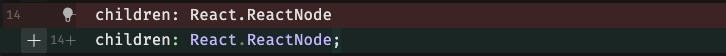

# Using CodeSandbox for code reviews
CodeSandbox branches are the perfect place to conduct code reviews. Simply open the branch from the GitHub PR and see the code changes, running preview and conversations all in one place. 

Reviews on CodeSandbox are synced with GitHub. It doesn't matter if you start a review in GitHub and finish it in CodeSandbox, all comments will be reflected in both GitHub and CodeSandbox. 

## Getting started
Reviews require a repository admin to install the [GitHub App](/learn/integrations/github-app). Once that is installed, you will see a comment in your GitHub PR with links to open the branch and the preview. 

## How it works
Once a PR is created, you will see links to the CodeSandbox branch. If you open the branch in the web editor, you will see something like the following

### Reviewers
All the of the requested reviewers and their review status are listed at the top of the PR tab. If they have left a message with their review, you can view that by selecting the chevron to the left of their name.

### Changes by file
All the changes are listed in this section. 
At this time, comments are only shown on diff files.

### Comments
You can add a comment by opening a diff file, and hovering your mouse between the line numbers to see a plus button. 

Open a comment by selecting the plus button and add your comment.
You may choose to add a single comment which will be immediately synced with GitHub OR start a review. 

When working on a review, your comments will be shown as "Pending" as indicated by this icon.

If you are a Pro users and have enabled Boxy, you may notice that the review message has a pre-populated text to use if it suits you.

After submitting your review, you will see the updated status as a reviewer with your message if you left one.

## Features and limitations

**PR Info**
PR description content is display on the `PR Info` file. This file is displayed by default when opening a branch from GitHub. You can open this file at any time by selecting the PR title at the top of the page.

**Comment input options**

| Input | Can create | Can display|
| -------- | -------- | -------- |
| Text | ✅ | ✅ |
| Markdown | ✅ | ✅ |
| Mentions | ✅ | ✅ |
| Emojis | ❌ | ✅ |
| Images | with markdown | ✅ |

