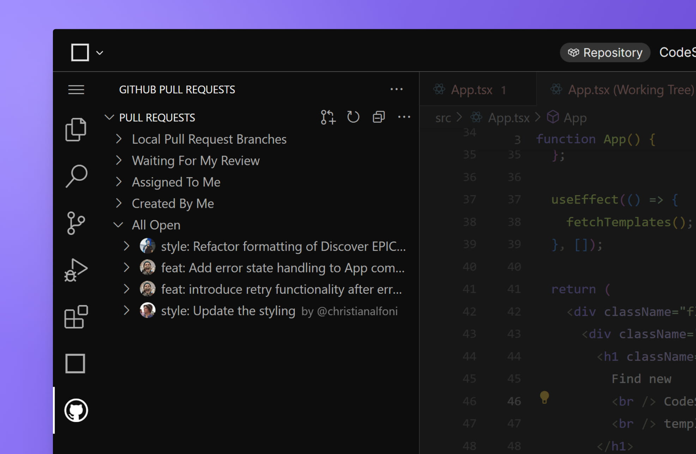

import { Callout } from 'nextra-theme-docs'

# Using CodeSandbox for PR reviews

<Callout>
PR Reviews are currently only available for GitHub repositories.
</Callout>

CodeSandbox is the perfect place to review pull requests. By opening the branch from the GitHub PR in CodeSandbox, you will see the code changes, code preview and conversations all in one place.

Reviews on CodeSandbox are powered by the [GitHub Pull Requests extension](https://marketplace.visualstudio.com/items?itemName=GitHub.vscode-pull-request-github). It doesn't matter if you start a review in GitHub and finish it in CodeSandbox–all comments will be reflected in both GitHub and CodeSandbox.

## Getting started

To review a GitHub PR in CodeSandbox, you must ensure you have granted the required permissions. You can check this status by clicking the "Accounts" icon at the bottom of the left sidebar.

<Callout emoji="💡">We highly recommend that a repository admin installs the [CodeSandbox GitHub App](/learn/integrations/github-app). Once that is installed, you will see a comment in your GitHub PRs with links to open the branch and the preview.</Callout>

## How it works

You can find all the details about how the extension works on its [official page](https://marketplace.visualstudio.com/items?itemName=GitHub.vscode-pull-request-github).
